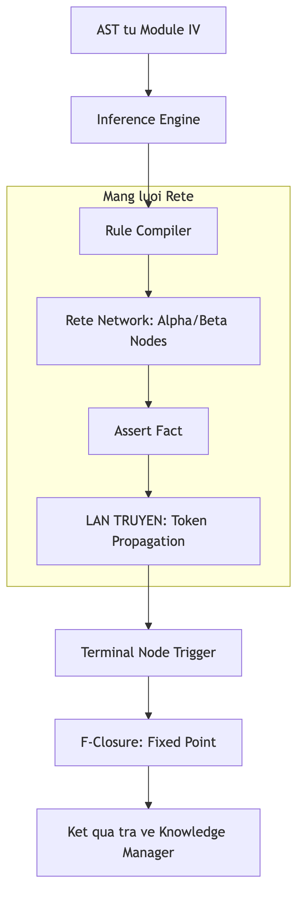

# Quá trình biên dịch và lan truyền dữ kiện

Lan truyền dữ kiện tri thức là tiến trình hạt nhân của tầng suy luận. Trong quá trình này, các sự thật (Facts) được đưa vào mạng lưới Rete và di chuyển qua các nốt để kiểm chứng và kết hợp.

## 4.7.5. Chu kỳ sống của Dữ kiện Tri thức

Hành trình của một dữ kiện qua mạng lưới nốt Rete bao gồm các giai đoạn sau:

-   **Tiếp nhận (Input)**: Bắt đầu từ nốt gốc khi có một dữ kiện mới được nhập vào hệ thống.
-   **Lọc (Alpha Matching)**: Dữ kiện đi qua các nốt Alpha để thẩm định các thuộc tính đơn lẻ. Chỉ các dữ kiện thỏa mãn mới được truyền tiếp.
-   **Nối (Beta Joining)**: Khi dữ kiện từ một nhánh gặp các dữ kiện tương ứng từ nhánh khác tại nốt Beta, chúng được hợp nhất thành một tổ hợp tri thức mới.
-   **Kích hoạt (Action)**: Khi tổ hợp tri thức đi tới nốt cuối (P-Node), luật dẫn được xác định là thỏa mãn hoàn toàn, chuẩn bị cho việc thực thi hành hành động kết luận.

*Hình 4.26: Vòng đời của một dữ kiện và chu kỳ suy luận trong hệ thống KBMS.*

## 4.7.6. Giải thuật Nối gia tăng tại nốt Beta

Hệ thống KBMS thực hiện phép nối tri thức một cách hiệu quả nhờ việc lưu trữ trạng thái tại các bộ nhớ cục bộ của nốt Beta:
1.  **Lưu trữ**: Dữ kiện mới được ghi vào bộ nhớ trái hoặc phải của nốt.
2.  **So khớp**: Nốt Beta thực hiện đối soát dữ kiện mới với các dữ kiện hiện có ở nhánh đối diện.
3.  **Hợp nhất**: Nếu không có xung đột biến số, các thành phần tri thức được kết hợp và lan truyền tiếp xuống đồ thị.

Quy trình này giúp máy chủ luôn duy trì được trạng thái suy luận mới nhất mà không mất quá nhiều thời gian tính toán lại, đặc biệt hiệu quả trong các ứng dụng giám sát thời gian thực.
