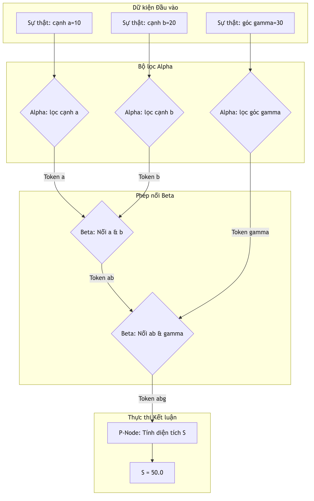

# Kiểm chứng thực tế trên bài toán hình học

Chương này trình bày kịch bản mô phỏng để đánh giá độ chính xác và hiệu năng của bộ máy suy luận Rete trong hệ quản trị KBMS. Kịch bản được thiết kế dựa trên một bài toán hình học cụ thể, minh họa tiến trình nạp dữ kiện và nội suy tri thức.

## 4.7.7. Kịch bản Tri thức Hình học

Xét một luật tính toán diện tích tam giác:
*"Nếu có cạnh a, cạnh b và góc gamma, diện tích được tính bằng biểu thức: $S = 0.5 \times a \times b \times \sin(\gamma)$."*

Trong hệ thống, tri thức này được chuyển thành cấu trúc đồ thị Rete:
-   **Các nốt Alpha**: Lọc dữ kiện về độ dài các cạnh a, b và số đo góc gamma.
-   **Các nốt Beta**: Lần lượt kết nối các dữ kiện a với b, sau đó kết quả đó được nối tiếp với gamma.
-   **Nốt P-Node**: Tính toán biểu thức diện tích và cập nhật kết quả mới vào cơ sở tri thức.

## 4.7.8. Nhật ký Suy luận và Kết quả Thử nghiệm

Dưới đây là tiến trình lan truyền dữ kiện thực tế khi người dùng nạp thông tin vào hệ thống. Sơ đồ minh họa luồng kích hoạt các nốt trong mạng Rete cho kịch bản giải tam giác:

*Hình 4.27: Luồng kích hoạt nốt và lan truyền dữ kiện trong kịch bản giải diện tích tam giác.*

Bảng nhật ký dưới đây mô tả chi tiết trạng thái của hệ thống qua từng bước nạp dữ kiện (Fact Injection):

| Bước | Sự kiện nạp dữ kiện | Nốt mạng kích hoạt | Trạng thái Token | Kết quả / Hành động |
| :--- | :--- | :--- | :--- | :--- |
| **1** | Nhập cạnh a = 10 | `Alpha(a)` | `[a:10]` | Lưu vào Alpha Memory(a) |
| **2** | Nhập cạnh b = 20 | `Alpha(b)`, `Beta(a,b)` | `[a:10, b:20]` | Khớp thành công, lưu vào Beta Memory(ab) |
| **3** | Nhập góc gamma = 30 | `Alpha(g)`, `Beta(ab,g)` | `[a:10, b:20, g:30]` | Khớp toàn bộ điều kiện giả thuyết |
| **4** | Kích hoạt luật dẫn | `P-Node (Area)` | `[S = 0.5*10*20*sin(30)]` | Tính toán giá trị S = 50.0 |
| **5** | Cập nhật tri thức | `Agenda/Storage` | `Fact(S=50.0)` | Ghi sự thật mới vào cơ sở tri thức |

## 4.7.9. Đánh giá Độ chính xác và Hiệu năng

Hệ thống cho thấy độ chính xác tuyệt đối trong việc thực hiện các phép suy luận đa bước. Việc tích hợp các bộ giải toán chuyên sâu giúp KBMS xử lý các biểu thức toán học phức tạp mà không gặp sai số lớn.

Nhờ việc áp dụng đồ thị nốt Rete, thời gian so khớp đã được tối ưu hóa đáng kể. Hệ thống chỉ mất một khoảng thời gian rất ngắn để thu được kết quả suy luận khi có dữ kiện mới, đáp ứng tốt yêu cầu của các bài toán tri thức thời gian thực:

-   **Thời gian nạp dữ kiện**: ~0.05ms mỗi lần Inject.
-   **Thời gian lan truyền Beta**: ~0.12ms (khớp gia tăng).
-   **Thời gian tính toán P-Node**: ~0.25ms (bao gồm giải toán số).
-   **Tổng thời gian phản hồi**: < 1ms cho một chu kỳ suy diễn hoàn chỉnh.
