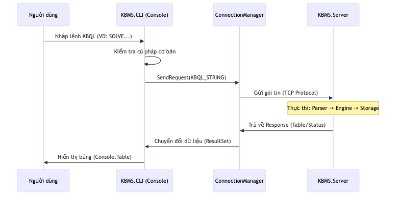

# Luồng Xử lý và Phân tích Phản hồi của CLI

Giao diện dòng lệnh (CLI) thực thi chu trình điều phối dữ liệu khép kín, từ giai đoạn thu thập dữ liệu đầu vào tới giai đoạn truyền tải nhị phân và kết xuất kết quả trực quan cho người dùng cuối.

## 1. Chu trình Truyền nhận và Điều phối Lệnh

Khi người dùng thực thi một câu lệnh, CLI thực hiện quy trình nội suy chuẩn hóa theo các giai đoạn sau:

*Hình 4.29: Sơ đồ tuần tự mô tả luồng xử lý câu lệnh và phản hồi từ Server của CLI.*

1.  **Đệm Dữ liệu Đầu vào (Input Buffering)**: Hệ thống thực hiện tích lũy các dòng nội dung cho đến khi tiếp nhận ký hiệu kết thúc câu lệnh (dấu `;`).
2.  **Kiến tạo Gói tin (Request Construction)**: Đóng gói nội dung lệnh thành cấu trúc `Message` nhị phân theo định dạng `QUERY` hoặc `LOGIN` phù hợp với tầng mạng.
3.  **Truyền tải Nhị phân (Binary Transport)**: Gửi gói tin qua Socket (`KBMS.Network`) và duy trì trạng thái chờ đợi phản hồi bất đồng bộ từ máy chủ.

## 2. Bộ máy Phân tích và Kết xuất Phản hồi

Thành phần trọng yếu nhất của CLI nằm ở lớp `ResponseParser.cs`. Do kết quả từ máy chủ có thể là một luồng dữ liệu liên tục (**Streaming Rows**), CLI phải thực hiện xử lý tách biệt từng khung tin nhị phân:

-   **Siêu dữ liệu (METADATA)**: Xác lập định nghĩa các cột dữ liệu (bao gồm tên và kiểu dữ liệu).
-   **Dữ liệu Bản ghi (ROW)**: Chứa dữ liệu thực tế cho từng thực thể tri thức trong tập kết quả.
-   **Kết quả Tổng quát (RESULT)**: Các thông báo xác nhận trạng thái thực thi thành công.
-   **Thông báo Lỗi (ERROR)**: Chứa thông tin chẩn đoán bao gồm nội dung lỗi và tọa độ phát sinh sai lệch (Dòng, Cột).

### Quy trình Hiển thị Bảng Dữ liệu Động

Lớp `ResponseParser` thực hiện vẽ biểu đồ bảng theo thuật toán tối ưu hóa không gian:

1.  **Dựng khung Tiêu đề (Header Rendering)**: Ngay khi tiếp nhận Siêu dữ liệu, CLI tính toán độ rộng cột lớn nhất dựa trên tên thuộc tính để thiết lập khung tiêu đề chuẩn hóa.
2.  **Hỗ trợ Ô dữ liệu đa dòng**: Nếu giá trị trong một ô chứa ký hiệu xuống dòng, hệ thống tự động phân tách và vẽ đường kẻ phân cách hàng để đảm bảo tính mỹ thuật và cân đối của bảng dữ liệu.
3.  **Chuyển đổi Chế độ Hiển thị**: Đối với các phản hồi thuộc nhóm `EXPLAIN` hoặc `DESCRIBE`, hệ thống tự động chuyển sang chế độ hiển thị theo cặp thuộc tính - giá trị trên từng hàng dọc để tối ưu hóa khả năng đọc.

## 3. Cơ chế Thực thi Hàng loạt và Quản lý Luồng

CLI hỗ trợ thực thi khối lượng lớn lệnh thông qua tệp tin kịch bản tri thức. Luồng xử lý được thực hiện tuần tự nhằm đảm bảo tính nhất quán của mạng lưới tri thức hệ thống.

Để duy trì trạng thái vận hành ổn định, CLI thực thi hai luồng xử lý đồng thời:
-   **Luồng Chính (Main Thread)**: Chịu trách nhiệm tương tác và tiếp nhận dữ liệu đầu vào từ người dùng.
-   **Luồng Giám sát (Heartbeat Thread)**: Duy trì tín hiệu định kỳ tới máy chủ để đảm bảo kết nối không bị ngắt quãng do các chính sách về thời gian chờ (Timeout).
