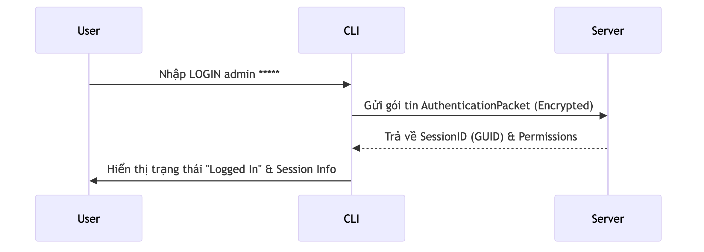
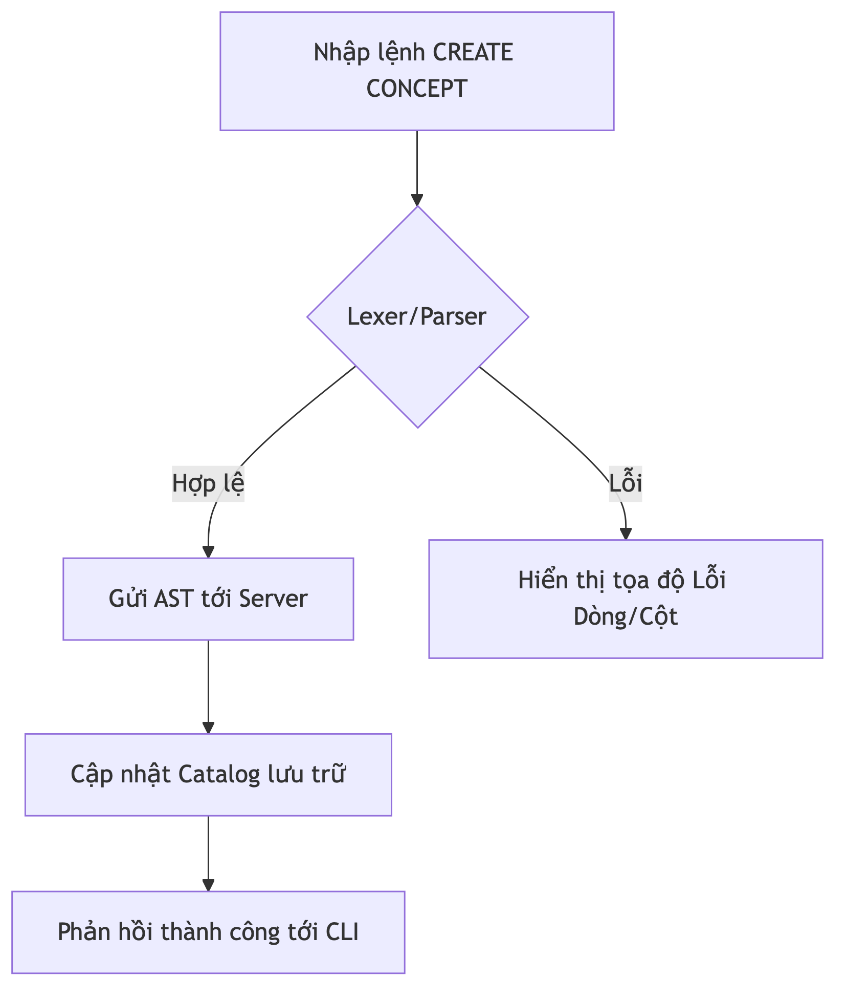
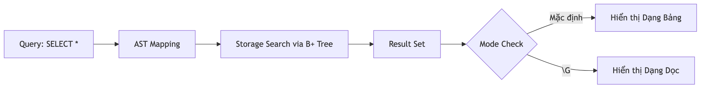
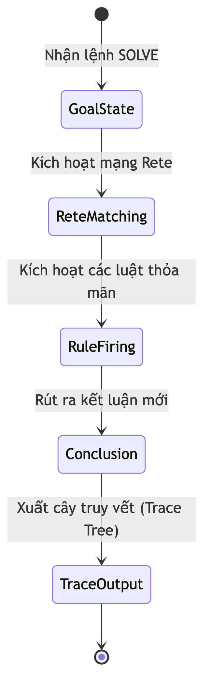
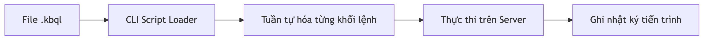

# Các Kịch bản Sử dụng CLI

Chương này trình bày các tình huống sử dụng thực tế của phân hệ CLI, minh họa quy trình tương tác giữa người dùng và hệ thống thông qua các sơ đồ luồng dữ liệu.

## 1. Kịch bản 1: Đăng nhập và quản lý phiên

Đây là bước khởi đầu để thiết lập kết nối an toàn tới máy chủ.

*Hình 4.26: Luồng xác thực và thiết lập phiên làm việc trên CLI.*

-   **Mục tiêu**: Xác thực quyền truy cập của người dùng.
-   **Quy trình**: Người dùng cung cấp danh tính và mật khẩu; hệ thống thực hiện kiểm tra và cấp mã định danh phiên nếu thông tin hợp lệ.

## 2. Kịch bản 2: Thiết kế cấu trúc tri thức

Sử dụng CLI để định nghĩa các Khái niệm và Luật dẫn trong cơ sở tri thức.

*Hình 4.27: Quy trình xử lý câu lệnh định nghĩa cấu trúc.*

-   **Mục tiêu**: Xây dựng mô hình tri thức hình thức.
-   **Quy trình**: Nhập mã nguồn tri thức; CLI thực hiện gửi gói tin tới máy chủ để biên dịch và cập nhật vào bộ nhớ lưu trữ.

## 3. Kịch bản 3: Truy vấn và khai thác dữ liệu

Thực hiện các câu lệnh tìm kiếm dữ kiện và lựa chọn hình thức hiển thị kết quả.

*Hình 4.28: Quy trình truy vấn và điều phối hiển thị.*

-   **Mục tiêu**: Truy xuất các đối tượng tri thức có trong hệ thống.
-   **Quy trình**: Thực hiện câu lệnh truy vấn; người dùng có thể lựa chọn hiển thị dạng bảng hoặc dạng dọc tùy theo mã lệnh.

## 4. Kịch bản 4: Thực thi và truy vết suy luận

Sử dụng lệnh tìm kiếm lời giải và theo dõi các bước logic đã thực hiện.

*Hình 4.29: Chu trình xử lý suy luận và trích xuất cây truy vết.*

-   **Mục tiêu**: Giải quyết bài toán tri thức dựa trên các luật dẫn có sẵn.
-   **Quy trình**: Gửi yêu cầu giải quyết mục tiêu; hệ thống trả về kết luận kèm theo danh sách các bước logic đã kích hoạt.

## 5. Kịch bản 5: Xử lý tập lệnh hàng loạt

Thực thi các tệp tin kịch bản chứa tập hợp nhiều câu lệnh tri thức.

*Hình 4.30: Quy trình thực thi tập lệnh từ tệp tin nguồn.*

-   **Mục tiêu**: Tự động hóa quá trình nạp hoặc cập nhật tri thức quy mô lớn.
-   **Quy trình**: Chỉ định đường dẫn tới tệp tin nguồn; hệ thống thực hiện tuần tự các khối lệnh và báo cáo tiến độ.
