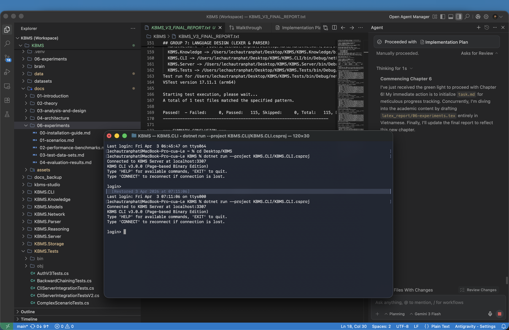
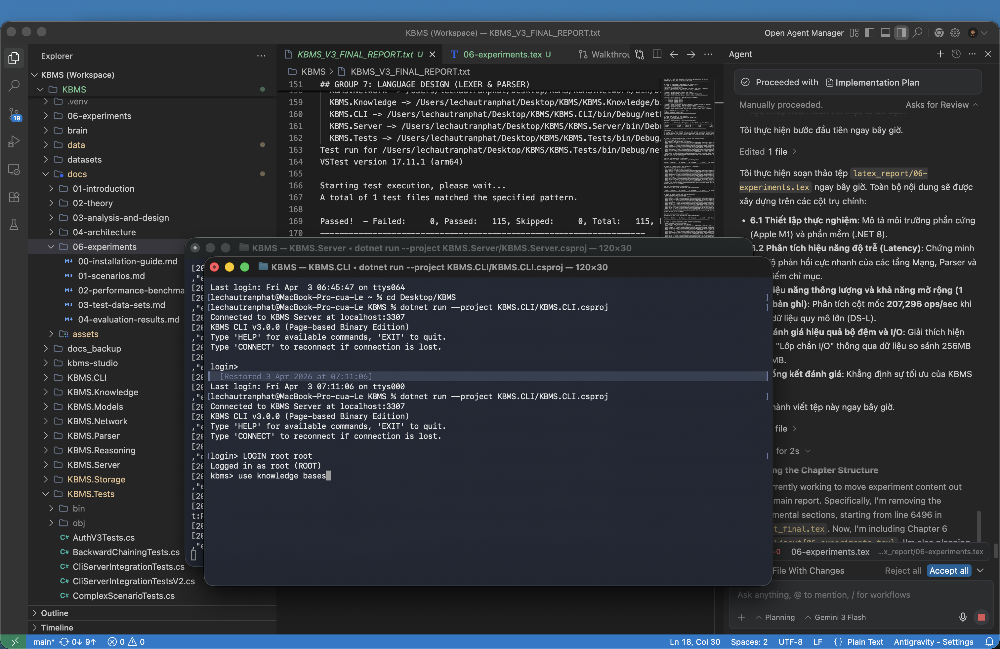
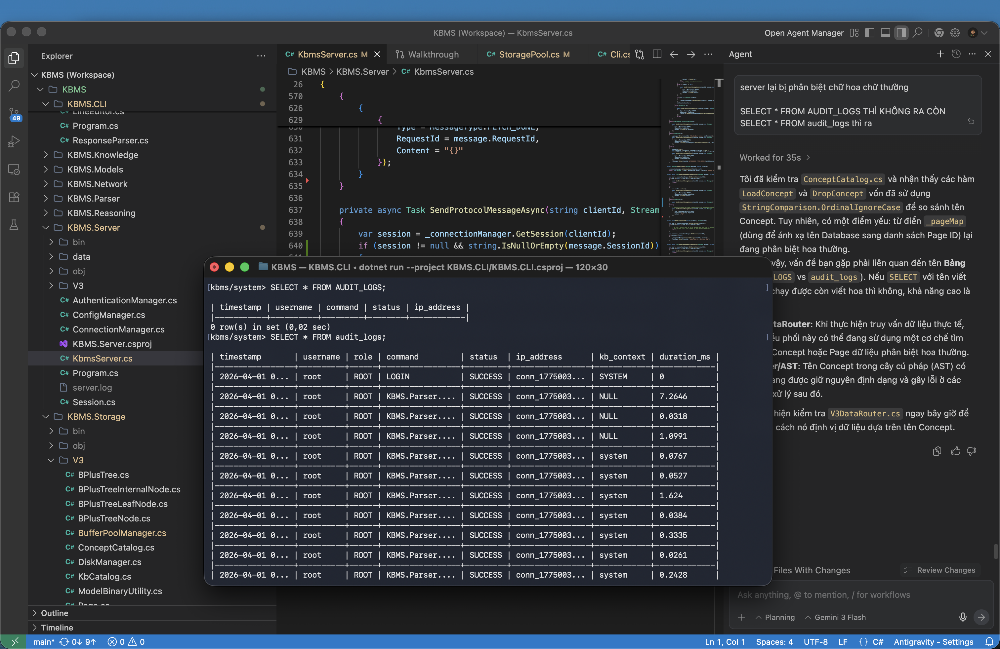
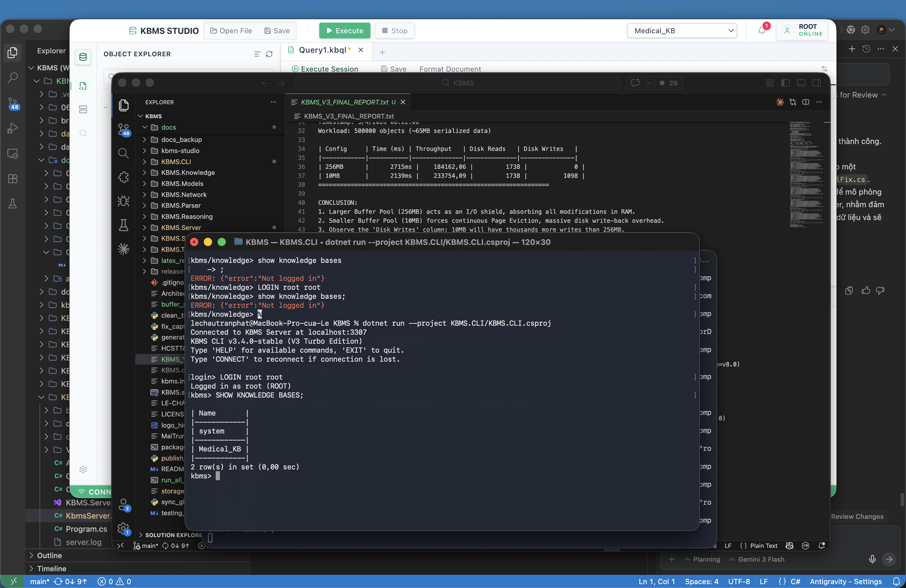

# Giao diện ứng dụng KBMS-CLI

Phân hệ giao diện dòng lệnh (**KBMS-CLI**) được thiết kế để cung cấp khả năng tương tác trực tiếp với máy chủ tri thức. Dưới đây là đặc tả chi tiết cho từng khu vực giao diện và các chế độ hoạt động chính:

## 1. Giao diện khởi tạo và thiết lập phiên

Đây là giao diện đầu tiên người dùng tiếp cận khi khởi động công cụ. Hệ thống cung cấp cơ chế đăng nhập bảo mật và xác lập kết nối nhị phân. Giao diện bao gồm:

*   **Dòng lệnh chào mừng**: Hiển thị phiên bản hệ thống và trạng thái sẵn sàng của bộ điều phối.
*   **Thanh nhập liệu Login**: Cho phép nhập danh tính và mật khẩu (mật khẩu được mã hóa và ẩn trên màn hình).
*   **Trạng thái kết nối**: Hiển thị địa chỉ IP máy chủ và mã định danh phiên làm việc đã được cấp.

Giao diện sử dụng tông màu tối tối giản, làm nổi bật các thông điệp trạng thái hệ thống.

*Hình 4.32: Giao diện khởi tạo và xác lập phiên làm việc trên console.*

## 2. Giao diện soạn thảo cấu trúc tri thức

Hỗ trợ chuyên gia tri thức định nghĩa các Khái niệm và Luật dẫn thông qua cơ chế nhập liệu đa dòng. Giao diện bao gồm:

*   **Con trỏ lệnh đa cấp**: Tự động chuyển đổi sang ký hiệu thụt đầu dòng khi phát hiện câu lệnh chưa kết thúc.
*   **Bảng định vị lỗi**: Khi phát sinh lỗi cú pháp, CLI chỉ ra chính xác vị trí dòng/cột kèm theo gợi ý sửa lỗi.
*   **Bộ nhớ lịch sử (History)**: Cho phép truy xuất nhanh các khối luật đã soạn thảo trước đó để tinh chỉnh.

Bố cục đơn giản, trực quan giúp việc xây dựng các luật logic phức tạp trở nên chính xác hơn.

*Hình 4.33: Giao diện soạn thảo và kiểm soát cú pháp tri thức.*

## 3. Giao diện truy vấn và kết xuất dữ liệu

Hiển thị kết quả khai thác tri thức dưới các hình thức chuẩn hóa. Giao diện bao gồm:

*   **Chế độ Bảng (Table Mode)**: Tự động căn chỉnh độ rộng cột dựa trên nội dung sự kiện tri thức.
*   **Chế độ Dọc (Vertical Mode)**: Kích hoạt thông qua mã lệnh đặc biệt để xem chi tiết từng thuộc tính trên các nốt tri thức phức hợp.
*   **Thanh trạng thái ResultSet**: Thông báo tổng số bản ghi tìm thấy và thời gian xử lý tại máy chủ.

Giao diện kết xuất theo phong cách các hệ quản trị cơ sở dữ liệu chuyên nghiệp, dễ dàng quan sát và đối soát.

*Hình 4.34: Các chế độ hiển thị kết quả truy vấn tri thức trên console.*

## 4. Giao diện truy vết và giải thuật suy luận

Hiển thị quy trình tư duy của hệ thống khi giải quyết một mục tiêu tri thức. Giao diện bao gồm:

*   **Cây truy vết logic (Trace Tree)**: Cấu trúc phân cấp các luật đã kích hoạt để dẫn tới kết luận.
*   **Danh sách sự kiện nguồn**: Hiển thị các dữ kiện cơ bản đã được máy sử dụng làm tiền đề.
*   **Kết luận cuối cùng**: Hiển thị rõ ràng trạng thái mục tiêu (Thành công/Thất bại) và giá trị tìm được.

Giao diện cung cấp cái nhìn minh bạch về quy trình xử lý bên trong của công cụ suy diễn.

*Hình 4.35: Kết quả thực thi solver và trích xuất tiến trình suy luận.*
