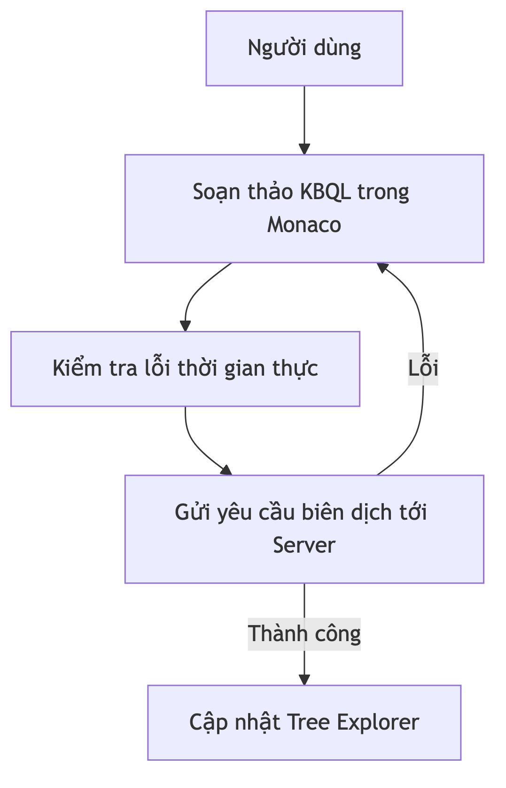
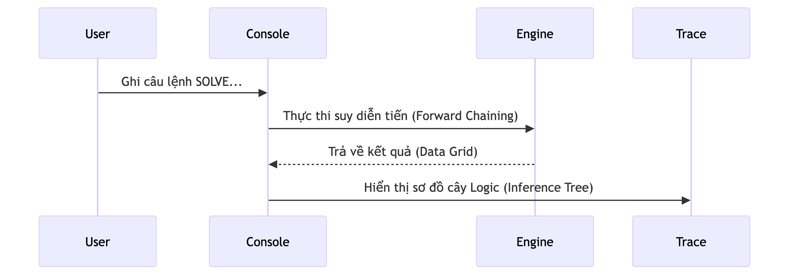
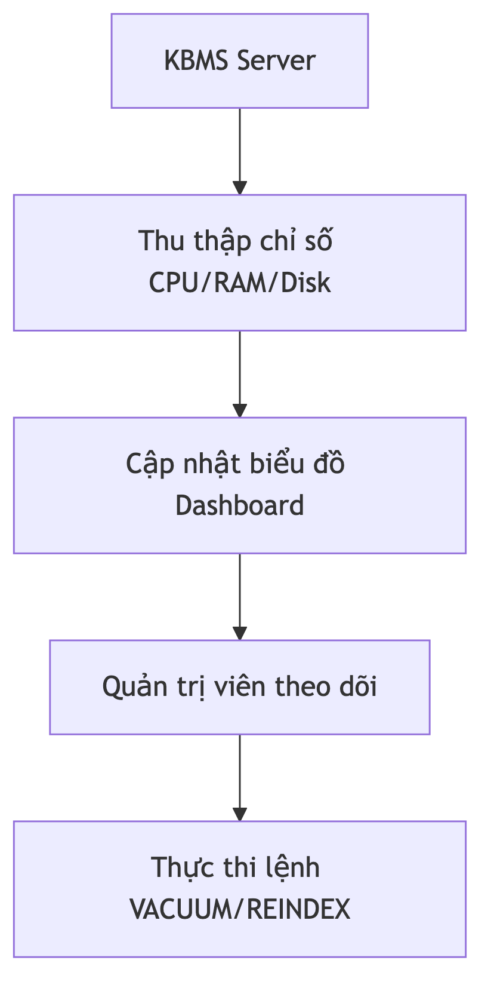

# Các Kịch bản Sử dụng Studio

Chương này trình bày các tình huống sử dụng thực tế của phân hệ Studio, minh họa quy trình tương tác phối hợp giữa các công cụ đồ họa thông qua các sơ đồ luồng dữ liệu.

## 1. Kịch bản 1: Thiết kế cấu trúc tri thức

Sử dụng trình thiết kế tri thức để xây dựng cấu trúc các Khái niệm và Luật dẫn.

*Hình 4.31: Quy trình soạn thảo và biên dịch tri thức trên giao diện Studio.*

-   **Mục tiêu**: Xây dựng mô hình tri thức hình thức thông qua giao diện đồ họa.
-   **Quy trình**: Người dùng thực hiện lệnh soạn thảo; hệ thống cung cấp các gợi ý cú pháp và phản hồi lỗi tức thời từ máy chủ.

## 2. Kịch bản 2: Giải quyết bài toán và truy vết suy luận

Tìm kiếm lời giải cho mục tiêu tri thức và theo dõi sơ đồ suy luận.

*Hình 4.32: Chu trình thực thi suy luận và hiển thị cây bước logic.*

-   **Mục tiêu**: Thực hiện các bài toán suy luận và minh bạch hóa quá trình giải quyết.
-   **Quy trình**: Nhập yêu cầu giải quyết mục tiêu; Studio hiển thị kết quả dưới dạng lưới dữ liệu và sơ đồ truy vết các bước logic đã thực hiện.

## 3. Kịch bản 3: Giám sát và bảo trì hệ thống

Theo dõi trạng thái vận hành và thực hiện các thao tác bảo trì cơ sở tri thức.

*Hình 4.33: Quy trình thu tập chỉ số và điều phối bảo trì.*

-   **Mục tiêu**: Đảm bảo trạng thái ổn định của hệ thống quản trị tri thức.
-   **Quy trình**: Theo dõi các biểu đồ tài nguyên trên giao diện; thực hiện các lệnh tối ưu hóa hoặc làm sạch dữ liệu khi cần thiết.
