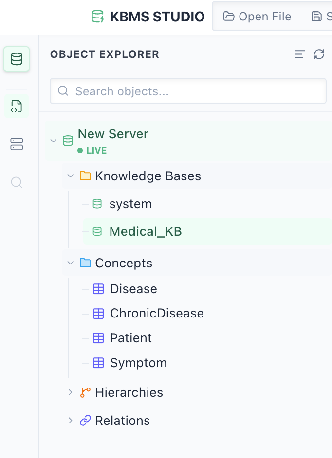
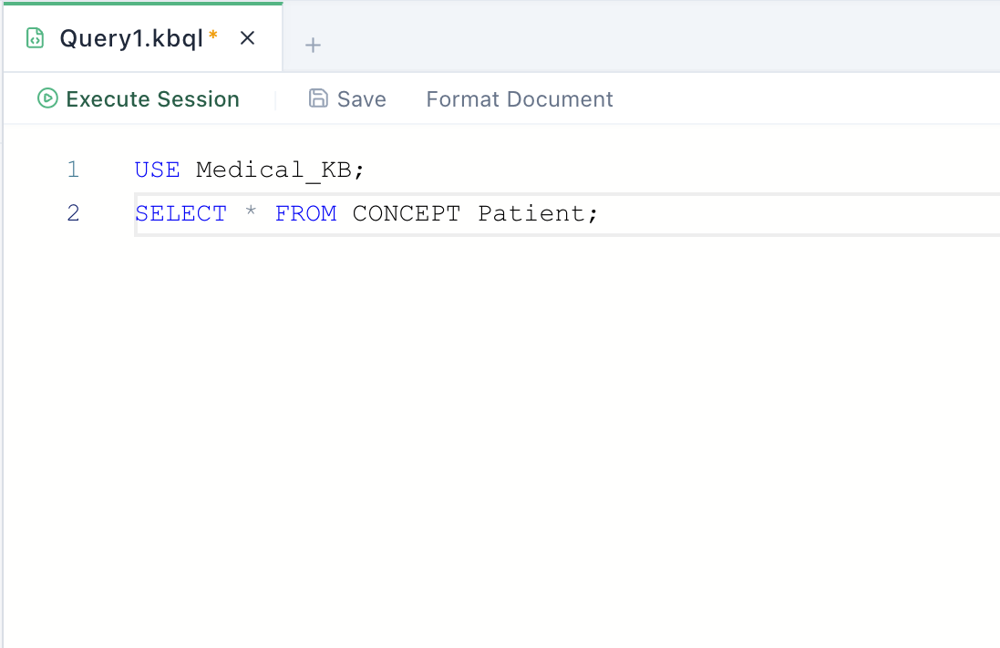
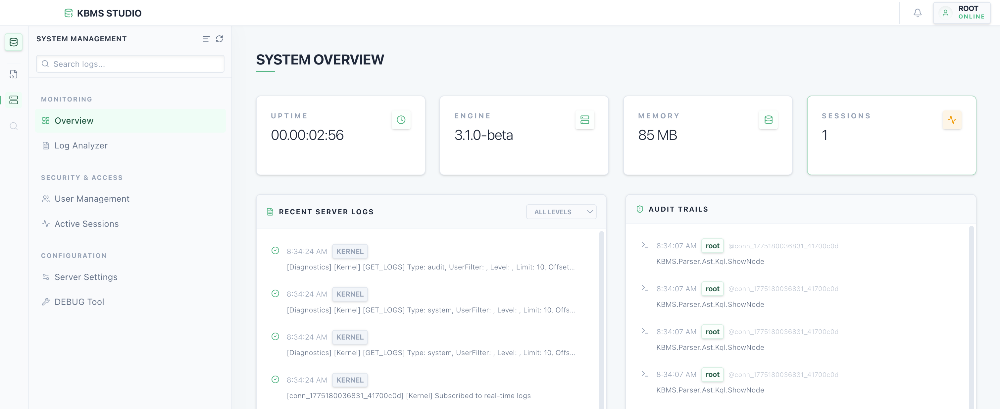
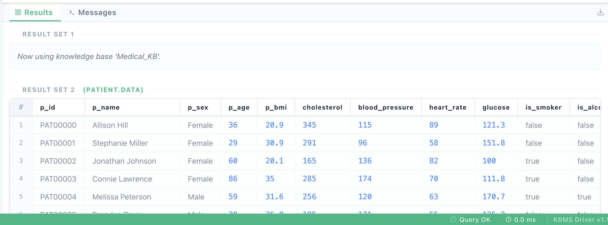

# Giao diện ứng dụng KBMS Studio

Phân hệ giao diện đồ họa (**KBMS Studio**) được thiết kế như một môi trường tích hợp (IDE) giúp tối ưu hóa quy trình quản trị và phát triển tri thức. Dưới đây là đặc tả chi tiết các khu vực chức năng chính của ứng dụng:

## 1. Giao diện quản lý dự án và phả hệ tri thức

Cung cấp cái nhìn tổng quát về cấu trúc tổ chức của cơ sở tri thức hiện hành. Giao diện bao gồm:

*   **Cây Explorer**: Hiển thị danh sách phân cấp của các Concepts, Relations và Rules. Người dùng có thể nhanh chóng định vị các đối tượng tri thức thông qua cấu trúc thư mục logic.
*   **Thanh điều hướng nhanh**: Cho phép chuyển đổi nhanh giữa các tập tin tri thức (`.kbql`) đang mở.
*   **Trình đơn ngữ cảnh**: Cung cấp các thao tác nhanh như tạo mới, xóa hoặc đổi tên các thực thể tri thức trực tiếp trên cây phả hệ.

Bố cục được sắp xếp khoa học ở phía bên trái màn hình, giúp chuyên gia tri thức luôn nắm bắt được quy mô của dự án.

*Hình 4.39: Giao diện quản lý cây phả hệ và điều phối tập tin tri thức.*

## 2. Giao diện soạn thảo mã nguồn tích hợp

Đây là khu vực tương tác trọng tâm dành cho việc định nghĩa tri thức hình thức. Giao diện bao gồm:

*   **Vùng soạn thảo Monaco**: Hỗ trợ tô màu cú pháp chuyên sâu cho ngôn ngữ KBQL, hiển thị số dòng và hỗ trợ thu gọn khối lệnh (Code Folding).
*   **Hệ thống IntelliSense**: Tự động gợi ý các từ khóa đặc quyền và tên các Khái niệm đã được định nghĩa, giúp tăng tốc độ soạn thảo và giảm sai sót.
*   **Chỉ báo lỗi trực tiếp**: Các lỗi biên dịch được gạch chân và hiển thị thông báo chi tiết khi di chuột qua, giúp hiệu chỉnh mã nguồn tức thời.

Giao diện sử dụng tông màu hiện đại, tối ưu cho việc làm việc cường độ cao với văn bản logic.

*Hình 4.40: Giao diện thiết kế tri thức với hỗ trợ cú pháp và kiểm lỗi.*

## 3. Giao diện giám sát hiệu năng hệ thống

Cung cấp các thông số vận hành thời gian thực của máy chủ KBMS. Giao diện bao gồm:

*   **Biểu đồ tài nguyên**: Trực quan hóa mức độ chiếm dụng CPU và RAM theo thời gian.
*   **Chỉ số Disk I/O**: Giám sát tốc độ đọc/ghi dữ liệu vào tệp tin cơ sở tri thức, hỗ trợ phát hiện các điểm nghẽn hiệu năng.
*   **Trạng thái Kết nối**: Hiển thị số lượng phiên làm việc đang hoạt động và băng thông đang sử dụng.

Giao diện Dashboard giúp quản trị viên chủ động trong việc duy trì độ ổn định của hạ tầng tri thức.

*Hình 4.41: Giao diện Dashboard giám sát sức khỏe và hiệu năng máy chủ.*

## 4. Giao diện thực thi và trực quan hóa kết quả

Khu vực hiển thị phản hồi từ máy chủ sau khi thực thi các yêu cầu tri thức. Giao diện bao gồm:

*   **Data Grid tương tác**: Kết quả truy vấn sự kiện được trình bày dưới dạng lưới dữ liệu, hỗ trợ sắp xếp và lọc trực tiếp trên các cột.
*   **Bảng điều khiển Trace**: Hiển thị sơ đồ cây các bước suy luận dành riêng cho lệnh `SOLVE`, giúp giải thích tường tận cách máy rút ra kết luận.
*   **Console Log**: Ghi nhận lịch sử các gói tin nhị phân đã trao đổi, phục vụ mục đích chẩn đoán hệ thống.

Giao diện đảm bảo tính minh bạch và dễ hiểu cho các kết quả trả về từ bộ máy suy diễn.

*Hình 4.42: Giao diện hiển thị kết quả và trực quan hóa tiến trình suy cứu.*
