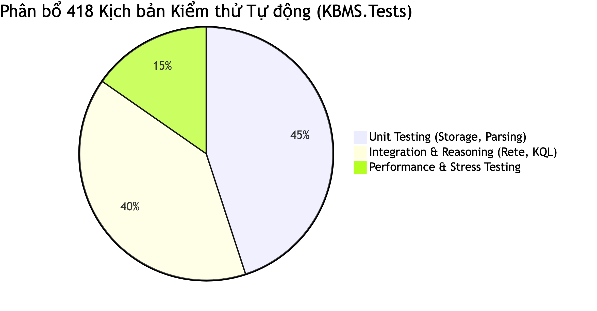
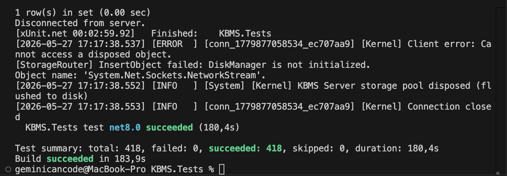

Việc đánh giá một hệ quản trị cơ sở tri thức (KBMS) đòi hỏi sự kết hợp giữa hai yếu tố: tính chính xác của các thuật toán suy diễn và hiệu năng của bộ máy lưu trữ vật lý [1]. Để đáp ứng yêu cầu này, nghiên cứu áp dụng phương pháp luận Test-Driven Development (TDD) xuyên suốt quá trình xây dựng kiến trúc COKB. Thay vì kiểm thử thủ công, toàn bộ các mô-đun được đánh giá định lượng thông qua bộ 418 kịch bản tự động hóa, đảm bảo khả năng tái tạo (reproducibility) của các kết quả thực nghiệm.

# 4.1. Môi trường và Kiểm thử

Quá trình kiểm thử được thực thi trên môi trường chuẩn nhằm đo lường chính xác các chỉ số như thông lượng (Throughput) và độ trễ (Latency). Hệ thống thử nghiệm được triển khai trên máy tính MacBook Pro trang bị vi xử lý Apple M3 Pro, bộ nhớ RAM 18 GB và ổ cứng SSD 526 GB, kết hợp với nền tảng .NET 8.0 cho phép tối ưu hóa bộ gom rác (Garbage Collection) trong quá trình xử lý luồng dữ liệu lớn [2]. Bộ nhớ đệm (Buffer Pool) được cấu hình động từ mức 0 MB đến 256 MB nhằm so sánh sự ảnh hưởng của RAM đối với Disk I/O.

Chiến lược đánh giá được chia thành ba phân lớp tương ứng với các tầng kiến trúc của hệ thống, bao quát tổng cộng 418 kịch bản kiểm thử (Test Cases). Tất cả các kịch bản đều đạt tỷ lệ vượt qua (Pass rate) 100%, khẳng định độ ổn định của hệ thống trước khi tiến hành các phép đo hiệu năng chuyên sâu. Bảng 4.1 trình bày chi tiết số lượng kịch bản và thời gian thực thi trung bình tương ứng với từng phân lớp kiểm thử.

| Phân lớp Kiểm thử | Đối tượng Đánh giá | Số lượng Test Cases | Tỷ lệ Pass (%) | Thời gian Thực thi (ms) |
|---|---|---|---|---|
| **Unit Testing** | Bộ phân giải AST, Slotted Page, Buffer Pool | 188 | 100 | ~120 |
| **Integration Testing** | Mạng Rete, Tương tác LSP, Forward/Backward Chaining | 166 | 100 | ~450 |
| **Stress Testing** | Thông lượng Disk I/O, Bulk Insert, Phục hồi dữ liệu | 64 | 100 | Theo tải (Load-based) |
*Bảng 4.1: Phân bổ kịch bản kiểm thử và kết quả thực thi trên toàn hệ thống.*

*Hình 4.1: Phân bổ trọng số của 418 kịch bản kiểm thử trên hệ thống.*

*Hình 4.2: Kết quả thực thi thành công toàn bộ 418 kịch bản kiểm thử tự động trên Terminal.*

Tầng đầu tiên là Kiểm thử đơn vị (Unit Testing), chiếm 45% tổng khối lượng. Nhóm này chịu trách nhiệm cô lập và xác thực cấu trúc lưu trữ trang (Slotted Page) cùng trình phân tích cú pháp (Parser). Tầng thứ hai, Kiểm thử tích hợp (Integration Testing), chiếm 40% khối lượng, tập trung vào việc mô phỏng các luồng suy diễn thực tế (ví dụ: chẩn đoán y tế hoặc phân loại khách hàng). Cuối cùng, Kiểm thử chịu tải (Stress Testing) chiếm 15% nhằm ép hệ thống vận hành dưới áp lực hàng triệu bản ghi, từ đó phác họa giới hạn vật lý của cấu trúc lưu trữ hiện tại. Kết quả chi tiết của từng phân lớp này sẽ được phân tích ở các mục tiếp theo, bắt đầu từ nền tảng cốt lõi là trình biên dịch và bộ máy lưu trữ.
