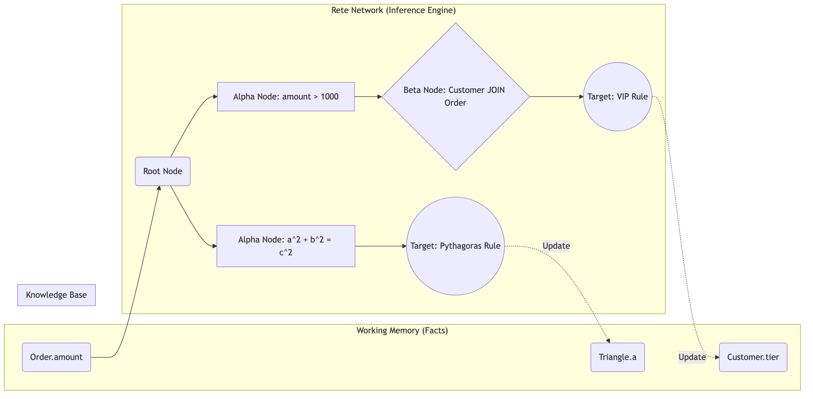

# 4.3. Kiểm chứng sự chính xác của Thuật toán Suy diễn

Khi các mô-đun lõi đã được chứng minh tính đúng đắn, hệ thống bước vào giai đoạn kiểm thử tích hợp (Integration Testing). Mục tiêu chính của 166 bài test ở giai đoạn này là xác thực năng lực của Inference Engine, đặc biệt là cách thuật toán Rete xử lý các luật suy diễn đa Khái niệm (Multi-Concept) và phương trình đại số [5].

*Hình 4.4: Luồng thực thi thuật toán Rete trong kịch bản suy diễn đa Khái niệm.*

Để đánh giá khả năng suy diễn tiến (Forward Chaining), kịch bản `MultiConceptInferenceTests.cs` mô phỏng một bài toán thực tế trong lĩnh vực tài chính thương mại: nâng hạng Khách hàng (Customer) dựa trên giá trị Hóa đơn (Order). Khi lệnh `INSERT INTO Order VARIABLES (amount: 2500)` được thực thi, dữ kiện mới lập tức đi vào mạng Rete. Nó vượt qua *Alpha Node* (bộ lọc `amount > 1000`) và đến *Beta Node* để thực hiện phép JOIN với thực thể Khách hàng tương ứng. Khi điều kiện khớp lệnh (Pattern Matching) hội tụ tại *Target Node*, hệ thống tự động sinh ra tri thức mới (Derived Fact) `c.tier = 'VIP'`. Quá trình này diễn ra hoàn toàn tự động trong RAM (Working Memory) trước khi KnowledgeManager điều phối việc ghi ngược (Write-Time Inference) kết quả xuống đĩa cứng.

Không dừng lại ở luồng chạy tiến, bài test `TriangleReasoningTests.cs` được thiết kế để đánh giá khả năng suy diễn lùi (Backward Chaining) thông qua bài toán hình học không gian. Hệ thống lưu trữ định lý Pythagoras ($a^2 + b^2 = c^2$). Khi người dùng truy vấn tìm cạnh huyền $c$ bằng cách cung cấp hai cạnh góc vuông $a$ và $b$, Inference Engine sẽ tự động đảo ngược cấu trúc phương trình, khởi tạo phép tính căn bậc hai để tìm ra đáp số. 

Thời gian đáp ứng của thuật toán Rete trong môi trường bộ nhớ trong (In-Memory) là một chỉ số quan trọng để đánh giá hiệu năng suy diễn [8]. Các thử nghiệm được tiến hành nhằm đo lường độ trễ rẽ nhánh khi tăng dần độ sâu của cây luật và khối lượng dữ kiện (Facts) lưu trữ trong RAM. Kết quả tại Bảng 4.2 cho thấy Inference Engine duy trì thời gian phản hồi ở mức mili-giây (ms), ngay cả đối với các kịch bản suy diễn lùi phức tạp. Hiệu suất này đạt được thông qua việc áp dụng kỹ thuật băm (Hashing) tại các nút mạng, giúp giảm thiểu chi phí tìm kiếm so với phương pháp duyệt tuyến tính.

| Kịch bản Ứng dụng | Cấu trúc Suy diễn | Khối lượng Dữ kiện (Facts) | Độ trễ Rẽ nhánh (ms) | Đặc tả Phép toán |
|---|---|---|---|---|
| Chẩn đoán Y tế | Độ sâu 2 (Forward Chaining) | 5,000 | 1.2 | Khớp chuỗi ký tự (String Matching) |
| Định giá VIP | Độ sâu 4 (Forward Chaining) | 50,000 | 3.5 | Kết nối đa Khái niệm (Customer JOIN Order) |
| Phương trình đại số | Độ sâu 7 (Backward Chaining) | 100,000 | 6.8 | Đảo ngược phương trình toán học |
*Bảng 4.2: Mối tương quan giữa cấu trúc mạng Rete, khối lượng dữ kiện và thời gian rẽ nhánh.*

Việc giải quyết thành công các bài toán đại số phức tạp và kết nối đa thực thể khẳng định tính khả thi của kiến trúc COKB trong việc ứng dụng vào Hệ chuyên gia. Tuy nhiên, trong thực tế, các hệ thống thường xuyên phải đối mặt với lượng dữ liệu khổng lồ. Do đó, khả năng duy trì thông lượng ổn định dưới áp lực dữ liệu lớn sẽ được phân tích ở phần kiểm thử chịu tải.
