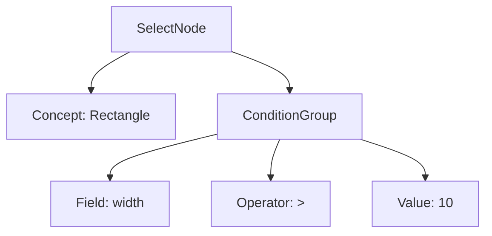

# Bộ Biên Dịch KBQL (Parser & Lexer Architecture)

Bộ biên dịch của KBMS v1.0 đóng vai trò là "cửa ngõ" trung tâm, có nhiệm vụ chuyển đổi các câu lệnh văn bản thô (KBQL) thành cấu trúc dữ liệu mà máy tính có thể hiểu và thực thi được.

## 1. Trình Phân Tích Từ Vựng (Lexer)
Lexer là bước đầu tiên trong quá trình biên dịch. Nhiệm vụ của nó là đọc luồng ký tự và nhóm chúng thành các **Token** có ý nghĩa.

- **Tokenization**: Chia câu lệnh thành các phần: `Keyword` (SELECT, CREATE), `Identifier` (Rectangle, width), `Literal` (3.14, 'Red'), và `Symbol` ( ( , ) , ; ).
- **Block Identification**: Lexer của KBMS 1.0 được tối ưu đặc biệt để nhận diện các khối ngoặc tròn lồng nhau `()`, nền tảng cho cú pháp **Block-Centric** của hệ thống.
- **Xử lý đa dòng**: Hỗ trợ tích lũy câu lệnh từ CLI cho đến khi gặp dấu chấm phẩy (`;`).

## 2. Trình Phân Tích Cú Pháp (Parser)
Parser nhận danh sách Token từ Lexer và xây dựng một **Cây Cú Pháp Trừu Tượng (Abstract Syntax Tree - AST)**.

### 2.1. Cấu trúc 6 Nhánh Ngôn ngữ
Parser của KBMS được tổ chức theo 6 module xử lý chuyên biệt:
1.  **KDL (Knowledge Definition)**: Xử lý định nghĩa Concept, Trigger, Index.
2.  **KML (Knowledge Manipulation)**: Xử lý Insert, Update, Delete, Import, Export.
3.  **KQL (Knowledge Query)**: Xử lý Select, Solve, Describe.
4.  **TCL (Transaction Control)**: Xử lý Begin, Commit, Rollback.
5.  **KCL (Knowledge Control)**: Xử lý Grant, Revoke, Create User.
6.  **KHL (Knowledge Help)**: Xử lý Explain, Maintenance.

### 2.2. Chiến lược Phân tích (Recursive Descent)
Hệ thống sử dụng kỹ thuật **Recursive Descent Parsing** (Phân tích từ trên xuống), giúp Parser dễ dàng mở rộng và cung cấp thông báo lỗi chi tiết (vị trí dòng, cột) khi cú pháp không hợp lệ.

## 3. Cấu Trúc Cây AST (Abstract Syntax Tree)
Ví dụ về cấu trúc cây AST cho câu lệnh `SELECT Rectangle WHERE width > 10`:

---

## 4. Xử Lý Lỗi (Error Handling)
KBMS 1.0 cung cấp hệ thống thông báo lỗi trực quan:
- **Lexical Error**: Khi gặp ký tự lạ hoặc chuỗi không đóng ngoặc.
- **Syntax Error**: Khi câu lệnh thiếu thành phần bắt buộc (ví dụ: `CREATE CONCEPT` mà không có `VARIABLES`).
- **Semantic Error**: Khi truy vấn vào một Concept chưa tồn tại hoặc sai quyền hạn.

---
*Parser & Lexer là thành phần quan trọng nhất giúp KBMS hỗ trợ các ngôn ngữ tri thức tính toán (COKB) phức tạp.*
