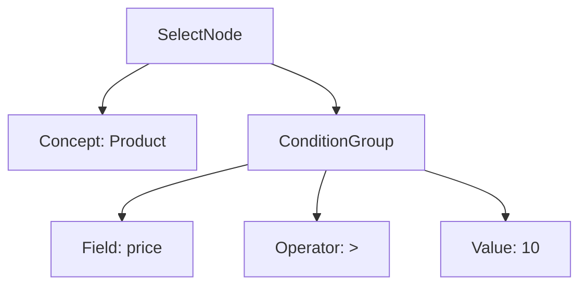

# Bộ Biên Dịch KBQL (Parser & Lexer Architecture)

Bộ biên dịch của KBMS v1.1 đóng vai trò là "cửa ngõ" trung tâm, có nhiệm vụ chuyển đổi các câu lệnh văn bản thô (KBQL) thành cấu trúc dữ liệu AST mà máy tính có thể thực thi được, hỗ trợ cả thực thi đơn lệnh và đa lệnh.

## 1. Trình Phân Tích Từ Vựng (Lexer)
Lexer là bước đầu tiên trong quá trình biên dịch. Nhiệm vụ của nó là đọc luồng ký tự và nhóm chúng thành các **Token** có ý nghĩa.

- **Tokenization**: Chia câu lệnh thành các phần: `Keyword` (SELECT, CREATE), `Identifier` (Rectangle, width), `Literal` (3.14, 100.00, 'Red'), và `Symbol` ( ( , ) , ; ).
- **Multi-statement Support**: Lexer nhận diện dấu chấm phẩy (`;`) như một dấu hiệu phân tách lệnh. Trong môi trường CLI, Lexer sẽ tích lũy các dòng cho đến khi gặp ít nhất một dấu `;` mới chuyển sang giai đoạn Parser.
- **Block Identification**: Lexer của KBMS được tối ưu đặc biệt để nhận diện các khối ngoặc tròn lồng nhau `()`, nền tảng cho cú pháp **Block-Centric** của hệ thống.

## 2. Trình Phân Tích Cú Pháp (Parser)
Parser nhận danh sách Token từ Lexer và xây dựng một **Cây Cú Pháp Trừu Tượng (Abstract Syntax Tree - AST)**.

### 2.1. Cấu trúc 6 Nhánh Ngôn ngữ
Parser của KBMS được tổ chức theo 6 module xử lý chuyên biệt:
1.  **KDL (Knowledge Definition)**: Xử lý định nghĩa Concept (hỗ trợ INT, DECIMAL, DOUBLE), Trigger, Index.
2.  **KML (Knowledge Manipulation)**: Xử lý `INSERT` (hỗ trợ cả gán tên và vị trí), Update, Delete, Import, Export.
3.  **KQL (Knowledge Query)**: Xử lý `SELECT` (hỗ trợ Metadata `system`, Subquery), `SOLVE`, `DESCRIBE`.
4.  **TCL (Transaction Control)**: Xử lý Begin, Commit, Rollback.
5.  **KCL (Knowledge Control)**: Xử lý Grant, Revoke, Create User.
6.  **KHL (Knowledge Help)**: Xử lý `EXPLAIN`, Maintenance.

### 2.2. Chiến lược Phân tích (Recursive Descent)
Hệ thống sử dụng kỹ thuật **Recursive Descent Parsing** (Phân tích từ trên xuống). Với v1.1, Parser được nâng cấp để trả về một **Danh sách các AST Nodes**, cho phép Server thực thi hàng loạt các câu lệnh một cách tuần tự.

## 3. Cấu Trúc Cây AST (Abstract Syntax Tree)
Ví dụ về cấu trúc cây AST cho câu lệnh `SELECT * FROM Product WHERE price > 10`:

---

## 4. Xử Lý Lỗi (Error Handling)
KBMS cung cấp hệ thống thông báo lỗi trực quan:
- **Lexical ERROR**: Khi gặp ký tự lạ hoặc chuỗi không kết thúc.
- **Syntax ERROR**: Khi câu lệnh thiếu thành phần bắt buộc. Đặc biệt trong v1.1, nếu một lệnh trong chuỗi đa lệnh bị lỗi, Parser sẽ báo lỗi ngay tại lệnh đó kèm vị trí dòng/cột chính xác để người dùng sửa chữa.

---
*Parser & Lexer của v1.1 được tối ưu hóa cho tốc độ và khả năng mở rộng ngôn ngữ KBQL trong tương lai.*
