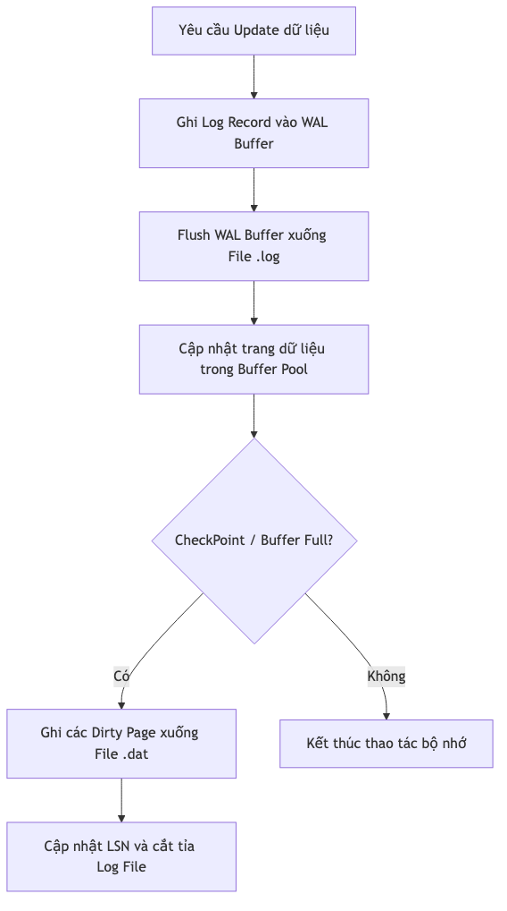

# Tổng quan về Cỗ máy Lưu trữ (Storage Engine)

Cỗ máy lưu trữ của KBMS (phiên bản V3) chịu trách nhiệm quản lý việc ghi dữ liệu tri thức xuống đĩa cứng một cách bền vững và truy xuất chúng với hiệu năng cao nhất.

## 1. Cấu trúc Trang (Page Structure)

KBMS chia file dữ liệu thành các đơn vị cố định gọi là **Page** (Trang), mặc định là **16KB**. Việc sử dụng kích thước trang cố định giúp tối ưu hóa việc đọc/ghi theo từng block của ổ cứng (HDD/SSD).

### Slotted Page Algorithm
Để lưu trữ các bản ghi (Tuples) có độ dài thay đổi, KBMS sử dụng thuật toán **Slotted Page**.
*   **Header:** Lưu trữ Metadata của trang (PageId, LSN, FreeSpacePointer).
*   **Slot Array:** Một mảng các "khe cắm" phát triển từ đầu trang về phía sau. Mỗi khe chứa `offset` (vị trí) và `length` (độ dài) của bản ghi.
*   **Tuples Data:** Dữ liệu thực tế được đẩy từ cuối trang ngược về phía trước.
*   **Ưu điểm:** Tận dụng tối đa không gian trống ở giữa trang mà không cần biết trước số lượng bản ghi.

---

## 2. Quản lý Bộ đệm (Buffer Pool Management)

Để giảm thiểu I/O (đọc/ghi file) chậm chạp, KBMS duy trì một vùng nhớ RAM gọi là **Buffer Pool**.

### Thuật toán LRU (Least Recently Used)
KBMS sử dụng chính sách thay thế LRU để quản lý các trang trong bộ đệm:
1.  **Pinning:** Khi một trang đang được sử dụng (để đọc hoặc ghi), nó được "Pin" (ghim). Trang đã bị ghim sẽ **không bao giờ** bị đẩy ra khỏi RAM.
2.  **Eviction (Trục xuất):** Khi Buffer Pool đầy và cần nạp trang mới, hệ thống sẽ chọn trang có `PinCount = 0` và thời gian truy cập xa nhất để loại bỏ.
3.  **Dirty Pages:** Nếu trang bị loại bỏ đã bị sửa đổi (`IsDirty = true`), hệ thống sẽ tự động thực hiện lệnh `Flush` để ghi nội dung xuống đĩa trước khi ghi đè trang mới vào frame đó.

---

## 3. Nhật ký ghi trước (Write-Ahead Logging - WAL)

Tất cả các thay đổi dữ liệu đều được ghi vào file Log trước khi được áp dụng vào file dữ liệu chính.

### Sơ đồ Luồng ghi WAL

*Hình: diagram_c2f1eb13.png*

*   **Mục tiêu:** Đảm bảo tính **Durability** (Độ bền vững). Nếu hệ thống bị sập nguồn đột ngột, KBMS sẽ đọc file log để tái tạo (Redo) lại các giao dịch chưa kịp ghi xuống đĩa.
*   **LSN (Log Sequence Number):** Mỗi bản ghi Log và mỗi trang dữ liệu đều có một số thứ tự LSN để đảm bảo tính tuần tự và kiểm tra phiên bản.

---

## 4. Định dạng Tệp tin

Hệ thống lưu trữ dưới các định dạng file tùy chỉnh:
*   `.kbf` (Knowledge Base File): Lưu trữ metadata và catalog của KB.
*   `.dat`: Lưu trữ dữ liệu thực tế của các Concept dưới dạng cây B+ Tree.
*   `.log`: Lưu trữ nhật ký WAL.
