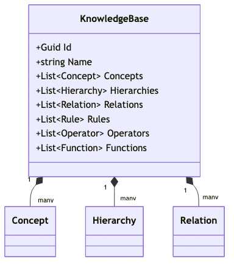
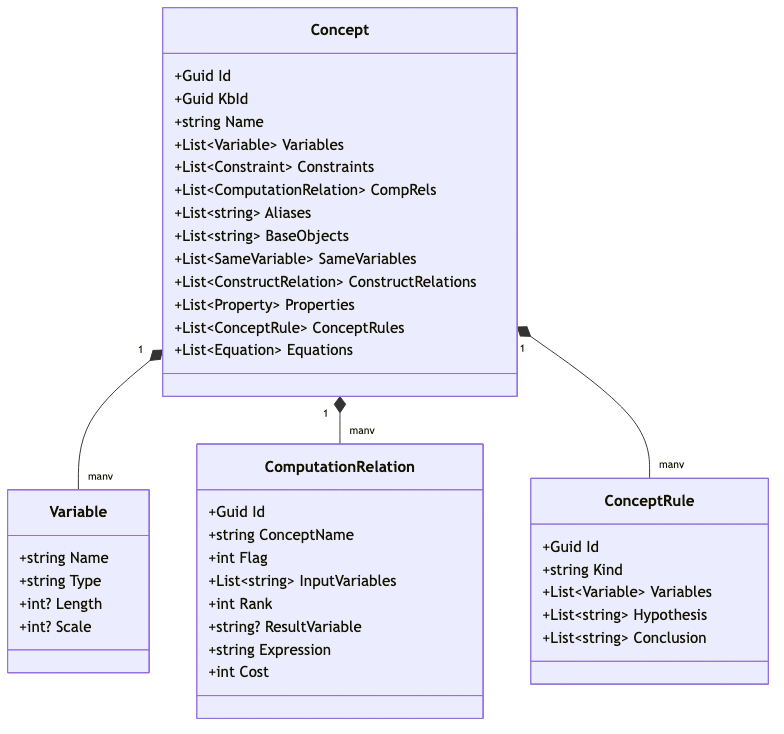
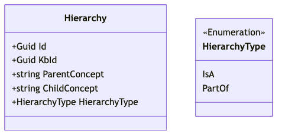
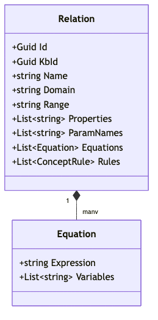
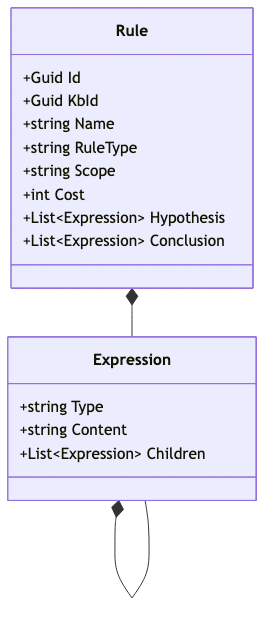
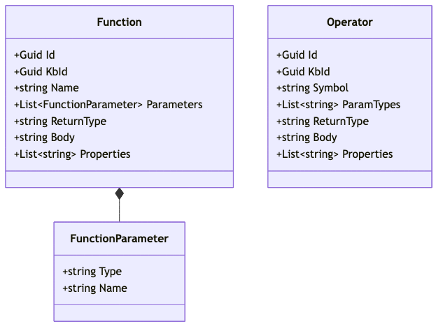
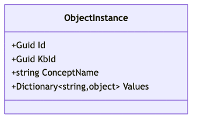

# 05. Định nghĩa Mô hình tri thức dạng COKB

Mô hình **COKB (Computational Objects Knowledge Base)** [1] là sự kết hợp giữa lập trình hướng đối tượng và logic toán học, cho phép biểu diễn các đối tượng có khả năng tự tính toán và suy diễn. Một hệ quản trị cơ sở tri thức KBMS V3 được xây dựng dựa trên cốt lõi là bộ 6 thành phần hình thức:

*Hình 5.1: Sơ đồ lớp mô tả cấu trúc thực thể của KnowledgeBase trong KBMS V3.*

$$COKB = (C, H, R, Ops, Funcs, Rules)$$

## 5.1. Thành phần C (Concepts - Tập các khái niệm)

Đây là thành phần quan trọng nhất, định nghĩa cấu trúc của các lớp đối tượng trong hệ thống. Mỗi khái niệm $c \in C$ được đặc tả bởi một bộ thành phần nội tại cực kỳ chi tiết:

*Hình 5.2: Sơ đồ lớp đặc tả cấu trúc nội tại phức hợp của một Concept.*

1.  **Variables (Biến)**: Tập các thuộc tính xác định đặc tính của đối tượng. Mỗi biến bao gồm `Name`, `Type`, `Length` và `Scale`.
2.  **Constraints (Ràng buộc)**: Các điều kiện logic (`Expression`) mà đối tượng phải thỏa mãn.
3.  **Equations (Phương trình)**: Các công thức toán học xác định mối liên hệ định lượng giữa các biến.
4.  **ComputationRelations (Quan hệ tính toán)**: Đặc tả khả năng tính toán của khái niệm thông qua `Rank`, `Flag` và `Cost`.
5.  **ConceptRules (Luật nội tại)**: Các luật dẫn cục bộ (`Hypothesis` -> `Conclusion`) chỉ có giá trị trong phạm vị khái niệm.
6.  **Cấu trúc mở rộng**: Bao gồm `Aliases` (Tên gọi khác), `BaseObjects` (Đối tượng cơ sở), `SameVariables` (Biến tương đương) và `ConstructRelations` (Quan hệ tạo lập).

## 5.2. Thành phần H (Hierarchy - Phân cấp tri thức)

Thành phần $H$ quản lý các mối quan hệ cấu trúc giữa các Concepts thông qua thực thể `Hierarchy`:

*Hình 5.3: Sơ đồ minh họa quan hệ Parent-Child thông qua HierarchyType.*

*   **ParentConcept & ChildConcept**: Xác định điểm đầu và điểm cuối của liên kết phân cấp.
*   **HierarchyType**: Bao gồm `IsA` (Kế thừa tri thức) và `PartOf` (Cấu trúc thành phần).

## 5.3. Thành phần R (Relations - Quan hệ ngữ nghĩa)

Quan hệ ngữ nghĩa $R$ trong KBMS V3 không chỉ là các liên kết tĩnh mà còn mang tính toán học và logic:

*Hình 5.4: Sơ đồ lớp đặc tả Relation với Domain, Range và tri thức nội tại.*

*   **Domain & Range**: Xác định miền xác định và miền giá trị của quan hệ.
*   **Properties**: Các tính chất của quan hệ như đối xứng, phản xạ, bắc cầu.
*   **Knowledge Integration**: Mỗi quan hệ có thể chứa `Equations` và `Rules` riêng để hỗ trợ suy diễn.

## 5.4. Thành phần Rules & Logic (Bộ máy suy diễn)

Bộ máy suy diễn sử dụng các luật dẫn toàn cục để tìm bao đóng tri thức. Mỗi `Rule` được cấu trúc chặt chẽ:

*Hình 5.5: Sơ đồ lớp đặc tả cấu trúc Rule và cấu trúc đệ quy Expression.*

*   **RuleType**: Phân loại luật (Deduction, Default, Constraint, Computation).
*   **Scope**: Phạm vi áp dụng của luật (tên Concept).
*   **Hypothesis & Conclusion**: Tập hợp các `Expression` (Biểu thức).
*   **Cấu trúc đệ quy Expression**: Mỗi biểu thức có thể chứa các biểu thức con (`Children`), cho phép biểu diễn các công thức logic và toán học có độ phức tạp bất kỳ.

## 5.5. Thành phần Ops & Funcs (Bộ máy thực thi)

Đây là các thành phần thực thi tính toán (Executable logic) của hệ thống:

*Hình 5.6: Sơ đồ lớp đặc tả thành phần Function và Operator.*

*   **Operators (Toán tử)**: Đặc tả qua `Symbol`, `ParamTypes` và `Body` thực thi.
*   **Functions (Hàm)**: Gồm tập `Parameters` (kiểu `FunctionParameter`), `ReturnType` và mã nguồn thực thi `Body`.

## 5.6. Thực thể Đối tượng (ObjectInstance)

Thực thể (**ObjectInstance**) là các thể hiện cụ thể mang giá trị thực tế của một Concept:

*Hình 5.7: Sơ đồ lớp đặc tả ObjectInstance và cơ chế lưu trữ giá trị Dictionary.*

*   **ConceptName**: Tên khái niệm mà thực thể thuộc về.
*   **Values**: Một `Dictionary<string, object>` lưu trữ tập hợp các cặp (Tên thuộc tính, Giá trị thực). Cơ chế này cho phép KBMS V3 quản lý dữ liệu đối tượng một cách linh hoạt và tối ưu bộ nhớ.

---

---

## 5.7. Ví dụ minh họa thực tế cho mô hình COKB

Để làm rõ các khái niệm lý thuyết trên, chúng ta xem xét một hệ tri thức về **Hình học phẳng (Geometry)** tập trung vào thực thể **Tam giác**.

### 5.7.1. Ví dụ về Concept (Khái niệm)
Định nghĩa khái niệm `TamGiac` trong KBMS:
- **Variables**: `a` (cạnh 1), `b` (cạnh 2), `c` (cạnh 3), `p` (nửa chu vi), `S` (diện tích).
- **Constraints**: $a + b > c, a + c > b, b + c > a$ (Điều kiện tồn tại tam giác).
- **Equations**: $p = (a + b + c) / 2$ và $S = \sqrt{p(p-a)(p-b)(p-c)}$ (Công thức Heron).

### 5.7.2. Ví dụ về Hierarchy (Phân cấp)
- **IsA**: `TamGiacVuong` là một `TamGiac` (Kế thừa toàn bộ biến và phương trình của `TamGiac` nhưng thêm ràng buộc $a^2 + b^2 = c^2$).
- **PartOf**: `Dinh` (Đỉnh) là một thành phần thuộc về `TamGiac`.

### 5.7.3. Ví dụ về Relation (Quan hệ)
- **Relation**: `DongDang(t1: TamGiac, t2: TamGiac)`
- **Properties**: Đối xứng (Symmetric), Bắc cầu (Transitive).
- **Inference logic**: Nếu $t1.a/t2.a = t1.b/t2.b = t1.c/t2.c$ thì $t1$ đồng dạng $t2$.

### 5.7.4. Ví dụ về Rule & Logic (Luật dẫn)
- **Rule**: `R1: TamGiac(a==b, b==c) -> TamGiac{Loai="Deu"}`
- **Ý nghĩa**: Nếu ba cạnh bằng nhau thì kết luận đây là tam giác đều.

### 5.7.5. Ví dụ về Ops & Funcs (Thực thi)
- **Function**: `Power(x, n)` - Tính lũy thừa $x^n$.
- **Operator**: `^` - Toán tử được định nghĩa bằng hàm `Power`.

### 5.7.6. Ví dụ về ObjectInstance (Thực thể)
Một thực thể cụ thể của `TamGiac` trong bộ nhớ RAM:
- **ID**: `550e8400-e29b-41d4-a716-446655440000`
- **Concept**: `TamGiac`
- **Values**: `{ "a": 3, "b": 4, "c": 5 }`

> [!TIP]
> Nhờ các phương trình đã định nghĩa ở mục 5.7.1, khi người dùng nạp vào bộ ba $(3, 4, 5)$, hệ thống sẽ tự động tính toán ra $p = 6$ và $S = 6$ thông qua bộ máy suy diễn.

---

> [!IMPORTANT]
> **Sự nhất quán (Consistency)**: Mọi thuộc tính và quan hệ được định nghĩa trong mô hình COKB đều được KBMS V3 kiểm soát kiểu liệu chặt chẽ thông qua cơ chế **True Typing**, đảm bảo tính toàn vẹn tri thức từ định nghĩa đến thực thể.

