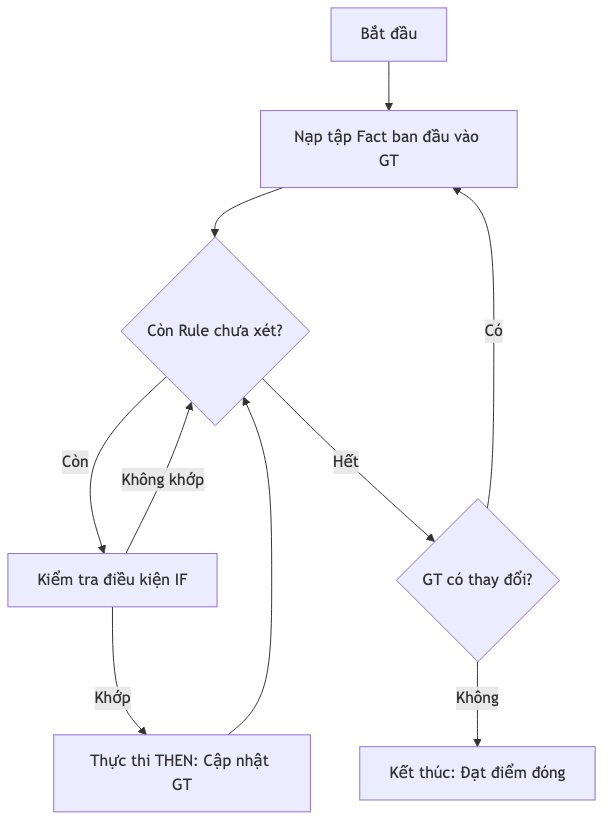
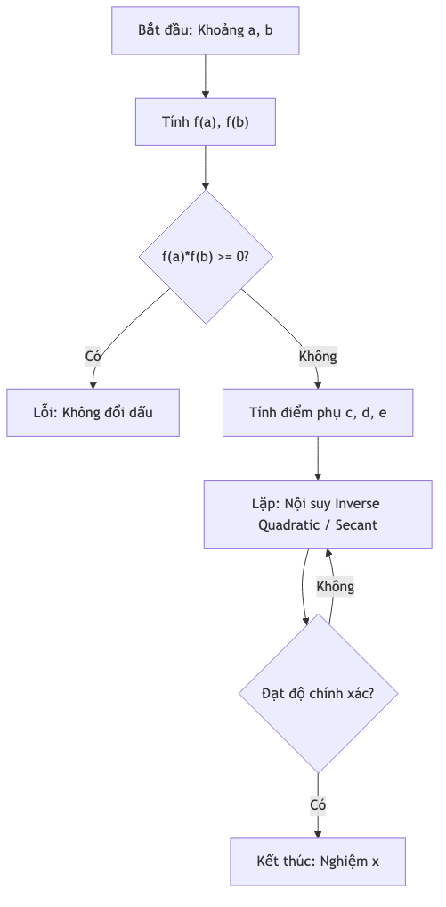
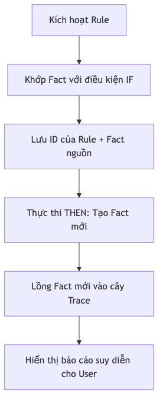

# Thuật toán Suy diễn & Giải phương trình

Bộ máy suy diễn KBMS (Inference Engine) chứa các thuật toán mạnh mẽ để xử lý các biểu thức logic và toán học nhằm tìm ra các giá trị mới từ dữ liệu hiện có.

## 1. Thuật toán Suy diễn Tiến (Forward Chaining - RC4)

Thuật toán chính được sử dụng để suy diễn từ sự kiện (Facts).

### Ý tưởng & Chi tiết
*   **GT (Ground Truth):** Tập hợp các Fact đã biết.
*   **KL (Knowledge List):** Tập hợp các mục tiêu (Goal) cần tìm (nếu có).
*   **Vòng lặp (Main Loop):**
    1.  Duyệt qua danh sách các Luật (Rules).
    2.  Kiểm tra điều kiện `IF` của luật bằng cách nạp giá trị từ tập GT.
    3.  Nếu `IF` đúng, thực thi phần `THEN` để gán giá trị mới cho biến hoặc thực hiện hành động (Action).
    4.  Nếu tập GT có thay đổi (có Fact mới), quay lại bước 1.
*   **Điều kiện dừng:** Khi không còn Fact nào mới được sinh ra trong một vòng lặp hoàn chỉnh (Đạt điểm đóng - Fixed-point / Closure).

### Sơ đồ Luồng Suy diễn (Forward Chaining)

*Hình: diagram_c32a847c.png*

---

## 2. Giải phương trình 1D (One-Dimensional Equation Solving - RC5)

KBMS có khả năng tìm giá trị của một biến chưa biết từ một phương trình toán học bất kỳ.

### Sơ đồ Thuật toán Brent (Brent's Method Flow)

*Hình: Sơ đồ Thuật toán Brent (Brent's Method Flow)*

---

---

## 3. Giải hệ phương trình 2D (Two-Dimensional Solving - RC5)

Sử dụng khi có 2 biến chưa biết và có ít nhất 2 phương trình liên quan đến chúng.

### Thuật toán: Newton-Raphson 2D
*   **Ý tưởng:** Sử dụng đạo hàm (Ma trận Jacobian) để tìm hướng di chuyển xấp xỉ nghiệm gần nhất.
*   **Các bước:**
    1.  Chọn một điểm khởi đầu (Initial guess).
    2.  Tính ma trận Jacobian $\mathbf{J}$ của hệ phương trình tại điểm đó.
    3.  Cập nhật điểm mới bằng công thức: $\mathbf{x}_{n+1} = \mathbf{x}_n - \mathbf{J}^{-1} \mathbf{F}(\mathbf{x}_n)$.
    4.  Lặp lại cho đến khi đạt độ hội tụ.
*   **Ứng dụng:** Giải các bài toán hình học phức tạp (như tìm giao điểm của hai đường tròn).

---

## 4. Phân cấp Tri thức (Hierarchy & Relations - RC8)

Xử lý kế thừa tri thức một cách đệ quy.

### Thuật toán: Effective Concept Generator
1.  Bắt đầu từ Concept mục tiêu.
2.  Tìm tất cả các Concept cha thông qua quan hệ **IS-A** (Kế thừa) và **PART-OF** (Thành phần).
3.  **Flattening:** Gộp tất cả các biến, luật và phương trình từ các Concept cha vào Concept mục tiêu.
4.  Lọc bỏ các thành phần trùng lặp (Overriding).
5.  Cuối cùng, chuyển "Concept hiệu quả" (Effective Concept) này vào bộ máy suy diễn linh hoạt.

---

## 5. Ràng buộc và Kiểm thử (Constraints & Verification)

Sau khi bộ máy suy diễn hoàn tất việc tính toán, bước cuối cùng là xác minh.
*   **Ý tưởng:** Mọi ràng buộc (Constraints) được định nghĩa cho Concept phải trả về giá trị `TRUE`.
*   **Chi tiết:** Nếu bất kỳ Constraint nào trả về `FALSE`, hệ thống sẽ hủy bỏ kết quả suy diễn và thông báo lỗi vi phạm logic tri thức.

---

## 6. Hệ thống Truy vết Suy diễn (Derivation Trace System)

Hệ thống cho phép người dùng hiểu "tại sao" một kết luận được đưa ra thông qua việc lưu trữ lịch sử suy diễn.

### Sơ đồ Quy trình Truy vết (Trace Flow)

*Hình: diagram_0af96377.png*
