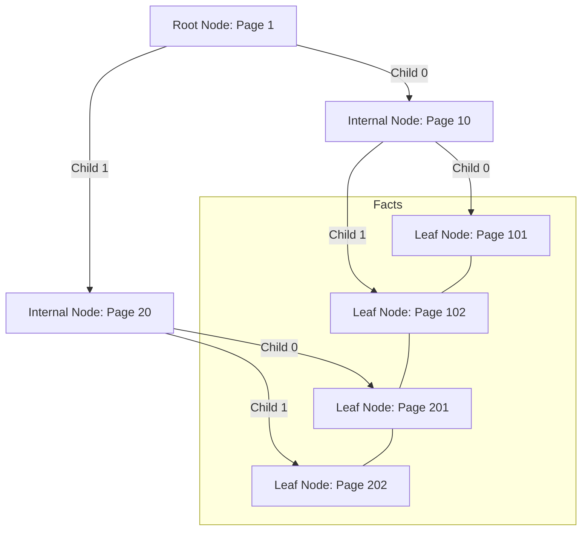

# Cấu trúc Cây B+ Tree

KBMS sử dụng cây B+ Tree làm cấu trúc dữ liệu chính để quản lý và truy xuất các Fact (bản ghi) trong mỗi Concept. B+ Tree là lựa chọn tối ưu cho việc truy vấn dữ liệu từ bộ nhớ ngoài (Disk).

## 1. Cấu trúc Đa tầng (Tiered Structure)

Cây B+ Tree trong KBMS V3 thường duy trì từ 3 đến 5 tầng tùy thuộc vào khối lượng tri thức:

Cấu trúc Mermaid (Source)

---

## 2. Quy trình Vận hành
Fact (Tuple).
*   **Liên kết:** Mỗi Node lá đều có con trỏ `NextPageId` trỏ đến Node lá tiếp theo, cho phép hệ thống thực hiện quét dữ liệu (Scan) theo phạm vi (Range Scan) cực nhanh mà không cần duyệt lại từ gốc.

---

## 3. Các Thuật toán Cốt lõi

### Thuật toán Tìm kiếm (Search)
1.  Bắt đầu từ Root Page.
2.  So sánh khóa cần tìm với các khóa trong Node nội bộ để chọn đúng PageId của Node con.
3.  Lặp lại cho đến khi chạm tới Node lá.
4.  Tại Node lá, duyệt qua các Slot để lấy dữ liệu.
*   **Độ phức tạp:** $O(\log_b n)$, với $b$ là bậc của cây (~600-1000 cho trang 16KB).

### Thuật toán Chèn và Tách Node (Insert & Split)
Khi một Node (Lá hoặc Nội bộ) bị đầy và không thể chèn thêm bản ghi mới:
1.  **Split:** Tạo một Page mới cùng cấp.
2.  **Move:** Chuyển một nửa số lượng khóa sang Page mới.
3.  **Update Parent:** Chèn khóa phân tách vào Node cha để dẫn hướng đến Page mới vừa tạo.
4.  **Propagate:** Nếu Node cha cũng đầy, quá trình tách sẽ được lặp lại ngược lên trên cho tới tận Root. Nếu Root bị tách, chiều cao của cây sẽ tăng thêm 1 lớp.

### Sơ đồ Tách Node (Split)

*Hình: Cơ chế Tách Nút (Split) khi Page bị đầy (Overflow)*

### Thuật toán Xóa và Kéo khít Node (Delete & Merge)
Khi một bản ghi bị xóa khỏi Node lá, thuật toán sẽ kiểm tra tỷ lệ lấp đầy (Fill Factor). Nếu không gian trống giảm quá ngưỡng tối thiểu (Thường là $< 50\%$ hoặc báo lỗi **Underflow**), KBMS thực hiện:
1.  **Redistribute (Mượn khóa từ Sibling):** Kiểm tra các Node ruột thịt liền kề (trái/phải). Nếu chúng có dư thừa không gian (khóa > 50%), hệ thống sẽ "mượn" một số khóa tràn sang Node hiện tại để bù đắp, đồng thời cập nhật lại Key ranh giới ở Node Nội bộ (Internal Node) bên trên.
2.  **Merge (Gộp trang):** Nếu cả Node ruột thịt bên cạnh cũng đang thoi thóp (cận mức tối thiểu), hệ thống tiến hành nối hai Node đó làm một. Cập nhật con trỏ `NextPageId` để vá lại chuỗi Leaf.
3.  **Delete in Parent:** Khóa phân giới trên Node cha trỏ xuống Node vừa bị hủy sẽ bị gỡ bỏ. Chu trình giải phóng này có thể đệ quy ngược lên tầng Root. Trang dữ liệu thừa sẽ được giao nộp lại cho `Free Space Manager` để tái chế.

---

## 4. Quản lý Index trong KBMS

Trong KBMS, mỗi Concept mặc định sẽ có một "Clustered Index" dựa trên cột ID (thường là biến đầu tiên).
*   **Dữ liệu đi kèm Index:** Khác với "Secondary Index" (chỉ chứa RowId), Clustered Index của KBMS chứa **toàn bộ nội dung** của Tuple ngay tại các Node lá.
*   **Lợi ích:** Truy cập trực tiếp dữ liệu chỉ sau một lần duyệt cây, giảm thiểu số lượng Fetch Page từ Buffer Pool.

---

## 5. Ví dụ minh họa

Giả sử ta có Concept `Product` với `id` là khóa chính:
*   **Root:** Chứa khóa [100, 200, 300].
*   **Node con 1:** Chứa các sản phẩm có ID từ 1 đến 99.
*   **Node con 2:** Chứa các sản phẩm từ 100 đến 199.
*   ...
*   Khi cần tìm sản phẩm ID=150, hệ thống sẽ đi từ Root $\rightarrow$ chọn Node con 2 $\rightarrow$ đọc dữ liệu tại Node lá đó.
