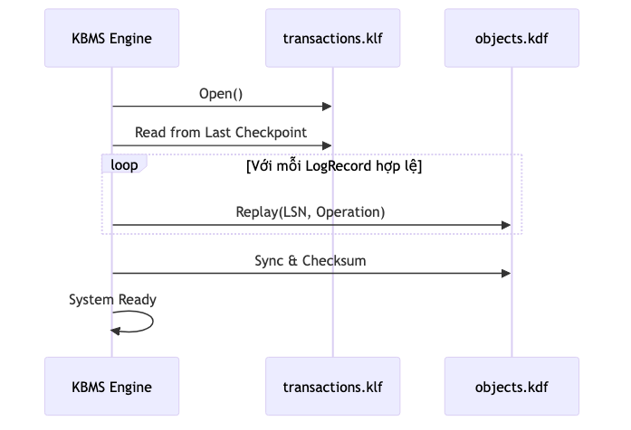
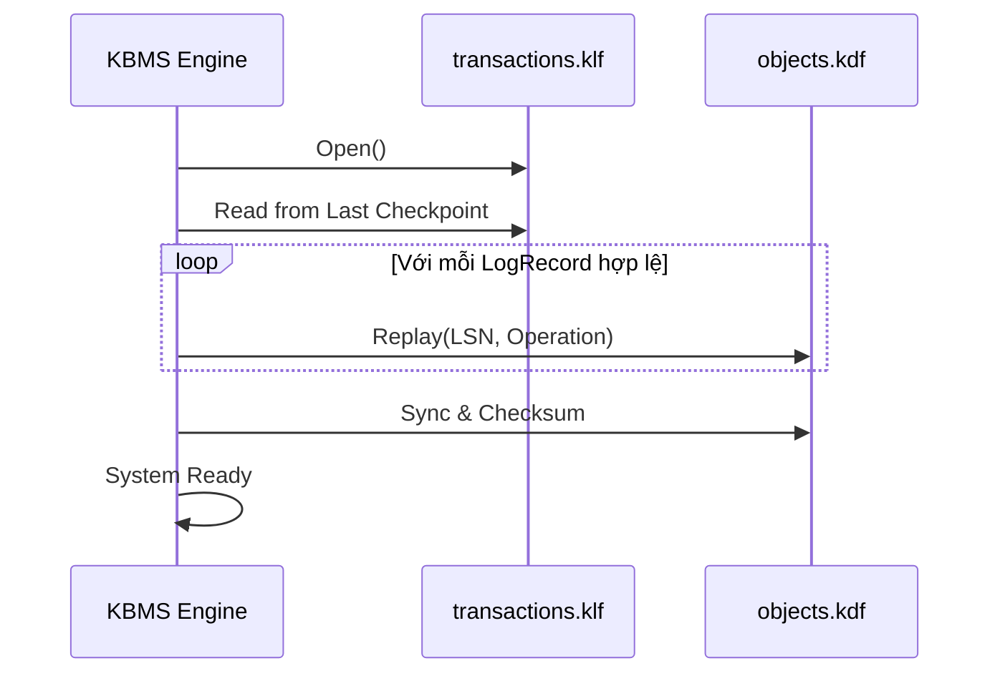

# Độ bền & Phục hồi sau sự cố (Durability & Recovery)

Đảm bảo dữ liệu không bị mất mát khi hệ thống bị ngắt điện đột ngột là nhiệm vụ của `WalManager`. Tài liệu này chi tiết hóa cơ chế phục hồi của KBMS V3.

---

## 1. Giao thức Write-Ahead Logging (WAL)

KBMS tuân thủ nguyên tắc: **Ghi Nhật ký trước khi ghi Dữ liệu**.

-   **Log First**: Mọi thay đổi (Insert, Update, Delete) được mô tả thành một đối tượng `LogRecord` và ghi vào tệp `transactions.klf` trên đĩa.
-   **Atomic Write**: Một bản ghi WAL chỉ được coi là thành công khi toàn bộ các bytes đã được hệ điều hành Flush xuống đĩa cứng (xác nhận bởi `FileStream.Flush(true)`).
-   **Memory Sync**: Sau khi Log được ghi thành công, dữ liệu trong `BufferPool` mới được đánh dấu là `Dirty` và cập nhật.

---

## 2. Cơ chế Điểm kiểm tra (Checkpointing)

Để ngăn tệp WAL (`transactions.klf`) phình to vô hạn, KBMS thực hiện quy trình **Checkpoint**:

1.  **Dừng ghi tạm thời**: Tạm dừng các giao dịch mới.
2.  **Flush Pages**: Ghi tất cả các trang bị thay đổi (`Dirty Pages`) trong Buffer Pool xuống tệp dữ liệu chính (`objects.kdf`).
3.  **Trị tiêu Log**: Xóa hoặc làm trống tệp `.klf` vì dữ liệu đã nằm an toàn trên file chính.
4.  **Ghi nhận trạng thái**: Cập nhật chỉ số Log mới nhất vào `metadata.kmf`.

---

## 3. Quy trình Phục hồi (Restart Recovery)

Khi KBMS khởi động lại sau một vụ treo máy (Crash), nó thực hiện quy trình **Forward Recovery**:

Cấu trúc Mermaid (Source)

-   **Redo Phase**: Hệ thống đọc tệp `.klf` từ vị trí Checkpoint cuối cùng và thực hiện lại mọi thao tác đã ghi trong Log để khớp với trạng thái RAM trước khi Crash.
-   **LSN (Log Sequence Number)**: Mỗi trang dữ liệu đều lưu trữ một chỉ số LSN tại **Byte Offset 4-7** trong Header 24B. Khi thực hiện phục hồi, hệ thống chỉ Replay các LogRecord có LSN lớn hơn LSN hiện tại của trang đó trên đĩa.
-   **Consistency Check**: Nếu bản ghi Log cuối cùng bị lỗi (Partial write), hệ thống sẽ bỏ qua bản ghi đó và Rollback về trạng thái nhất quán gần nhất.

---

## 4. Phân tích Hiệu năng

Ghi WAL là thao tác **Sequential I/O** (Ghi tuần tự), do đó nó có tốc độ cực nhanh (thường là $O(1)$) so với việc ghi ngẫu nhiên (Random I/O) vào cây B+ Tree. Đây là lý do KBMS có throughput ghi cao ngay cả trên các ổ đĩa HDD truyền thống.
