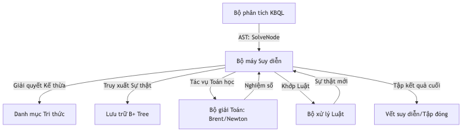
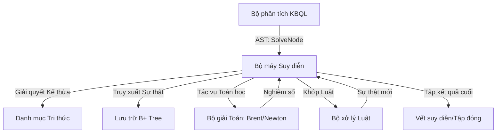
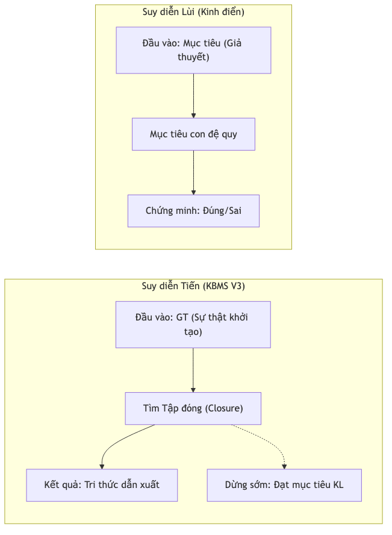
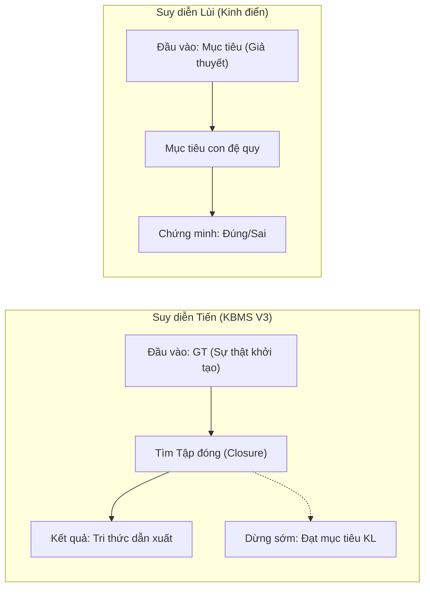

## 1. Kiến trúc Điều phối (Reasoning Orchestration)

Bộ máy suy diễn không hoạt động độc lập mà đóng vai trò là "bộ não" trung tâm điều phối giữa ngôn ngữ truy vấn và dữ liệu vật lý.

Cấu trúc Mermaid (Source)

Cấu trúc Mermaid (Source)

---

## 2. Nguyên lý Đóng kín Tri thức (Knowledge Closure)

Trực giác của KBMS dựa trên khái niệm **Tập đóng (Closure)**. Cho một tập hợp các sự thật đầu vào (**GT**) và một tập hợp các luật/phương trình (**Rules**), mục tiêu là tìm ra tập hợp lớn nhất các sự thật có thể được suy ra một cách logic.

$$Closure(GT, Rules) = GT \cup \{ \text{Kết luận từ các Luật và Phương trình được kích hoạt} \}$$

Hệ thống sẽ lặp lại quá trình suy diễn cho đến khi đạt được trạng thái **Fixed-point** (điểm dừng) - nơi việc tiếp tục suy diễn không sinh ra thêm bất kỳ sự thật mới nào.

---

## 3. Biểu diễn Tri thức (Knowledge Representation)

Trong KBMS, tri thức được biểu diễn dưới dạng các đối tượng (Concepts) và các ràng buộc (Constraints) giữa chúng.

### Các thành phần của một Concept
*   **Variables (Biến):** Các thuộc tính của đối tượng (ví dụ: `Price`, `Quantity`).
*   **Rules (Luật):** Logic `IF-THEN` để suy diễn ra giá trị hoặc sự kiện mới.
*   **Equations (Phương trình):** Các công thức toán học mô tả mối quan hệ giữa các biến.
*   **Constraints (Ràng buộc):** Các điều kiện mà dữ liệu buộc phải thỏa mãn.
*   **Relations (Quan hệ):** Mối liên kết giữa các Concept (IS-A, PART-OF, ...).

---

## 4. Quy trình Suy diễn (Reasoning Lifecycle)

Khi một bản ghi dữ liệu (Fact) được đưa vào hệ thống, bộ máy suy diễn thực hiện các bước sau:

1.  **Preprocessing (Tiền xử lý):** Nạp toàn bộ metadata của Concept, bao gồm các luật kế thừa từ IS-A và Part-Of.
2.  **Initialization (Khởi tạo):** Đưa các Fact đầu vào vào tập **GT (Ground Truth)**.
3.  **Cyclic Evaluation (Đánh giá vòng lặp):** Hệ thống liên tục quét qua tập hợp các Rules và Equations cho đến khi không còn Fact nào mới được sinh ra.
4.  **Verification (Kiểm chứng):** Sau khi suy diễn xong, hệ thống kiểm tra lại toàn bộ các `Constraints` để đảm bảo kết quả suy diễn không vi phạm bất kỳ quy tắc nào.

---

## 5. Chiến lược Suy diễn: Forward vs. Backward Chaining

Trong lý thuyết Hệ chuyên gia, có hai chiến lược chính:
- **Forward Chaining (Suy diễn tiến)**: Từ sự thật (**GT**) suy ra kết luận. Thích hợp cho việc "khám phá" mọi tri thức có thể từ một tập dữ liệu nhỏ.
- **Backward Chaining (Suy diễn lùi)**: Từ mục tiêu (**KL**) tìm ngược lại xem cần những sự thật nào. Thích hợp cho việc "kiểm chứng" giả thuyết trong một cơ sở tri thức khổng lồ.

### Tại sao KBMS V3 chọn Forward Chaining?
Hệ thống KBMS hiện đại được tối ưu hóa cho các **Mô hình Vật thể Tính toán (Computational Objects)**. Trong các mô hình này (như Hình học hay Tài chính), các biến số và công thức có mối quan hệ ràng buộc chặt chẽ và cục bộ. Việc sử dụng **Goal-Directed Forward Chaining** mang lại các ưu điểm:
1.  **Hiệu năng**: Tìm tập đóng (Closure) nhanh hơn việc duyệt cây mục tiêu đệ quy (SLD-resolution) trong các hệ thống chứa nhiều phương trình toán học.
2.  **Tính đầy đủ**: Đảm bảo mọi hệ quả của một thay đổi dữ liệu đều được cập nhật vào GT.
3.  **Dừng sớm (Early Exit)**: Mặc dù là suy diễn tiến, Server sẽ dừng ngay lập tức khi tất cả các biến mục tiêu trong danh sách **KL** đã được tìm thấy (Dòng code 378).

### Giới hạn An toàn (Safety Limit)
Để ngăn chặn các vòng lặp vô hạn trong trường hợp tri thức bị mâu thuẫn hoặc đệ quy quá sâu, bộ máy suy diễn áp dụng giới hạn: **Tối đa 50 vòng lặp (Iterations)**. Nếu sau 50 lần quét mà hệ thống vẫn sinh ra Fact mới, nó sẽ tự động dừng và báo cáo trạng thái Closure hiện tại (Dòng code 93).

---

### IS-A (Kế thừa)
*   **Ý tưởng:** Nếu A **IS-A** B, thì mọi biến và luật của B sẽ được "truyền" sang A.
*   **Ví dụ:** `Square` IS-A `Rectangle`. Khi tính diện tích cho `Square`, hệ thống có thể dùng luôn luật `Area = Width * Height` của `Rectangle`.

### PART-OF (Thành phần)
*   **Ý tưởng:** Mô tả cấu trúc phân rã của đối tượng. Một đối tượng lớn được tạo từ nhiều đối tượng con.
*   **Ví dụ:** `Car` PART-OF `Engine`, `Wheel`. Hệ thống tự động ánh xạ các biến từ các phần con vào đối tượng cha để suy diễn tổng thể.

### CONSTRUCT_RELATIONS (Quy tắc quan hệ)
*   **Ý tưởng:** Định nghĩa các quy luật chung cho một mối quan hệ cho trước (ví dụ: Quan hệ `CongRuence` - Bằng nhau trong hình học).
*   **Ứng dụng:** Khi hai đối tượng thỏa mãn quan hệ này, các phương trình tương ứng (như `Object1.Size = Object2.Size`) sẽ được tự động tiêm vào hệ thống để giải.

---

## 6. Giải trình và Truy vết (Traceability)

Bộ máy suy diễn KBMS không phải là một "Black Box" (Hộp đen). Nó cung cấp khả năng giải thích lý do tại sao một giá trị được tạo ra.
*   **Derivation Trace:** Lưu trữ nguồn gốc (Source) của mỗi biến được suy diễn, bao gồm cả các biến đầu vào được dùng tại bước đó.
*   **Cơ chế:** Mỗi lần một Rule hoặc Equation kích hoạt thành công, một bản ghi Trace sẽ được đẩy vào kết quả truy vấn.

---

## 7. Kế hoạch Triển khai Mã nguồn Engine (Implementation Strategy)

Để hiện thực hóa bản thiết kế kỹ thuật trên thành phân hệ phần mềm hoạt động thực tế, lộ trình triển khai (Backend C#) được chia làm 4 giai đoạn chính (Phases):

### Giai đoạn 1: Tiền xử lý & Xây dựng Cấu trúc Tri thức (Preprocessing)
Xây dựng lớp Abstract Syntax Tree (AST) tiếp nhận từ bộ phân tích (Parser). Ở giai đoạn này, dữ liệu đầu vào (Sự thật - Fact) được "Làm phẳng" (Flattening) bằng cách quét chuỗi kế thừa `IS-A` và `PART-OF` nhằm lôi kéo tất cả Metadata cần thiết sang đối tượng con. Quá trình tiền xử lý biến danh mục tri thức thô thành một đối tượng sẵn sàng chạy (Executable Concept).

### Giai đoạn 2: Lõi Suy diễn Lan truyền (Deductive Core & Propagation)
Xây dựng vòng lặp chính của cơ chế **Goal-Directed Forward Chaining** (FClosure). 
*   Cài đặt luồng nhận diện chuỗi biến tương đương và sao chép/lan truyền giá trị tức thời (**SameVariables Propagation**).
*   Chạy luồng khớp mệnh đề IF-THEN (**Rule Matching**) để đẩy liên tiếp kết luận logic vào Tập Sự Thật (Ground Truth).

### Giai đoạn 3: Tích hợp Lõi giải Toán học (Mathematical Solvers)
Phát triển các Adapter kết nối lớp thuật toán tính toán với hệ thống:
*   Adapter Phương trình 1 ẩn (**Brent's Method**): Quét qua các biểu thức còn 1 biến và tiến hành tính toán hội tụ nghiệm số tự động.
*   Adapter Hệ phương trình (**Newton-Raphson 2D**): Nhận diện cụm 2 phương trình chung 2 ẩn, định cấu hình ma trận Jacobian và cập nhật vòng lặp đệ quy.

### Giai đoạn 4: Bảo vệ Hệ thống & Truy vết (Safety Constraints & Traceability)
Đảm bảo Engine chạy độc lập không gây vắt kiệt RAM máy chủ bằng cách cài giới hạn an toàn **$N=50$ vòng lặp tối đa (Iterations)**. Nếu sau 50 chu kỳ duyệt hệ thống vẫn chưa trả về điểm đóng (Closure), thuật toán tự ngắt kết nối. Song song đó, viết bộ thu thập nhật ký truy xuất (**Trace System**) để xuất định dạng dữ liệu cây giải trình thành dạng JSON chuyển qua cho Front-End UI hiển thị.
