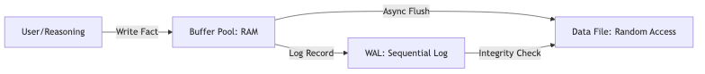
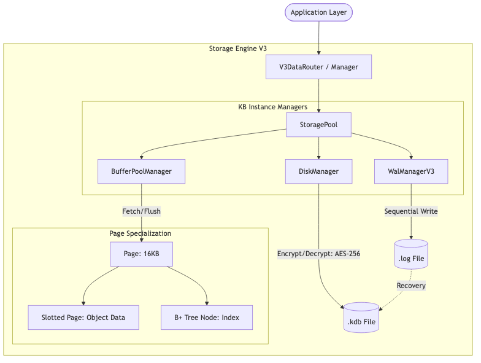
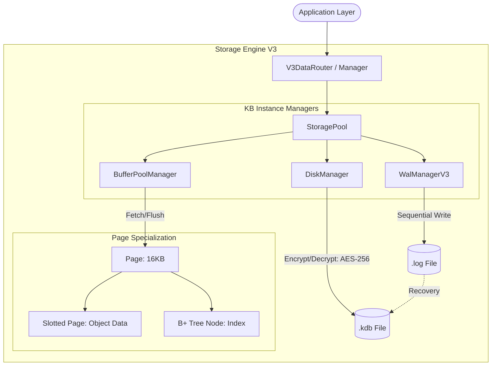

# 07.1. Tổng quan về Kiến trúc Lưu trữ (Storage Architecture)

Cỗ máy lưu trữ của KBMS (phiên bản V3) chịu trách nhiệm quản lý việc ghi dữ liệu tri thức xuống đĩa cứng một cách bền vững và truy xuất chúng với hiệu năng cao nhất. Kiến trúc này được thiết kế theo mô hình phân tầng từ vật lý đến logic.

> [!NOTE]
> Để hiểu rõ các thuật ngữ chuyên ngành (Page, Buffer Pool, WAL...) trước khi tiếp cận kiến trúc bên dưới, vui lòng xem phần **07.0. Tham chiếu Thuật ngữ Kỹ thuật**.

---

## 1. Hệ thống Phân tầng I/O (Multi-layered I/O)

Dữ liệu trong KBMS luân chuyển qua 3 trạng thái chính để đảm bảo sự cân bằng giữa tốc độ truy cập RAM và độ an toàn của đĩa cứng:

*Hình 7.1: Sơ đồ chiến lược luồng I/O đa tầng của KBMS.*

---

## 2. Sơ đồ Kiến trúc Thành phần (Component Architecture)

Kiến trúc nội tại của Storage Engine V3 được tổ chức theo mô hình quản lý tập trung (`StoragePool`), đảm bảo tính cô lập giữa các Cơ sở tri thức (KB) khác nhau.

*Hình 7.2: Sơ đồ kiến trúc thành phần chi tiết của Storage Engine V3.*

Cấu trúc Mermaid (Source)

---

## 3. Quản lý Bộ đệm (Buffer Pool Manager)

Để giảm thiểu I/O chậm chạp, KBMS duy trì một vùng nhớ RAM gọi là **Buffer Pool**. Thành phần này hoạt động như một lớp trung gian thông minh giữa RAM và Đĩa.

### Thuật toán thay thế LRU (Least Recently Used)
KBMS sử dụng chính sách LRU để điều phối các trang trong bộ đệm:
-   **Pinning (Ghim trang):** Khi một trang đang được truy cập, `PinCount` tăng lên. Trang có `PinCount > 0` sẽ không bị đẩy ra khỏi RAM.
-   **Dirty Pages:** Những trang có thay đổi dữ liệu sẽ được đánh dấu `IsDirty = true`.
-   **Eviction (Trục xuất):** Khi bộ đệm đầy, hệ thống tìm trang có `PinCount = 0` và không được sử dụng trong thời gian lâu nhất để giải phóng. Nếu trang đó là "Dirty", nó sẽ được ghi xuống đĩa (Flush) trước khi bị thay thế.

---

## 3. Hạn mức Kỹ thuật của Kiến trúc V3

Kiến trúc phân trang 16KB cho phép KBMS mở rộng mạnh mẽ:

*Bảng 7.1: Thông số định lượng của Storage Engine V3*
| Thông số | Giá trị | Giải thích |
| :--- | :--- | :--- |
| **Kích thước Trang** | **16 KB** | Khớp với block size tối ưu của SSD hiện đại. |
| **Dung lượng tối đa** | **~35.25 TB** | Giới hạn bởi 2.1 tỷ Page ID (4-byte). |
| **Tốc độ Look-up** | **O(1)** | Nhờ sử dụng Hash Table để quản lý Frame thay vì quét mảng. |
| **Mã hóa tĩnh** | **AES-256** | Được tích hợp trực tiếp tại tầng DiskManager. |

---

## 4. Lộ trình Triển khai Kỹ thuật

Tiến trình xây dựng Backend cho Storage Engine được thực thi qua 4 giai đoạn:
1.  **Tầng Vật lý:** Xây dựng `DiskManager` hỗ trợ `Random Access` và `AES Encryption`.
2.  **Tầng Quản lý RAM:** Lập trình `BufferPoolManager` và cơ chế thay thế trang LRU.
3.  **Tầng Cấu trúc Dữ liệu:** Thiết kế giải thuật `Slotted Page` cho dữ liệu biến thiên.
4.  **Tầng Chỉ mục:** Xây dựng cấu trúc cây `B+ Tree` để kết nối hàng triệu trang thành một hệ thống đồng nhất.
