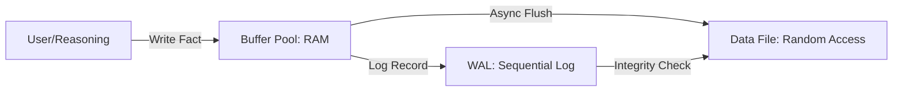

# 07.1. Tổng quan về Cỗ máy Lưu trữ (Storage Engine)

Cỗ máy lưu trữ của KBMS (phiên bản V3) chịu trách nhiệm quản lý việc ghi dữ liệu tri thức xuống đĩa cứng một cách bền vững và truy xuất chúng với hiệu năng cao nhất.

## 1. Cấu trúc Trang (Page Structure)

KBMS chia file dữ liệu thành các đơn vị cố định gọi là **Page** (Trang), mặc định là **16KB**. Việc sử dụng kích thước trang cố định giúp tối ưu hóa việc đọc/ghi theo từng block của ổ cứng (HDD/SSD).

### Slotted Page Algorithm
Để lưu trữ các bản ghi (Tuples) có độ dài thay đổi, KBMS sử dụng thuật toán **Slotted Page**.
*   **Header:** Lưu trữ Metadata trang (24 Bytes): PageId, LSN, PrevPageId, NextPageId, FreeSpacePointer, TupleCount.
*   **Slot Array:** Một mảng các "khe cắm" phát triển từ đầu trang về phía sau. Mỗi khe chứa `offset` (vị trí) và `length` (độ dài) của bản ghi.
*   **Tuples Data:** Dữ liệu thực tế được đẩy từ cuối trang ngược về phía trước.
*   **Ưu điểm:** Tận dụng tối đa không gian trống ở giữa trang mà không cần biết trước số lượng bản ghi.

---

## 2. Phân tích Độ phức tạp (Complexity Analysis)

Hệ thống lưu trữ V3 được tối ưu hóa để xử lý hàng triệu bản ghi với độ trễ tối thiểu (Low-latency).

| Thành phần | Thuật toán | Độ phức tạp | Ghi chú |
| :--- | :--- | :--- | :--- |
| **B+ Tree Search** | Binary Search (Nodes) | $O(\log_b n)$ | $b$ là bậc của cây (Branching Factor). |
| **B+ Tree Insert** | Split & Rebalance | $O(\log_b n)$ | Đảm bảo cây luôn cân bằng tuyệt đối. |
| **B+ Tree Delete** | Merge & Rebalance | $O(\log_b n)$ | Giải phóng không gian trang khi cần. |
| **Buffer Look-up** | Hash Table | $O(1)$ | Truy xuất trang trong RAM cực nhanh. |
| **WAL Write** | Sequential Log | $O(1)$ | Tốc độ ghi nhanh vì không cần Disk Seek. |

---

## 3. Quản lý Bộ đệm (Buffer Pool Management)

Để giảm thiểu I/O (đọc/ghi file) chậm chạp, KBMS duy trì một vùng nhớ RAM gọi là **Buffer Pool**.

### Thuật toán LRU (Least Recently Used)
KBMS sử dụng chính sách thay thế LRU để quản lý các trang trong bộ đệm:
1.  **Pinning:** Khi một trang đang được sử dụng (để đọc hoặc ghi), nó được "Pin" (ghim). Trang đã bị ghim sẽ **không bao giờ** bị đẩy ra khỏi RAM.
2.  **Eviction (Trục xuất):** Khi Buffer Pool đầy và cần nạp trang mới, hệ thống sẽ chọn trang có `PinCount = 0` và thời gian truy cập xa nhất để loại bỏ.
3.  **Dirty Pages:** Nếu trang bị loại bỏ đã bị sửa đổi (`IsDirty = true`), hệ thống sẽ tự động thực hiện lệnh `Flush` để ghi nội dung xuống đĩa trước khi ghi đè trang mới vào frame đó.

---

## 4. Hạn mức Kỹ thuật (Technical Limits)

KBMS V3 được thiết kế để mở rộng (Scale-out) mạnh mẽ với các thông số định lượng sau:

| Thông số | Giá trị thực tế | Giới hạn lý thuyết |
| :--- | :--- | :--- |
| **Dung lượng CSDL** | **~35.25 TB** | $2^{31} \times 16,384$ Bytes |
| **Số lượng Trang (Pages)**| **2.1 Tỷ trang** | $2,147,483,647$ (4-byte ID) |
| **Kích thước Trang** | **16 KB** | Cố định theo kiến trúc V3. |
| **Bậc của cây (B+ Tree)** | **~512** | Dựa trên Key 32B + PageId 4B. |
| **Cache RAM tối đa** | Theo tệp `.ini` | Giới hạn bởi OS (64-bit). |

---

## 5. Chiến lược Luồng I/O (I/O Strategy)

Dữ liệu luân chuyển qua 3 trạng thái để đảm bảo cả tốc độ và độ an toàn:

*Hình 7.1: Sơ đồ chiến lược luồng I/O đa tầng của KBMS.*

Cấu trúc Mermaid (Source)

---

## 6. Danh mục Đặc tả Tầng Lưu trữ

Để tìm hiểu sâu hơn về kiến trúc nhị phân và cơ chế vận hành, hãy tham khảo:

- [02-Cấu trúc Cây B+ Tree](./02-btree.md)
- [03-Cấu trúc Trang vật lý](./03-page-layout.md)
- [04-Cơ chế Độ bền & Phục hồi](./04-recovery.md)
- [05-Quản lý Đĩa & Mã hóa](./05-disk-management.md)

---

## 7. Nhật ký ghi trước (Write-Ahead Logging - WAL)

Tất cả các thay đổi dữ liệu đều được ghi vào file Log trước khi được áp dụng vào file dữ liệu chính.

### Sơ đồ Luồng ghi WAL

*Hình 7.2: Cơ chế ghi nhật ký trước (WAL) để đảm bảo tính bền vững ACID.*

*   **Mục tiêu:** Đảm bảo tính **Durability** (Độ bền vững). Nếu hệ thống bị sập nguồn đột ngột, KBMS sẽ đọc file log để tái tạo (Redo) lại các giao dịch chưa kịp ghi xuống đĩa.
*   **LSN (Log Sequence Number):** Mỗi bản ghi Log và mỗi trang dữ liệu đều có một số thứ tự LSN để đảm bảo tính tuần tự và kiểm tra phiên bản.

---

## 8. Định dạng Tệp tin

Hệ thống lưu trữ dưới các định dạng file tùy chỉnh:
*   `.kbf` (Knowledge Base File): Lưu trữ metadata và catalog của KB.
*   `.dat`: Lưu trữ dữ liệu thực tế của các Concept dưới dạng cây B+ Tree.
*   `.log`: Lưu trữ nhật ký WAL.

---

## 9. Kế hoạch Triển khai (Implementation Strategy)

Để hoàn thiện tầng giao tiếp đĩa cứng và đảm bảo tính ACID, tiến trình lập trình Backend (Architecture Coding Approach) cho Storage Engine được thực thi nghiêm ngặt qua 4 giai đoạn cốt lõi:

### Giai đoạn 1: Quản lý Vật lý & Cơ chế Mã hóa (DiskManager)
Khởi tạo cấu hình truy xuất vật lý `FileStream.Seek` cho phép nhảy thẳng đến khối bộ nhớ theo kích thước khối cố định (16KB). Tích hợp module mã hóa tĩnh `AES-256`, thiết lập vector khóa IV để mã hóa/giải mã on-the-fly mỗi khi lấy dữ liệu ra khỏi bề mặt đĩa cứng. Thiết lập các chốt an toàn Disk Allocation (kỹ thuật Zero-fill) để chống phân mảnh cấp độ File System OS.

### Giai đoạn 2: Bộ đệm & An toàn I/O (BufferPool & WalManager)
Viết lớp quản lý RAM nội vụ (`BufferManager`). Cấu hình thuật toán điều phối `LRU - Least Recently Used`, lập trình cơ chế "Ghim" trang (`PinCount`) và đánh dấu bị sửa (`IsDirty`). Đồng thời, lập trình kết nối hệ thống Write-Ahead Logging. Khi có giao dịch bẩn, ghi file `.klf` bằng phương thức quét tuần tự (Sequential I/O), đảm bảo Forward Recovery hoạt động hoàn hảo khi bị cúp điện. 

### Giai đoạn 3: Giải phẫu Chuỗi Nhị phân (Slotted Page)
Tiến lên cấu trúc trang học thuật. Lập trình bộ nén nhị phân (Binary Serialization) để tạc khối 16,384 Bytes thành các `Page`. Thiết kế `Header` (24 Bytes Metadata), cấu hình mảng "Slot Array" (phát triển ngược chiều Payload) nhằm lưu thông tin khoảng cách (Offset) cho Tuple độ dài tùy biến. Chia nhánh kế thừa lớp trang thành `LeafPage` (Nút Lá) và `InternalPage` (Nút Trung Gian).

### Giai đoạn 4: Hạ tầng Đồ thị Thuần túy (B+ Tree Index)
Kết nối hàng triệu khối nhị phân thành một đồ thị khổng lồ. Lập trình hệ thống B+ Tree Indexing $O(\log n)$. Đẩy dữ liệu gốc trực tiếp vào Cấp Lá (Clustered Index Pattern) để tiết kiệm thao tác truy xuất. Khởi chạy và kiểm nghiệm thuật toán Đệ quy tự tách nhánh (Split Node) khi trang dữ liệu báo trạng thái cạn không gian (Overflow).
