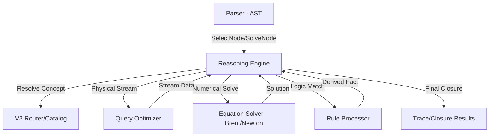

# 08.1. Kiến trúc Hệ thống Suy diễn (Reasoning Architecture)

Bộ máy suy diễn (**Reasoning Engine**) là thành phần trung tâm của [KBMS](../00-glossary/01-glossary.md#kbms), đóng vai trò điều phối giữa ngôn ngữ truy vấn cao cấp và mô hình tri thức thực tế.

---

## 1. Nguyên lý Thiết kế

Trong [KBMS](../00-glossary/01-glossary.md#kbms) V3, suy diễn không đơn thuần là xử lý logic `IF-THEN` mà là quá trình tìm kiếm **Tập đóng (Closure)** của tri thức. Cho một tập hợp sự thật ban đầu (**GT**) và các luật/phương trình (**K**), hệ thống nỗ lực tìm ra tập hợp lớn nhất các hệ quả logic có thể dẫn xuất được.

$$Closure(GT, K) = GT \cup \{ \text{Kế luận từ các luật/phương trình được kích hoạt} \}$$

### 1.1. Chiến lược Suy diễn: Goal-Directed Forward Chaining
[KBMS](../00-glossary/01-glossary.md#kbms) áp dụng chiến lược suy diễn tiến (**[Forward Chaining](../00-glossary/01-glossary.md#forward-chaining)**) có định hướng mục tiêu:
- **[Forward Chaining](../00-glossary/01-glossary.md#forward-chaining)**: Từ các sự thật đầu vào, hệ thống lan truyền tri thức để dẫn ra các giá trị mới. Thích hợp cho các mô hình đối tượng tính toán có ràng buộc chặt chẽ.
- **Goal-Directed**: Mặc dù là suy diễn tiến, hệ thống sẽ tự động tối ưu hóa lộ trình và dừng ngay khi đạt được danh sách biến mục tiêu (**Targets**) được yêu cầu bởi người dùng, giúp tiết kiệm tài nguyên CPU.

---

## 2. Sơ đồ Điều phối Suy diễn

Sơ đồ dưới đây mô tả cách thức bộ máy suy diễn tương tác với các phân hệ khác để giải quyết yêu cầu tri thức:

*Hình 8.1: Sơ đồ tương quan giữa Engine Suy diễn và các phân hệ hệ thống.*

---

## 3. Mối liên hệ với Bộ tối ưu hóa Truy vấn (System Synergy)

Để đạt được hiệu năng tối đa, hệ thống duy trì một ranh giới rõ rệt giữa hai loại hình tối ưu hóa:

| Loại Tối ưu hóa | Vị trí | Mục tiêu |
| :--- | :--- | :--- |
| **Logic Optimization** | **Reasoning Engine (Ch 08)** | Lựa chọn giải thuật suy diễn, quản lý đệ quy và điểm dừng hiệu quả nhất. |
| **Physical Optimization** | **[Query Optimizer](../10-server/03-query-optimization.md) (Ch 10)** | Đảm bảo luồng dữ liệu thô được nạp vào engine với chi phí I/O thấp nhất. |

Sự cộng hưởng này cho phép [KBMS](../00-glossary/01-glossary.md#kbms) suy diễn một cách thông minh: Engine suy diễn quyết định chúng ta cần "giải" cái gì, và Bộ tối ưu hóa truy vấn quyết định làm sao để lấy dữ liệu phục vụ việc giải đó nhanh nhất.

---

## 4. Biểu diễn Tri thức (Knowledge Representation)

Tri thức trong engine được cấu trúc thành các thực thể tính toán:
- **Variables**: Các thuộc tính định danh giá trị.
- **Rules**: Logic mệnh đề cho các suy luận định tính.
- **Equations**: Ràng buộc toán học cho các tính toán định lượng.
- **Hierarchy (IS-A & PART-OF)**: Cơ chế kế thừa và phân rã tri thức phức tạp.
