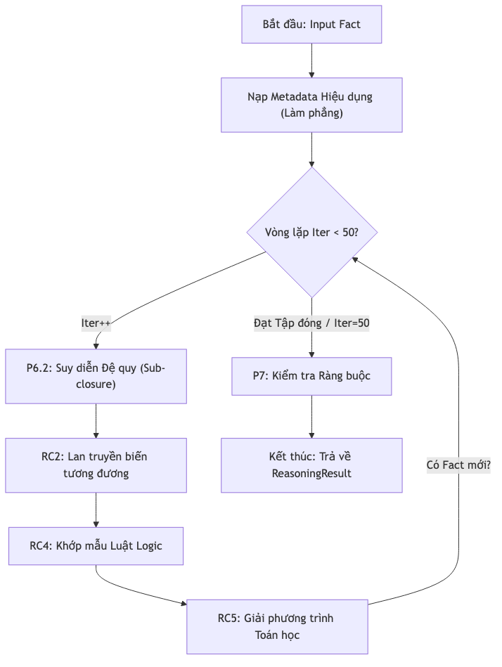
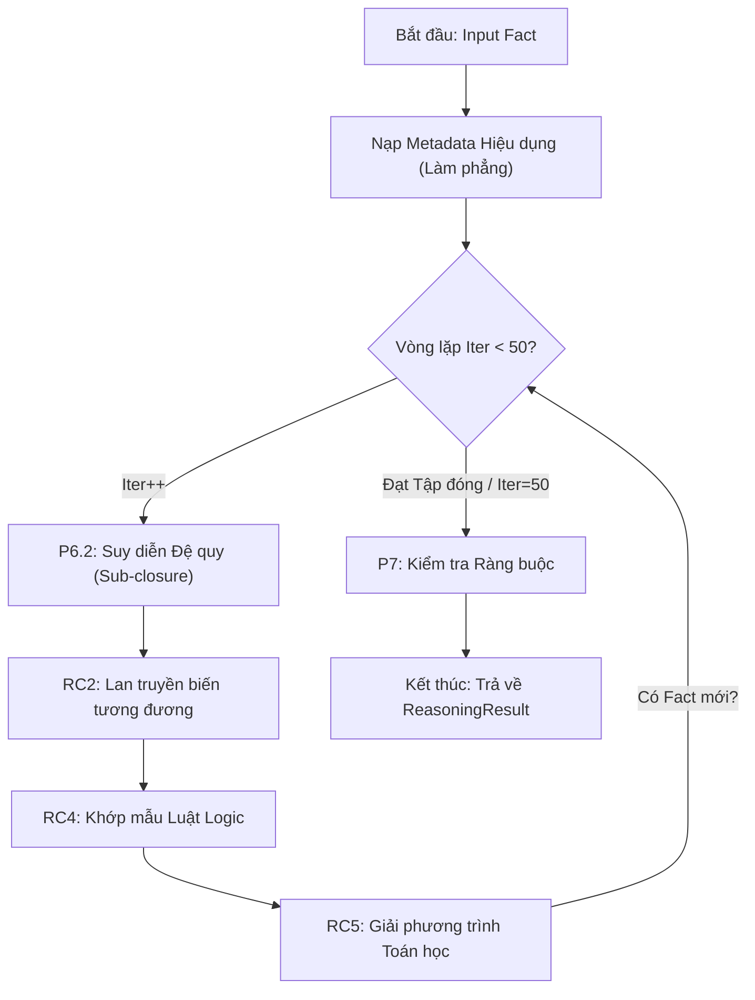

---

## 08.2. Các Thuật toán Suy diễn Cốt lõi (Forward Chaining - FClosure)

Thuật toán này là xương sống của KBMS, thực hiện việc mở rộng tập tri thức GT cho đến khi đạt điểm đóng (Closure).

### 1.1. Các Giai đoạn Thực thi (Phases)
Bên trong vòng lặp chính, bộ máy thực hiện các bước sau theo thứ tự ưu tiên:

1.  **Recursive Sub-closure (Phase 6.2)**: Duyệt qua các biến có kiểu dữ liệu là một Concept khác. Hệ thống sẽ tự động gọi hồi quy `FindClosure` cho các đối tượng con này để đồng bộ tri thức từ dưới lên.
2.  **SameVariables Propagation (RC2)**: Lan truyền giá trị giữa các cặp biến được đánh dấu tương đương. Ví dụ: `a = b` thì nếu biết `a`, hệ thống tự động gán giá trị cho `b`.
3.  **Computation Relations (RC3)**: Thực thi các quan hệ tính toán trực tiếp (**Rf**) từ biểu thức.
4.  **Logic Rules (RC4)**: Khớp mẫu các luật `IF-THEN`. Nếu mẫu khớp, các kết luận mới được đẩy vào GT.
5.  **Equation Solving (RC5)**: Giải các phương trình toán học và hệ phương trình để tìm các ẩn số mới.

### 1.2. Ví dụ Chạy khô (FClosure Dry Run)
*(Bảng ví dụ Triangle đã được cung cấp ở phần trước)*

### 1.3. Sơ đồ Luồng FClosure (Chi tiết Server-side)



<details>
<summary>Cấu trúc Mermaid (Source)</summary>


</details>

---

## 2. Giải phương trình 1D (Brent's Method - RC5)

KBMS sử dụng thuật toán Brent để tìm nghiệm của phương trình $f(x)=0$ trong một khoảng cô lập.

### 2.1. Độ hội tụ (Convergence)
Thuật toán kết hợp giữa Bisection (đảm bảo hội tụ) và Secant/Inverse Quadratic Interpolation (đảm bảo tốc độ).
- **Tốc độ**: Hội tụ siêu tuyến tính với bậc $\phi \approx 1.618$.
- **Ưu điểm**: Không yêu cầu tính đạo hàm $f'(x)$.

---

## 3. Giải hệ phương trình 2D (Newton-Raphson - RC5)

Được kích hoạt khi phát hiện 2 phương trình có chung 2 biến chưa biết (Dòng code 341-374).

### 3.1. Ma trận Jacobian & Công thức cập nhật
Hệ thống tính toán ma trận Jacobian $\mathbf{J}$ bằng phương pháp sai phân hữu hạn (Dòng code 573):
$$ \mathbf{J} = \begin{bmatrix} \frac{\partial f_1}{\partial x} & \frac{\partial f_1}{\partial y} \\ \frac{\partial f_2}{\partial x} & \frac{\partial f_2}{\partial y} \end{bmatrix} $$

Sau đó cập nhật giá trị theo công thức (Dòng code 579-583):
$$ \Delta \mathbf{x} = -\mathbf{J}^{-1} \mathbf{F}(\mathbf{x}) $$

---

## 4. Phân tích Độ phức tạp (Complexity Analysis)

*Bảng 8.1: Bảng ký hiệu thuật toán F-Closure*
| Thuật toán | Mục tiêu | Độ phức tạp | Lý do kỹ thuật (Server-side) |
| :--- | :--- | :--- | :--- |
| **FClosure** | Suy diễn tổng thể | $O(50 \times (R + E + SV))$ | Giới hạn $N=50$ vòng lặp tối đa. $R$: số luật, $E$: số phương trình, $SV$: số cặp biến tương đương. |
| **Newton-Raphson** | Giải hệ 2D | $O(50 \times 4 \times eval)$ | Newton lặp max 50 lần; mỗi lần tính 4 đạo hàm riêng lẻ ($eval$). |
| **Brent's Method** | Giải PT 1D | $O(1/\phi^n)$ | Hội tụ siêu tuyến tính, số bước lặp $n$ thường nhỏ (< 20). |
| **Flattening** | Gộp tri thức | $O(H \times V)$ | $H$: chiều sâu kế thừa, $V$: tổng số biến trong hệ thống. |
| **Trace System** | Giải thích | $O(D)$ | $D$: Độ sâu vết suy diễn (Reasoning Depth). |

## 5. Nhật ký Suy diễn (Reasoning Trace Example)

Khi bạn thực hiện lệnh `SOLVE`, KBMS trả về một bản giải trình chi tiết:

```json
{
  "closure": { "a": 3, "b": 4, "c": 5, "S": 6 },
  "traces": [
    { "target": "c", "source": "CosineLaw", "inputs": ["a", "b", "angleC"], "value": 5.0 },
    { "target": "p", "source": "PerimeterFormula", "inputs": ["a", "b", "c"], "value": 6.0 },
    { "target": "S", "source": "HeronFormula", "inputs": ["p", "a", "b", "c"], "value": 6.0 }
  ]
}
```
