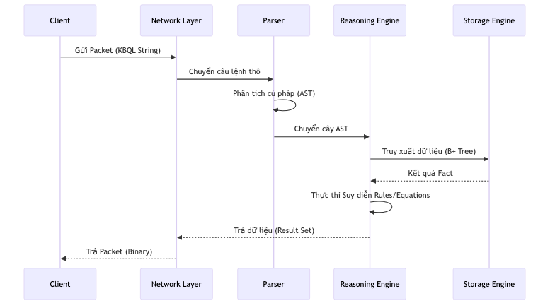
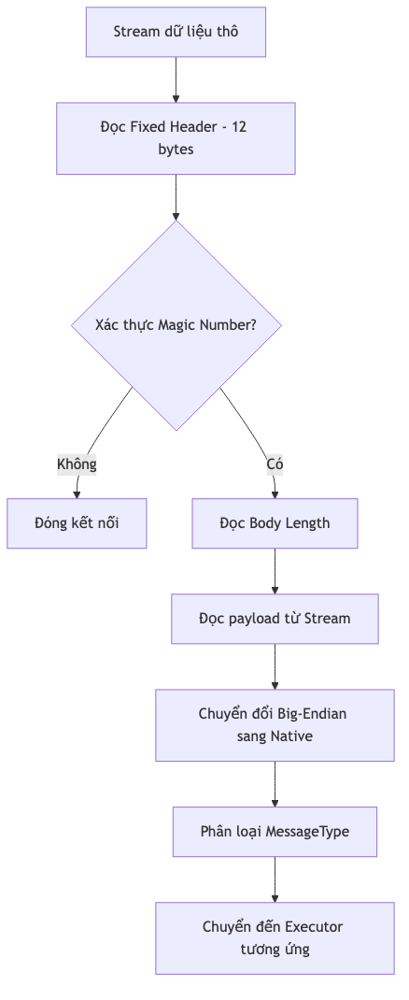

Mỗi khi người dùng gửi một câu lệnh KBQL từ Client, Server sẽ thực hiện một quy trình xử lý đa tầng để hiểu ý định (Intent) và thực thi đúng các phép toán/suy diễn.

## 1. Vòng đời của một Truy vấn (Query Lifecycle)

Dưới đây là sơ đồ tuần tự mô tả các bước từ khi Client gửi câu lệnh đến khi nhận được kết quả cuối cùng:

*Hình: Sơ đồ Tuần tự Vòng đời Truy vấn (Query Lifecycle)*

---

## 2. Luồng xử lý Packet (Packet Processing Flow)

Hệ thống xử lý các byte dữ liệu thô từ Stream và chuyển đổi chúng thành các cấu trúc thông điệp có ý nghĩa:

*Hình: Sơ đồ# 09.2. Luồng Xử lý Truy vấn Mạng
*

---

## 3. Phân tích Từ vựng (Lexer)

**Ý tưởng:** Biến chuỗi văn bản (String) thô thành một danh sách các tín hiệu có nghĩa (Tokens).
*   **Thuật toán Tokenizer:** Quét chuỗi ký tự, nhận diện các từ khóa (`SELECT`, `CREATE`), định danh (tên Concept), toán tử và giá trị số/chuỗi.
*   **Báo lỗi:** Nếu gặp ký tự lạ, Tokenizer ngay lập tức trả về lỗi kèm vị trí chính xác (Dòng, Cột).

---

## 4. Phân tích Cú pháp (Parser & AST)

**Ý tưởng:** Xây dựng cây cú pháp trừu tượng (Abstract Syntax Tree - AST) từ danh sách Tokens.
*   **Kỹ thuật:** Sử dụng trình phân tích cú pháp **Recursive Descent** (Phân tích đi xuống đệ quy) để khớp các Tokens với bộ ngữ pháp của KBQL.
*   **Cấu trúc AST:** Mỗi câu lệnh được biểu diễn thành một cây các đối tượng. Ví dụ, lệnh `SELECT` sẽ có các nhánh con là `Fields`, `Source`, `WhereCondition`, và `Limit`.

---

## 5. Thực thi và Cấp phát (Executor & Router)

Sau khi có AST từ `KBMS.Parser`, gói tin bắt đầu chuyển giao cho Logic Cấu trúc lõi:
1.  **Chồng Khớp (Binding) & Routing:** Từng lệnh tách lẻ trong chuỗi văn bản được cắt ra và chuyển qua Router `_knowledgeManager.Execute(ast, ...)` để thực thi tuần tự.
2.  **Catalog Check:** Concept được truy vấn có tồn tại không?
3.  **Schema & Type Check:** Các biến trong hàm `SELECT` hoặc `CALC()` có hợp lệ về kiểu dữ liệu hay không? Mọi sai phạm đều ngay lập tức bị tóm gọn ở lớp `KBMS.Parser.ParserException`, đính kèm vào đó (Line, Column) và đẩy ngược ra Network Client dưới dạng JSON (`Type: ERROR`) nhằm nhắc người dùng sửa sai.

---

## 6. Lập kế hoạch Thực thi (Query Execution Plan)

Hệ thống quyết định cách thức thực hiện truy vấn tối ưu nhất:
*   **Access Pattern:** Sử dụng Index (B+ Tree) hay quét tuần tự (Full Scan)?
*   **Join Strategy:** Áp dụng phương pháp JOIN nào để kết hợp các Khái niệm?
*   **Reasoning Injection:** Nếu truy vấn yêu cầu suy diễn (`INFER` hoặc truy cập các biến suy diễn), hệ thống sẽ tiêm (Inject) thêm các bước gọi vào `ReasoningEngine` trước khi trả kết quả cuối cùng.

---

## 7. Ví dụ luồng xử lý thực tế

Câu lệnh: `SELECT name FROM Student WHERE age > 18;`

1.  **Lexer:** `[SELECT, name, FROM, Student, WHERE, age, >, 18, ;]`
2.  **Parser:** Tạo đối tượng `SelectStatement` với `Table=Student`, `Filter=(age > 18)`.
3.  **Binder:** Xác nhận `Student` có trong KB, `name` và `age` là hợp lệ.
4.  **Executor:**
    *   Gọi `StorageEngine` để lấy dữ liệu từ B+ Tree của `Student`.
    *   Sử dụng `ReasoningEngine` để lọc các bản ghi có `age > 18`.
    *   Chỉ trả về trường `name` cho phía Network Layer.

---

## 8. Kế hoạch Triển khai Mã Nguồn Backend (Implementation Strategy)

Gắn liền với kiến trúc C# của hệ thống, luồng thiết kế cho tầng mạng và Bộ phân tích từ vựng (Network & Parser) được thực thi theo 4 Giai đoạn định hình thực tế:

### Giai đoạn 1: Quản trị Kết nối (TCP Listener & Async Handle)
Trực tiếp thiết lập máy chủ `KbmsServer` trên kiến trúc Async/Await I/O. Quăng nhiệm vụ hứng Client đang rỗi vào vùng không chặn (Fire-and-forget qua `_ = HandleClientAsync()`) nhằm khai phóng ThreadPool. Thiết lập hệ thống quét tệp chết (Cleanup Expired Sessions) nhằm đóng ngắt `Socket` lậu và hoàn trả RAM về máy chủ.

### Giai đoạn 2: Mã hóa Giao thức Nhị phân (Packet Binary Protocol)
Tiến hành lập trình bộ vỏ `KBMNetwork` để viết định dạng truyền tải tuân thủ tài liệu cấu trúc gói `Protocol.cs`. Viết các thao tác C# Core cấp thấp `Span<byte>`, `BinaryPrimitives` xử lý `BigEndian` tạc khuôn truyền tin (Đọc đủ Byte Session, RequestID, và Payload).

### Giai đoạn 3: Phân tích Cú Pháp Đệ Quy (Lexer & AST Parser)
Sử dụng tư duy trình biên dịch tạo module `KBMS.Parser`. Lập trình `Token` và quét nhận dạng Regex cắt chuỗi chữ vô nghĩa thành mảng ký pháp Logic. Xây dựng một cỗ máy phân tích đi xuống (Recursive Descent Parser) quét nối Tokens thành Cây Cú Pháp `AST` (Abstract Syntax Tree), giúp CSDL hiểu ý đồ của con người.

### Giai đoạn 4: Bảo mật & Phiên Giao dịch (Session & Security)
Quản trị hàng ngàn User kết nối TCP đồng thời thông qua tính năng cấu trúc `ConcurrentDictionary` của lớp `ConnectionManager.cs`. Triển khai tính năng User Auth Protocol (LOGIN Message), xác minh Password mã hóa trên hệ từ điển `UserCatalog`, rà soát quyền sở hữu và hạn chế tấn công. Bắt lỗi AST trả về cấu trúc lỗi (kéo theo Line/Col) trên gói JSON Network gửi tới UI của Designer.
