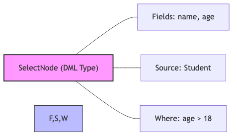

# Tầng Parser: Cơ chế Đệ quy Đi xuống (Recursive Descent)

Lớp `Parser.cs` là "ngã tư" điều hướng mọi câu lệnh. Với hơn 3400 dòng mã nguồn, nó thực hiện một quy trình phân tích cú pháp hiệu năng cao dựa trên thuật toán **Recursive Descent (Đệ quy đi xuống)**.

## 1. Cơ chế Điều hướng (Sentence Dispatching)

Mỗi khi máy chủ nhận được một chuỗi Tokens từ Lexer, nó khởi tạo `Parser.cs` và gọi hàm `ParseAll()`.

```csharp
// Luồng xử lý đa câu lệnh trong Parser.cs
public List<AstNode> ParseAll() {
    var statements = new List<AstNode>();
    while (!IsAtEnd()) {
        var stmt = ParseStatement(); // "Ngã tư" điều hướng
        statements.Add(stmt);
        if (Check(TokenType.SEMICOLON)) Advance(); // Tiêu thụ dấu ';'
    }
}
```

### Hàm `ParseStatement()`
Đây là bộ khung switch-case khổng lồ, quyết định câu lệnh tiếp theo là DDL (Định nghĩa), DML (Truy vấn) hay TCL (Giao dịch). Mỗi khi nhận diện được một từ khóa bắt đầu (như `CREATE`, `SELECT`), nó sẽ ủy quyền cho một hàm con chuyên biệt (ví dụ: `ParseCreate()`, `ParseSelect()`).

---

## 2. Kỹ thuật Dự đoán & Tiêu thụ (Look-ahead)

KBMS sử dụng ngữ pháp **LL(k)**, cho phép Parser "nhìn trước" $k$ Token để quyết định nhánh thực thi mà không cần quay lui (Backtracking).


*Hình: Ví dụ cấu trúc cây AST sau khi phân tích (dàn ngang)*

*   **`Peek()`**: Xem Token hiện tại mà không tiêu thụ.
*   **`Check(type)`**: Kiểm tra xem Token hiện tại có đúng Type mong muốn hay không.
*   **`Consume(type)`**: Nếu Token đúng Type, tiến tới Token tiếp theo. Nếu sai, ngay lập tức ném ra `ParseException` kèm tọa độ `Line/Column`.
*   **`Advance()`**: Luôn tiến về phía trước, đảm bảo độ phức tạp thời gian là $O(N)$ (N là số lượng Token).

---

## 3. Phân tích Khối Lệnh phức tạp (Complex Parsing)

Một trong những phần xử lý tinh vi nhất trong `Parser.cs` là phân tích lệnh `CREATE CONCEPT`. Thay vì một parser phẳng, nó thực hiện đệ quy lồng nhau:

1.  **`ParseCreate`** gọi **`ParseCreateConcept`**.
2.  **`ParseCreateConcept`** lặp trong khối `(...)` và kiểm tra từ khóa.
3.  Nếu gặp `VARIABLES`, nó gọi **`ParseVariableDefinition`** để bóc tách `name: TYPE`.
4.  Nếu gặp `CONSTRAINTS`, nó gọi **`ParseConstraintList`** (đây là lúc Expression Parser được kích hoạt).
5.  Nếu gặp `RULES`, nó gọi **`ParseConceptRuleList`** (phân tích IF-THEN logic).

> [!CAUTION]
> **Error Reporting & Recovery**
> Khi gặp một lỗi cú pháp (ví dụ: thiếu dấu ngoặc đóng), Parser sẽ ném một `ParseException`. Hệ thống thu nạp `Line` và `Column` từ chính Token bị lỗi. Điều này cực kỳ quan trọng giúp nhà phát triển tìm ra và sửa lỗi ngay lập tức trên bản đồ tri thức lớn. 🕵️‍♂️
