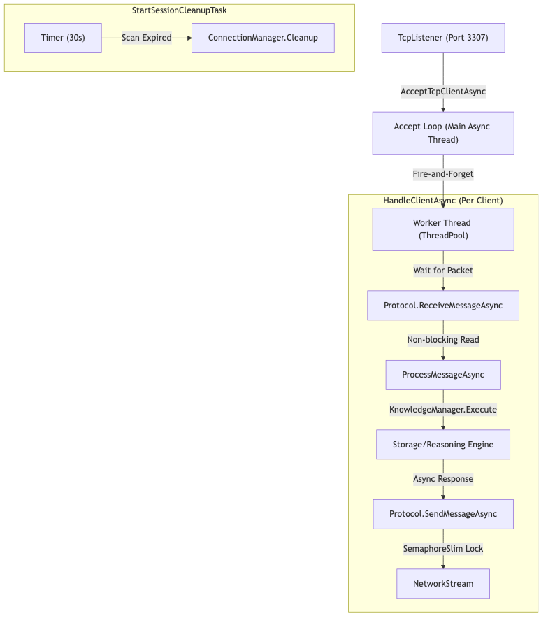

# 10.1. Điều phối Mạng & Luồng Hoạt động

Máy chủ KBMS (`KbmsServer.cs`) được thiết kế trên mô hình xử lý hiệu năng cao, cho phép tiếp nhận hàng ngàn kết nối đồng thời nhờ vào kiến trúc **Task-based Asynchronous Pattern (TAP)** của .NET.

## 1. Mô hình Xử lý Luồng (Async Threading Model)

Khác với các hệ thống cũ sử dụng `1-Thread-Per-Client`, KBMS sử dụng kỹ thuật bất đồng bộ thực thụ để giải phóng bộ nhớ và tăng khả năng chịu tải.

*Hình 10.1: Mô hình xử lý bất đồng bộ (Asynchronous) sử dụng ThreadPool của .NET.*

1.  **Chấp nhận kết nối (Acceptance Loop)**: 
    Vòng lặp `while` chính sử dụng `await _listener.AcceptTcpClientAsync(...)`. Khi có client kết nối, hệ thống không đợi mà ngay lập tức spawn một tác vụ con (`_ = HandleClientAsync(client)`) rồi quay lại lắng nghe client tiếp theo.
2.  **Xử lý Gói tin (Fire-and-Forget)**: 
    Nhiệm vụ xử lý client được đẩy hoàn toàn vào ThreadPool của hệ điều hành. Điều này giúp Main Thread của Server không bao giờ bị nghẽn (Non-blocking).
3.  **Hàng đợi Ghi (Semaphore Lock)**: 
    Do Server có thể gửi nhiều thông điệp bất đồng bộ (ví dụ: đang gửi kết quả Query thì Server muốn gửi thêm Live Log), lớp `Protocol` sử dụng `SemaphoreSlim` để khóa luồng ghi nhị phân, đảm bảo các byte không bị trộn lẫn trên đường truyền.

---

## 2. Quản lý Phiên (Session Management)

Kéo dài sự tồn tại của kết nối và định danh người dùng thông qua lớp `ConnectionManager.cs`.

*   **Lưu trữ an toàn luồng**: Toàn bộ các phiên làm việc được lưu trong một `ConcurrentDictionary`. Đây là cấu trúc dữ liệu tối ưu cho phép hàng trăm Thread con cùng lúc đọc/ghi thông tin Session mà không gây ra lỗi tranh chấp bộ nhớ (Race Conditions).
*   **Dọn dẹp tài nguyên (Cleanup Task)**: 
    Máy chủ khởi chạy một tiến trình ngầm `StartSessionCleanupTask` định kỳ mỗi **30 giây**. Nó quét qua danh sách `LastActivityAt` và tự động đóng các `Socket` của client đã quá lâu không tương tác (`DefaultTimeoutSeconds`), giúp rảnh RAM cho những kết nối mới.

---

## 3. Vòng đời của một Giao dịch (Lifecycle)

Máy chủ vận hành theo một vòng lặp sự kiện (Event Loop) cho mỗi client:

1.  **Receive**: Đọc Header (4 byte đầu) để biết kích thước gói.
2.  **Dispatch**: Chuyển giao gói tin cho `ProcessMessageAsync`.
3.  **Execute**: Nếu là truy vấn, Server gọi `KnowledgeManager` để xử lý.
4.  **Respond**: Đóng gói kết quả và gửi ngược lại client.

> [!TIP]
> **Kỹ thuật TDS (Tabular Data Streaming)**
> Khi gặp kết quả lớn (>100 dòng), Server sẽ không gửi 1 gói tin khổng lồ. Thay vào đó, nó chia nhỏ dữ liệu thành các lô `ROW (0x07)` và gửi liên tục. Client có thể bắt đầu hiển thị dữ liệu ngay khi lô đầu tiên tới nơi, tạo cảm giác hệ thống phản hồi tức thì (Instant Feedback).
