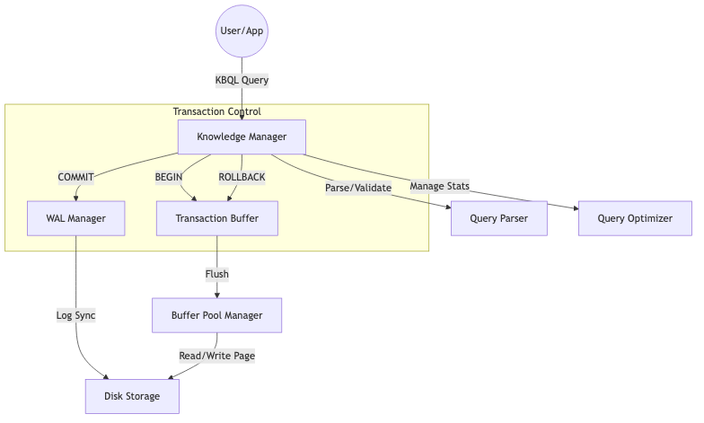

# Kiến trúc Bộ não Điều phối

`KnowledgeManager.cs` là thành phần trung tâm, đóng vai trò "Bộ não" của toàn bộ hệ thống [KBMS](../00-glossary/01-glossary.md#kbms). Nó kết nối giữa Tầng Ngôn ngữ ([Parser](../00-glossary/01-glossary.md#parser)/[AST](../00-glossary/01-glossary.md#ast)) và Tầng Lưu trữ/Suy diễn (Storage/Reasoning).

## 1. Cơ chế Bộ hạ lệnh (The Dispatcher)

Sau khi `KBMS.Parser` bẻ gãy câu lệnh thành một cây cú pháp ([AST](../00-glossary/01-glossary.md#ast)), `KnowledgeManager` sẽ thực hiện đệ quy qua danh sách các nút này và gọi hàm `Execute(ast, user, currentKb)`.

```csharp
// Luồng thực thi lõi trong KnowledgeManager.cs
public object Execute(AstNode ast, User user, string? currentKb) {
    var kbName = DetermineKbName(ast) ?? currentKb;
    var action = DetermineAction(ast);
    
    if (!CheckPrivilege(user, action, kbName)) 
        return ErrorResponse.PermissionErrorResponse(action, kbName);
        
    return ExecuteQuery(ast, kbName);
}
```

### Chức năng chính:
*   **Routing (Định tuyến)**: Xác định lệnh này thuộc về Knowledge Base (KB) nào dựa trên từ khóa `USE` hoặc tham số câu lệnh.
*   **Security Guard (Bảo vệ)**: Sử dụng `CheckPrivilege` để lọc quyền của `User` hiện tại (ROOT, ADMIN, WRITE, SELECT). Mọi hành động xâm phạm đều bị chặn ngay tại đây trước khi chạm vào dữ liệu.
*   **[Execution Pipeline](../00-glossary/01-glossary.md#execution-pipeline)**: Hàm `ExecuteQuery` chứa một bộ chuyển mạch (Switch-case) khổng lồ điều hướng hơn **50 loại nút [AST](../00-glossary/01-glossary.md#ast)** khác nhau (từ `CREATE_CONCEPT` đến `SOLVE`).

---

## 2. Các Công nghệ Liên kết Tri thức

Hệ thống điều phối của [KBMS](../00-glossary/01-glossary.md#kbms) V3 mang tính đột phá nhờ các cơ chế sau:

### 2.1. Auto-expand Variables
Khi bạn khai báo một [Concept](../00-glossary/01-glossary.md#concept) chứa thuộc tính là một [Concept](../00-glossary/01-glossary.md#concept) khác (Ví dụ: `p: Point`), `KnowledgeManager` sẽ tự động "nở" biến này thành các thuộc tính con (`p.x`, `p.y`). 
*   **Lợi ích**: Giúp bộ máy suy diễn (`ReasoningEngine`) có thể truy cập trực tiếp vào các biến cơ sở mà không cần phải parse lại cấu trúc object phức tạp ([Flattening](../00-glossary/01-glossary.md#flattening) process).

### 2.2. Triggers Registry
`KnowledgeManager` duy trì một danh sách các **[Trigger](../00-glossary/01-glossary.md#trigger)** đang hoạt động. Ngay sau khi một lệnh `INSERT`, `UPDATE` hoặc `DELETE` thành công, bộ điều phối sẽ tự động gọi hàm `FireTriggers` để kích hoạt các phản ứng dây chuyền (Chain reactions) trong tri thức.

### 2.3. V3 [Data Router]
Bộ điều phối không còn truy cập file trực tiếp. Nó giao tiếp thông qua `V3DataRouter`. Router này chịu trách nhiệm xác định vị trí vật lý của dữ liệu trên hàng chục tệp tin `.kbf`, `.dat` khác nhau, giúp [KBMS](../00-glossary/01-glossary.md#kbms) mở rộng quy mô dữ liệu theo kiến trúc Multi-Database.

---

## 3. Quản lý Giao dịch

Khác với các hệ thống đơn giản, bộ điều phối của bạn hỗ trợ **Transaction Control Language ([TCL](../00-glossary/01-glossary.md#tcl))**:
*   **BEGIN TRANSACTION**: Bật cờ `inTransaction` và khởi tạo bộ đệm (`txBuffer`).
*   **COMMIT**: Phóng toàn bộ dữ liệu từ [Buffer Pool](../00-glossary/01-glossary.md#buffer-pool) xuống đĩa qua WAL. 
*   **ROLLBACK**: Xóa sạch bộ đệm, khôi phục trạng thái tri thức về điểm an toàn trước đó.


*Hình 10.2: Sơ đồ tương tác giữa [Knowledge Manager](../00-glossary/01-glossary.md#knowledge-manager) và các phân hệ cấp thấp.*
