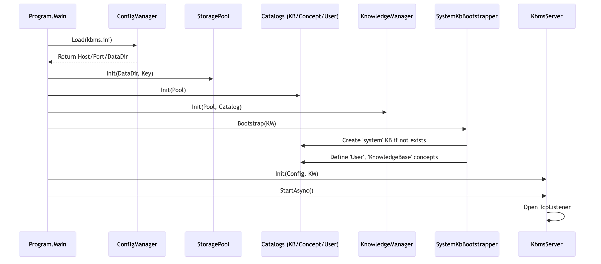

# 10.3. Hạ tầng V3

Phiên bản [KBMS](../00-glossary/01-glossary.md#kbms) V3 giới thiệu một bước tiến lớn: **Tự khởi động bằng chính ngôn ngữ tri thức**. Mã nguồn tại `KBMS.Server/V3` chịu trách nhiệm thiết lập nền móng cho mọi Knowledge Base khác.

## 1. Cơ chế Tự nạp Hệ thống (System Bootstrapper)

Mỗi khi máy chủ [KBMS](../00-glossary/01-glossary.md#kbms) khởi động lần đầu tiên trên một thư mục dữ liệu mới, `SystemKbBootstrapper.cs` sẽ được gọi để thực thi tiến trình "Khai thiên lập địa":

*Hình: Các bước khởi tạo hạ tầng từ Config đến Socket*

1.  **Khởi tạo `system` KB**: Hệ thống tự động lệnh `CreateKnowledgeBase("system")`.
2.  **Định nghĩa Siêu tri thức (Meta-Concepts)**: 
    [Bootstrapper](../00-glossary/01-glossary.md#bootstrapper) nạp sẵn các khái niệm cốt lõi:
    *   `User`: Lưu trữ Username, Password (Hash), Role, Permissions.
    *   `KnowledgeBase`: Danh mục các KB hiện có.
    *   `Session`: Theo dõi lịch sử đăng nhập/đăng xuất.
3.  **Bootstrap Admin**: Nếu chưa có người dùng nào, hệ thống tự động tạo tài khoản `root` mặc định.

---

## 2. Các Danh mục Chuyên biệt

Khác với V2 (lưu mọi thứ chung 1 file), V3 tách biệt hoàn toàn để tối ưu hóa quản lý:

*   **`KbCatalog.cs`**: Quản trị "Phả hệ" của các tri thức. Nó lưu trữ Metadata của hàng chục KB và quản lý quyền truy cập.
*   **`ConceptCatalog.cs`**: Quản lý hàng ngàn [Concept](../00-glossary/01-glossary.md#concept) và [Rule](../00-glossary/01-glossary.md#rule) của mỗi KB. Nó hỗ trợ nạp đè và thay đổi cấu trúc [Concept](../00-glossary/01-glossary.md#concept) mà không làm hỏng dữ liệu vật lý.
*   **`UserCatalog.cs`**: Hệ thống quản trị người dùng trung tâm. Nó đóng vai trò là "chứng minh thư" của cả máy chủ, cấp xác thực (Authentication) cho mọi kết nối TCP đi vào.

---

## 3. Hệ thống Cập nhật & Di trú

Để giữ cho hệ thống luôn ổn định giữa các phiên bản, [KBMS](../00-glossary/01-glossary.md#kbms) cung cấp các công cụ hạ tầng trong thư mục này:

### 3.1. `SystemUpdater.cs`
Tự động quét và vá các Schema của `system` KB khi người dùng nâng cấp phần mềm. Điều này đảm bảo các tri thức cũ luôn tương thích với bộ suy diễn mới.

### 3.2. `V2ToV3Converter.cs`
Đây là "Cây cầu nối" cho phép người dùng cũ của [KBMS](../00-glossary/01-glossary.md#kbms) V2 chuyển toàn bộ tri thức sang V3. Nó thực hiện quét đĩa cũ, bóc tách `Objects` và tự động băm nhỏ dữ liệu để đẩy vào cấu trúc **[Slotted Page](../00-glossary/01-glossary.md#slotted-page) 16KB** của V3.

