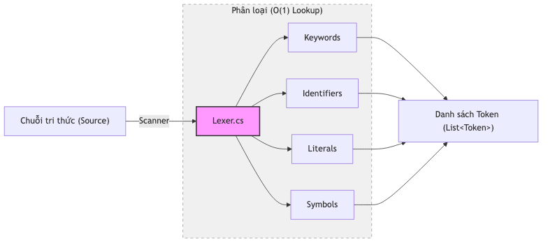

# 11.1. Lexing: Phân tích Từ vựng chuyên sâu

`Lexer.cs` là thành phần đầu tiên của máy chủ [KBMS](../00-glossary/01-glossary.md#kbms) tiếp nhận truy vấn người dùng. Nó thực hiện quét chuỗi (Scanning) $O(L)$ để bẻ gãy văn bản thô thành một danh sách các nguyên tử ngôn ngữ gọi là **Tokens**.

## 11.2. Cơ chế Quét

[Lexer](../00-glossary/01-glossary.md#lexer) vận hành như một máy trạng thái ([State Machine](../00-glossary/01-glossary.md#state-machine)) với hai con trỏ: `_start` (điểm bắt đầu của một từ) và `_current` (vị trí đang quét hiện tại).

*Hình: Quy trình quét chuỗi và định danh [Token](../00-glossary/01-glossary.md#token) (dàn ngang)*

### Quy trình xử lý (`ScanToken`):
1.  **Bỏ qua nhiễu**: Loại bỏ khoảng trắng (` `), tab (`\t`), xuống dòng (`\n`). Khi gặp xuống dòng, [Lexer](../00-glossary/01-glossary.md#lexer) tự động tăng chỉ số `_line` và reset `_column` để phục vụ báo lỗi.
2.  **Ký tự đơn**: Định danh ngay lập tức các [Token](../00-glossary/01-glossary.md#token) như `(`, `)`, `,`, `;`, `+`, `-`, `*`, `/`.
3.  **Toán tử kép**: Sử dụng hàm `Match()` để kiểm tra ký tự tiếp theo (Ví dụ: `>` và `>=`).
4.  **Chú thích (Comments)**: Khi gặp `--`, [Lexer](../00-glossary/01-glossary.md#lexer) sẽ bỏ qua toàn bộ phần còn lại của dòng.

---

## 2. Xử lý các Hằng số

`Lexer.cs` chứa các phương thức chuyên biệt để bóc tách dữ liệu thực tế:

### 2.1. Hằng số Số
Hỗ trợ đầy đủ các định dạng số học:
*   **Số nguyên**: `123`.
*   **Số thực**: `123.45`.
*   **Số âm**: Nhận diện dấu `-` đứng trước chữ số.
*   **Số mũ (Scientific Notation)**: Hỗ trợ `1.23e-10`.
*   **Xử lý nội bộ**: Sử dụng `double.TryParse` với `CultureInfo.InvariantCulture` để đảm bảo tính nhất quán trên mọi hệ điều hành.

### 2.2. Hằng số Chuỗi
Hỗ trợ cả nháy đơn `'` và nháy kép `"`:
*   **Ký tự thoát (Escape)**: Cho phép dùng nháy kép lặp lại (`""`) để biểu diễn một dấu nháy đơn trong chuỗi.
*   **Đa dòng**: Chuỗi có thể kéo dài qua nhiều dòng, [Lexer](../00-glossary/01-glossary.md#lexer) sẽ tự nạp các ký tự xuống dòng vào giá trị [literal](../00-glossary/01-glossary.md#literal).

---

## 3. Quản lý Từ khóa

[KBMS](../00-glossary/01-glossary.md#kbms) sở hữu một kho từ điển từ khóa (Keywords) đồ sộ với hơn **190 [Token](../00-glossary/01-glossary.md#token) Types**.

*Bảng 11.1: Phân loại các nhóm [Token](../00-glossary/01-glossary.md#token) trong [Lexer](../00-glossary/01-glossary.md#lexer)*
| Nhóm | Ví dụ từ khóa |
| :--- | :--- |
| **DML** | `SELECT`, `INSERT`, `UPDATE`, `DELETE`, `SOLVE` |
| **[DDL](../00-glossary/01-glossary.md#ddl)** | `CREATE`, `DROP`, `ALTER`, `CONCEPT`, `RELATION` |
| **Types** | `INT`, `DECIMAL`, `VARCHAR`, `BOOLEAN`, `DATE` |
| **[TCL](../00-glossary/01-glossary.md#tcl)** | `BEGIN`, `COMMIT`, `ROLLBACK` |

[Lexer](../00-glossary/01-glossary.md#lexer) thực hiện tra cứu không phân biệt hoa thường (`OrdinalIgnoreCase`) để tạo ra các [Token](../00-glossary/01-glossary.md#token) có Type tương ứng, giúp [Parser](../00-glossary/01-glossary.md#parser) xử lý nhanh chóng mà không cần so khớp chuỗi (String comparison).

