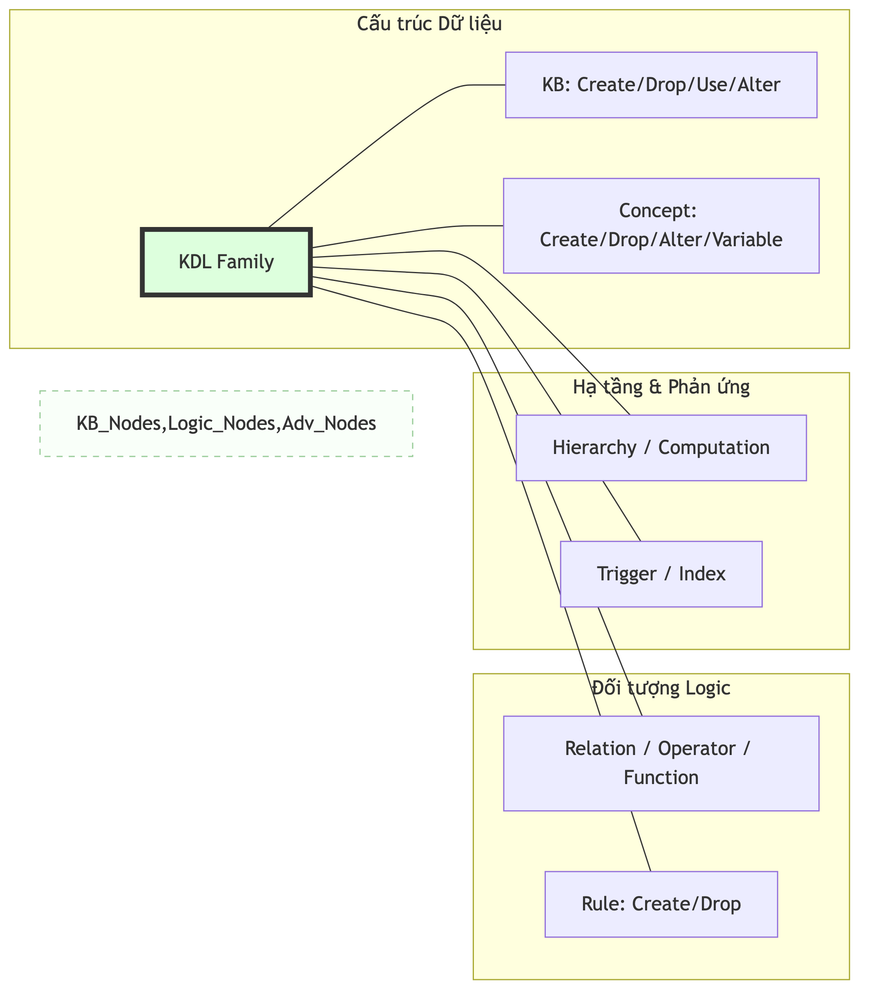
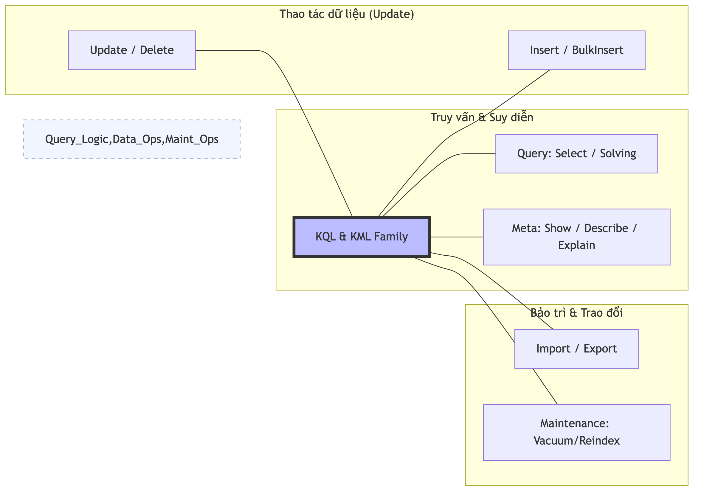
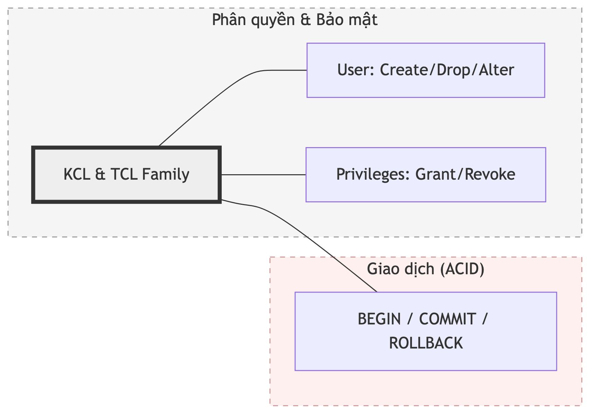

# 11.3. Hệ thống Cây cú pháp Trừu tượng ([AST](../00-glossary/01-glossary.md#ast) Nodes)

Cây [AST](../00-glossary/01-glossary.md#ast) là đại diện logic hoàn chỉnh cho tri thức sau khi được biên dịch. Tại [KBMS](../00-glossary/01-glossary.md#kbms), mỗi câu lệnh được bóc tách thành một hoặc nhiều `AstNode` chuyên biệt, phân cấp theo 5 họ ngôn ngữ thực tế trong thư mục `KBMS.Parser/Ast`.

*Hình: Tổng quan 5 nhánh Phả hệ Tri thức [KBMS](../00-glossary/01-glossary.md#kbms)*

---

## 1. Hệ phả [[KDL](../00-glossary/01-glossary.md#kdl)]
Đây là họ lớn nhất, chịu trách nhiệm định nghĩa "cơ thể" của tri thức:

*Hình: Chi tiết các Node định nghĩa tri thức ([KDL](../00-glossary/01-glossary.md#kdl))*

*   **Knowledge Base**: `CreateKnowledgeBaseNode`, `DropKbNode`, `UseKbNode`, `AlterKbNode`.
*   **Concepts**: `CreateConceptNode`, `DropConceptNode`, `AlterConceptNode`, `AddVariableNode`.
*   **Rules**: `CreateRuleNode`, `DropRuleNode`.
*   **Hierarchy**: `AddHierarchyNode`, `RemoveHierarchyNode`.
*   **Relation**: `CreateRelationNode`, `DropRelationNode`.
*   **Operator**: `CreateOperatorNode`, `DropOperatorNode`.
*   **Function**: `CreateFunctionNode`, `DropFunctionNode`.
*   **Advanced**: `AddComputationNode`, `RemoveComputationNode`, `CreateIndexNode`, `CreateTriggerNode`.

---

## 2. Hệ phả [KQL](../00-glossary/01-glossary.md#kql) & [[KML](../00-glossary/01-glossary.md#kml)]
Các nhánh này chịu trách nhiệm hỏi đáp và bảo trì dữ liệu tri thức:

*Hình: Chi tiết các Node Truy vấn ([KQL](../00-glossary/01-glossary.md#kql)) và Thao tác ([KML](../00-glossary/01-glossary.md#kml))*

### 2.1. Nhóm [KQL](../00-glossary/01-glossary.md#kql)
*   **`SelectNode`**: Dùng để lọc và truy vấn các đối tượng tri thức dựa trên thuộc tính.
*   **`SolveNode`**: Dùng cho bộ máy suy diễn (`ReasoningEngine`), chứa các mệnh đề `Given` (giả thiết) và `Find` (mục tiêu).
*   **`ShowNode`**: Liệt kê danh sách các thành phần (Concepts, Rules, KnowledgeBases).
*   **`DescribeNode`**: Xem chi tiết cấu trúc của một [Concept](../00-glossary/01-glossary.md#concept) cụ thể.
*   **`ExplainNode`**: Giải thích luồng suy luận của một câu lệnh tri thức.

### 2.2. Nhóm [KML](../00-glossary/01-glossary.md#kml)
*   **`InsertNode` / `InsertBulkNode`**: Nạp tri thức mới vào đĩa.
*   **`UpdateNode` / `DeleteNode`**: Sửa đổi và xóa bỏ các Object Instance.
*   **`ImportNode` / `ExportNode`**: Giao lưu tri thức với các tệp tin bên ngoài (`.csv`, `.json`).
*   **`MaintenanceNode`**: Các lệnh quản trị bộ nhớ thấp cấp (v.d: `REINDEX`, `VACUUM`).

---

## 3. Hệ phả [KCL](../00-glossary/01-glossary.md#kcl) & [[TCL](../00-glossary/01-glossary.md#tcl)]
Nhánh bảo mật và quản lý giao dịch:

*Hình: Chi tiết các Node Bảo mật ([KCL](../00-glossary/01-glossary.md#kcl)) và Giao dịch ([TCL](../00-glossary/01-glossary.md#tcl))*

*   **DCL (Control)**: `CreateUserNode`, `DropUserNode`, `AlterUserNode`, `GrantNode`, `RevokeNode`.
*   **[TCL](../00-glossary/01-glossary.md#tcl) (Transaction)**: `BeginTransactionNode`, `CommitNode`, `RollbackNode`.

---

## 5. Đặc điểm chung của mọi Node
Mọi lớp Node đều kế thừa từ **`AstNode.cs`**, đảm bảo các tính năng cốt lõi:
1.  **Vị trí nguồn**: Lưu trữ `Line` (Dòng) và `Column` (Cột) của câu lệnh gốc.
2.  **Type định danh**: Mọi Node đều có thuộc tính `Type` (như `"CREATE_CONCEPT"`) giúp Server Routing nhanh chóng.
3.  **ToQueryString()**: Khả năng tái tạo lại mã nguồn [KBQL](../00-glossary/01-glossary.md#kbql) từ cây [AST](../00-glossary/01-glossary.md#ast) ([Reverse Engineering](../00-glossary/01-glossary.md#reverse-engineering)).

