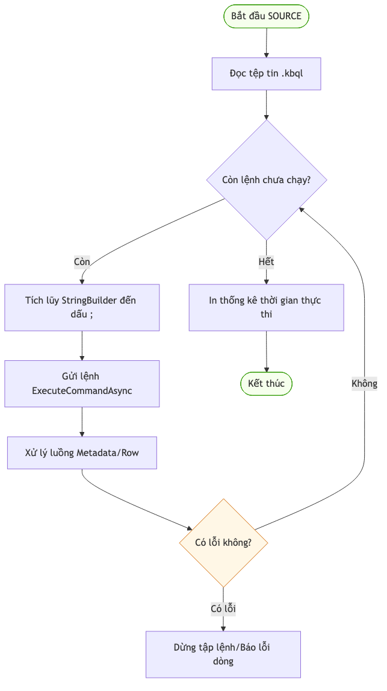

# 12.2. Luồng Xử lý Dữ liệu CLI

Để đảm bảo hiệu năng trong môi trường dòng lệnh, `KBMS.CLI` vận hành theo một luồng xử lý phi đồng bộ (Asynchronous) dựa trên socket.

## 1. Luồng Gửi lệnh (Command Execution Flow)

Khi người dùng nhấn Enter, CLI thực hiện các bước sau:

1.  **Input Buffering**: Tích lũy các dòng cho đến khi gặp dấu `;`.
2.  **Request Construction**: Đóng gói lệnh thành các `Message` (Dạng `QUERY` hoặc `LOGIN`).
3.  **Binary Transport**: Gửi qua `KBMS.Network` (Socket).
4.  **Wait for Response**: Lắng nghe phản hồi từ máy chủ.

---

## 2. Bộ máy Phân tích Phản hồi (`ResponseParser`)

Phần phức tạp nhất của CLI nằm ở `ResponseParser.cs`. Do kết quả từ Server có thể là một luồng dữ liệu (Streaming ROWS), CLI phải xử lý từng gói tin:

*   **METADATA**: Định nghĩa các cột (Name, Type).
*   **ROW**: Dữ liệu thực tế cho từng bản ghi.
*   **RESULT**: Thông điệp cuối cùng (v.d: "Insert successful").
*   **ERROR**: Chứa thông tin lỗi (Message, Line, Column).

### Quy trình hiển thị:
`ResponseParser.cs` thực hiện vẽ bảng "động" theo thuật toán tối ưu:
1.  **Header Rendering**: Ngay khi nhận `METADATA`, CLI tính toán độ rộng cột lớn nhất dựa trên tên cột và vẽ khung Header.
2.  **Multi-line Cell Support**: Nếu dữ liệu trong một ô chứa dấu xuống dòng (`\n`), CLI sẽ tự động chia ô đó thành nhiều dòng và vẽ đường kẻ phân cách hàng (`|---+---|`) để đảm bảo bảng luôn cân đối.
3.  **Vertical Rendering**: Đối với các phản hồi thuộc nhóm `Explain_` hoặc `Describe_`, CLI chuyển sang chế độ hiển thị theo cặp `Field: Value` trên từng hàng dọc.

---

## 3. Chế độ Chạy Script (Batch Source)

CLI hỗ trợ thực thi khối lượng lớn lệnh thông qua tệp tin `.kbql`. Luồng này được xử lý tuần tự để đảm bảo tính nhất quán:

---

## 4. Đa luồng & Kết nối (Multi-threading)

CLI chạy hai luồng chính để duy trì trạng thái:
1.  **Main Thread**: Chờ nhận input của người dùng.
2.  **Heartbeat Thread**: (Tùy chọn) Gửi tín hiệu duy trì kết nối nếu cần thiết.

> [!IMPORTANT]
> **Streaming Mode**
> Nhờ cơ chế nhận tin phi tập trung, người dùng có thể thấy kết quả trả về ngay lập tức cho các truy vấn lớn (`LIMIT 10000`) mà không cần chờ Server nén toàn bộ dữ liệu. ⚡
