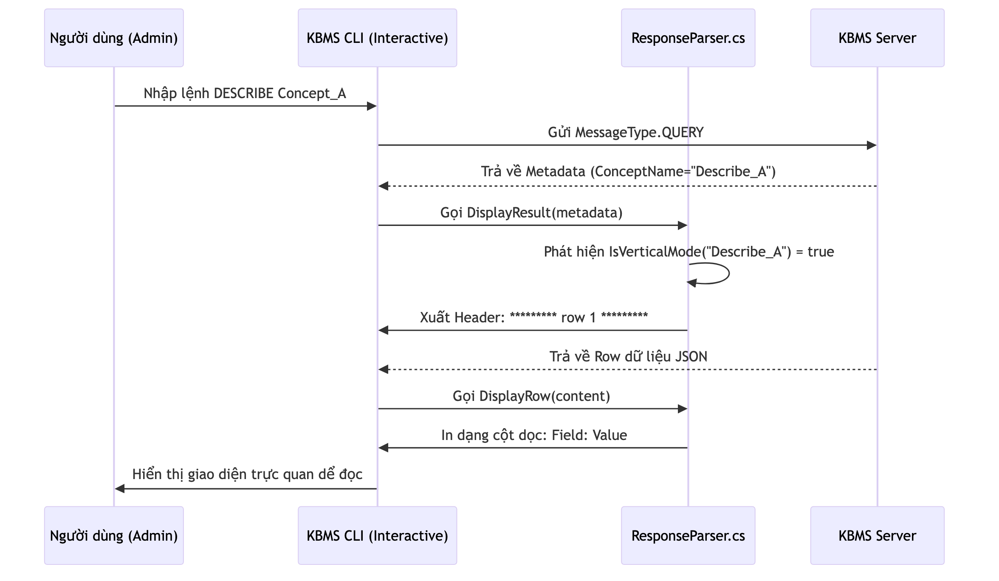

# 12.3. Các Trường hợp Sử dụng CLI

KBMS CLI là công cụ tối thượng cho các quản trị viên hệ thống và chuyên gia tri thức cần sự tốc độ và khả năng tự động hóa.

## 1. Kịch bản 1: Phân tích Cấu trúc (Structure Analysis)

*   **Mục tiêu**: Xem chi tiết định nghĩa của một Concept phức tạp với hàng chục biến.
*   **Sơ đồ Hoạt động**:

*   **Quy trình chi tiết**:
    1.  **Gửi lệnh**: Người dùng gõ `DESCRIBE <ConceptName>;`.
    2.  **Nhận diện**: CLI nhận gói tin Metadata có thuộc tính `ConceptName` bắt đầu bằng `Describe_`.
    3.  **Chế độ Dọc**: `ResponseParser` tự động chuyển sang Vertical Mode để hiển thị danh sách biến theo chiều dọc, tránh việc bảng bị tràn màn hình (Overflow).
    4.  **Kết quả**: Từng biến được liệt kê rõ ràng kèm kiểu dữ liệu tương ứng.

## 2. Kịch bản 2: Tự động hóa Nạp Tri thức (Batch Loading)

*   **Mục tiêu**: Nạp hàng ngàn thực thể tri thức từ tệp tin script có sẵn.
*   **Quy trình chi tiết**:
    1.  **Chuẩn bị**: Tạo tệp `import.kbql` chứa các lệnh `INSERT`.
    2.  **Thực thi**: Gõ `SOURCE import.kbql;` tại CLI.
    3.  **Vòng lặp**: CLI đọc từng block lệnh (phân tách bởi dấu `;`) và gửi tới Server.
    4.  **Xử lý sai sót**: Nếu một lệnh gặp lỗi, CLI sẽ dừng ngay lập tức và chỉ ra vị trí dòng lệnh bị lỗi trong tệp nguồn để quản trị viên sửa chữa.
    5.  **Thống kê**: Sau khi hoàn thành, CLI in ra tổng số bản ghi đã nạp và tổng thời gian thực thi.

---

## 3. Kịch bản 3: Kiểm tra Kết nối & An ninh (Security Check)

*   **Mục tiêu**: Đăng nhập và kiểm tra tình trạng kết nối tới máy chủ từ xa.
*   **Quy trình**:
    1.  Người dùng gõ `LOGIN <username> <password>`.
    2.  CLI gửi gói tin `LOGIN` bảo mật tới Server.
    3.  Server xác thực và trả về `LOGIN_SUCCESS`.
    4.  Prompt của CLI chuyển từ `login>` sang `kbms> `, sẵn sàng cho các lệnh truy vấn.

> [!TIP]
> **Hiệu năng Dòng lệnh**
> Nhờ cơ chế streaming dữ liệu, CLI có thể hiển thị những bản ghi đầu tiên của một truy vấn `SELECT` lớn chỉ sau vài mili giây, giúp người dùng đánh giá dữ liệu mà không cần chờ đợi toàn bộ kết quả. ⚡
