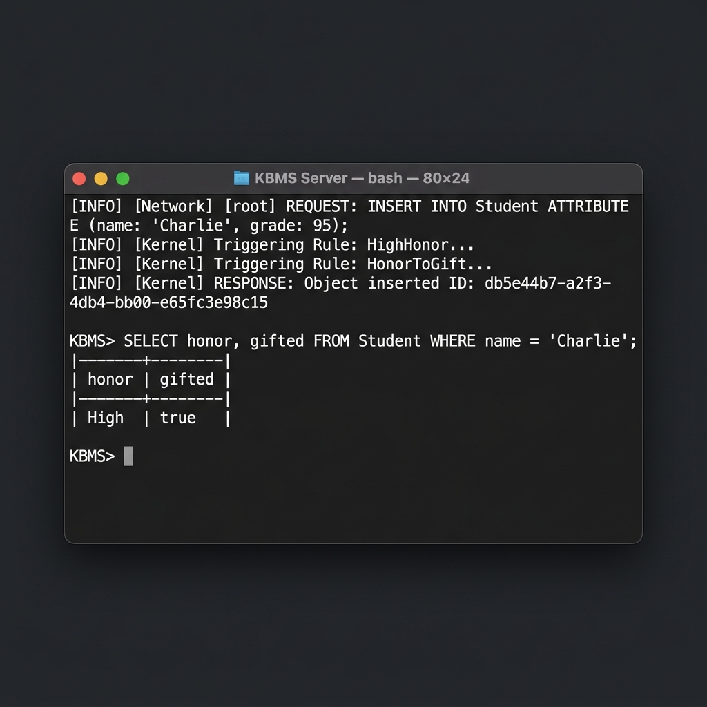

# 03. Bộ dữ liệu Kiểm thử mẫu (Data Sets)

Hệ thống KBMS sử dụng các bộ dữ liệu (Datasets) được định nghĩa chuẩn hóa trong thư mục `/datasets` để phục vụ cho các bài kiểm thử tự động và thủ công.

## 1. Danh mục các Bộ dữ liệu (Datasets Catalog)

| Tên Dataset | File Nguồn | Mô tả | Ứng dụng |
| :--- | :--- | :--- | :--- |
| **Enterprise IT** | [enterprise_it.kbql](../../datasets/enterprise_it.kbql) | Mẫu dữ liệu nhân viên, phòng ban. | Join, Metadata, RBAC. |
| **Charlie Reasoning** | [charlie_reasoning.kbql](../../datasets/charlie_reasoning.kbql) | Mẫu dữ liệu sinh viên và điểm số. | F-Closure, Forward Chaining. |
| **Stress Volume** | [stress_volume.kbql](../../datasets/stress_volume.kbql) | Mẫu dữ liệu lớn (BigData). | Load Test, Volume, Indexing. |

## 2. Chi tiết Bộ dữ liệu trọng tâm: "Charlie" (Suy diễn Đệ quy)

Sử dụng trong `Phase5ForwardChainingTests.cs` để kiểm tra khả năng suy diễn đa tầng.

### Dữ liệu nguồn:
| name | grade | honor | gifted |
| :--- | :--- | :--- | :--- |
| Charlie | 95 | *Tự động (High)* | *Tự động (true)* |

### Logic Luật áp dụng:
1.  **Rule 1**: Nếu `grade >= 90` thì `honor = 'High'`.
2.  **Rule 2**: Nếu `honor = 'High'` thì `gifted = true`.

## 3. Nhật ký Logic suy diễn (Log Trace)

Dưới đây là bằng chứng thực tế khi hệ thống xử lý bộ dữ liệu Charlie từ tệp `charlie_reasoning.kbql`:

---

> [!NOTE]
> Tất cả các tệp `.kbql` trong thư mục `/datasets` có thể được nạp trực tiếp vào **KBMS CLI** bằng lệnh `SOURCE path/to/file.kbql` để tái lập môi trường kiểm thử nhanh chóng.
