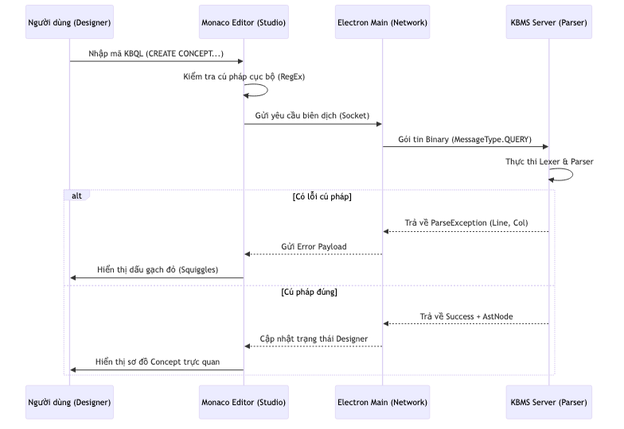
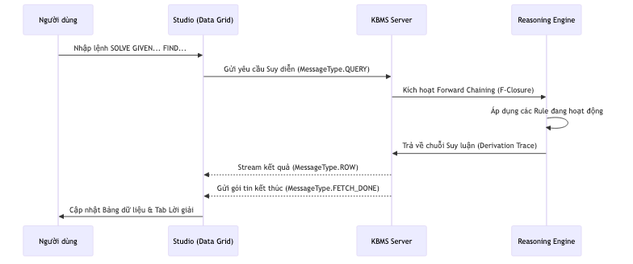
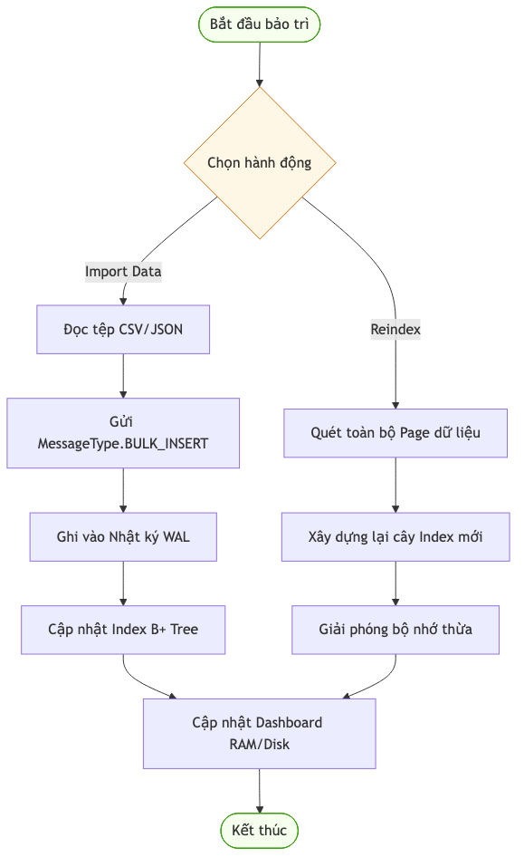
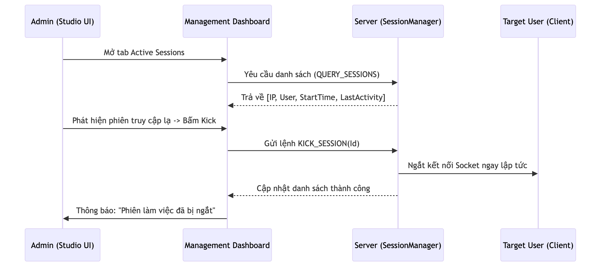
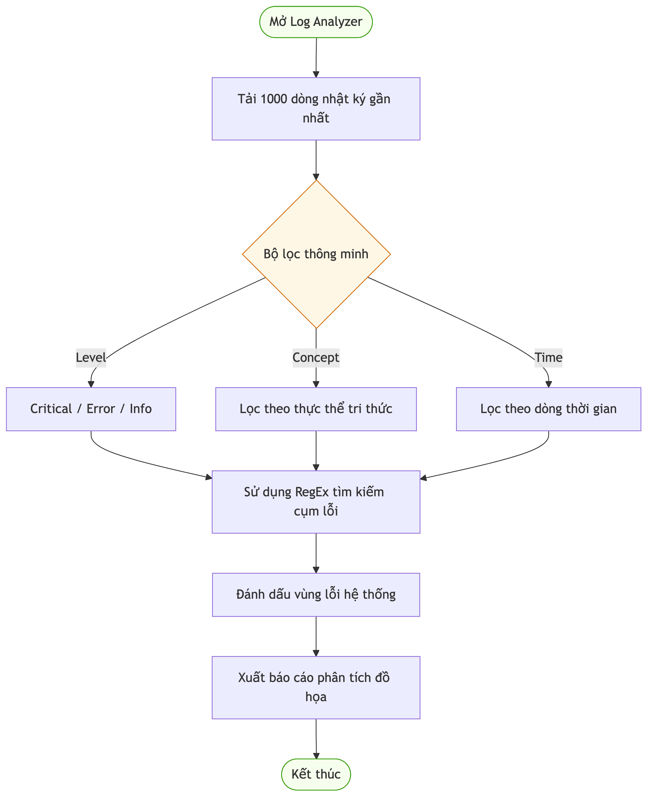

# 13.3. Các Trường hợp Sử dụng Studio

KBMS Studio không chỉ là một trình soạn thảo, mà còn là một bộ công cụ giải quyết các bài toán tri thức chuyên sâu.

## 1. Kịch bản 1: Thiết kế Bản đồ Tri thức Hình học (KDL Design)

*   **Mục tiêu**: Định nghĩa các Concept như `Diem`, `DoanThang`, `TamGiac` và các `Rule` tính toán diện tích.
*   **Sơ đồ Hoạt động**:

*   **Quy trình chi tiết trong Studio**:
    1.  **Nhập liệu**: Người dùng sử dụng **Monaco Editor** với tính năng Auto-complete để gõ nhanh `CREATE CONCEPT`.
    2.  **Kiểm tra**: Parser tại Server thực hiện biên dịch thời gian thực. Nếu sai, **Error Squiggles** sẽ xuất hiện ngay lập tức.
    3.  **Trực quan**: Khi cú pháp đúng, Designer sẽ vẽ lại sơ đồ Concept giúp người dùng kiểm tra các mối quan hệ (Properties/Constraints).
    4.  **Lưu trữ**: Sau khi hoàn thiện, tri thức được lưu vào tệp `.kbql` hoặc nạp trực tiếp vào RAM Server.

## 2. Kịch bản 2: Giải toán Tự động (Reasoning & Solving)

*   **Mục tiêu**: Tìm lời giải cho bài toán: "Cho tam giác ABC vuông tại A, tính BC khi biết AB, AC".
*   **Sơ đồ Hoạt động**:

*   **Quy trình chi tiết trong Studio**:
    1.  **Gửi yêu cầu**: Nhập lệnh `SOLVE ON TamGiac GIVEN AB=3, AC=4 FIND BC;`.
    2.  **Suy diễn**: Server chuyển yêu cầu cho `Reasoning Engine` để thực hiện thuật toán F-Closure.
    3.  **Phản hồi**: Kết quả giá trị (`BC=5`) nhảy ra trên **Data Grid**.
    4.  **Truy vết**: Người dùng mở tab **Reasoning Trace** để xem cây suy luận: `Pitago Rule` -> `BC = Sqrt(AB^2 + AC^2)`.

## 3. Kịch bản 3: Quản trị Hệ thống (Advanced Management)

*   **Mục tiêu**: Theo dõi hiệu năng và bảo trì dữ liệu khi hệ thống chứa hàng triệu đối tượng.
*   **Sơ đồ Hoạt động**:

*   **Quy trình chi tiết trong Studio**:
    1.  **Nạp dữ liệu**: Dùng giao diện Import để đẩy các tệp CSV chứa hàng triệu Objects thông qua lệnh **Bulk Insert**.
    2.  **Giám sát**: Dashboard hiển thị thời gian thực mức độ chiếm dụng **RAM (LRU Cache)** và **Disk (Page Storage)**.
    3.  **Bảo trì**: Thực hiện `MAINTENANCE REINDEX` trực tiếp từ Studio để tối ưu hóa cấu trúc cây B+ Tree sau khi nạp dữ liệu lớn.
    4.  **Kiểm tra**: Theo dõi **Activity Logs** để đảm bảo mọi giao dịch (Transaction) đều hoàn thành an toàn.

## 4. Kịch bản 4: Giám sát An ninh & Phiên làm việc (Security & Session Management)

*   **Mục tiêu**: Admin kiểm soát các truy cập vào hệ thống và ngăn chặn các phiên làm việc đáng ngờ.
*   **Sơ đồ Hoạt động**:

*   **Quy trình chi tiết trong Studio**:
    1.  **Tra cứu**: Admin mở tab **Active Sessions** để xem danh sách IP và User đang kết nối.
    2.  **Phát hiện**: Nhận diện một phiên làm việc lạ từ IP không xác định.
    3.  **Xử lý**: Nhấn nút **Kick**; Studio gửi lệnh `KICK_SESSION` xuống Server.
    4.  **Kết quả**: Server ngắt Socket ngay lập tức và gửi thông báo Notification tới toàn bộ Admin khác về hành động này.

## 5. Kịch bản 5: Phân tích Nhật ký Chuyên sâu (Deep Log Analysis)

*   **Mục tiêu**: Truy tìm nguyên nhân gốc rễ của các lỗi logic hoặc lỗi IO thấp cấp.
*   **Sơ đồ Hoạt động**:

*   **Quy trình chi tiết trong Studio**:
    1.  **Lọc dữ liệu**: Sử dụng **Log Analyzer** để lọc các lỗi ở cấp độ `CRITICAL`.
    2.  **Truy vấn**: Sử dụng RegEx để tìm kiếm các cụm từ khóa liên quan đến thực thể (v.d: `TamGiac_01`).
    3.  **Đánh giá**: Studio hiển thị biểu đồ tần suất lỗi, giúp xác định lỗi xảy ra do Rule logic hay do xung đột Page dữ liệu.
    4.  **Xuất bản**: Xuất báo cáo dưới dạng tệp văn bản để phục vụ công tác bảo trì.

---

## 6. Tổng kết Giá trị

Nhờ sự kết hợp giữa giao diện đồ họa (Studio) và hiệu năng của lõi C#, người dùng có thể chuyển đổi linh hoạt từ việc **soạn thảo học thuật** sang **ứng dụng công nghiệp** một cách mượt mà.

> [!TIP]
> **Tư duy Tri thức**
> Studio giúp biến các dòng lệnh khô khan thành các cấu trúc có thể nhìn thấy và chạm vào được, giúp việc học tập và nghiên cứu tri thức trở nên dễ dàng hơn bao giờ hết. 🎓
