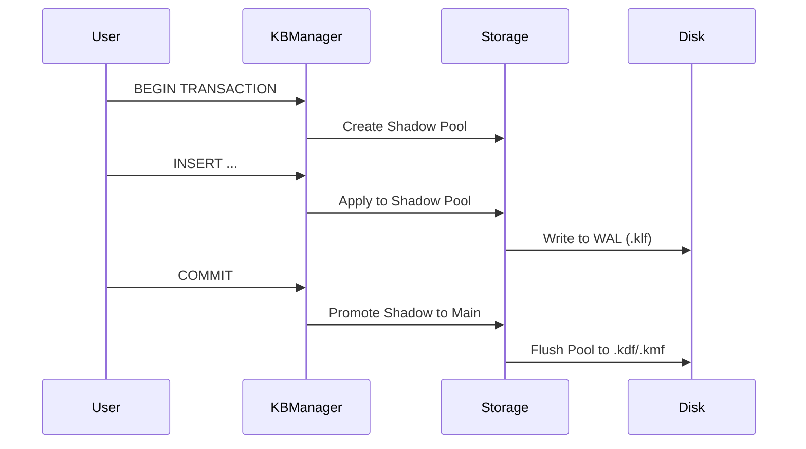

# KBMS Architecture: 4-Tier Design

KBMS is built on a modular 4-tier architecture that separates physical storage concerns from high-level reasoning. This design ensures performance, scalability, and transactional integrity.

## 1. Physical Layer (Data Management)
The Physical Layer interacts directly with the file system. It manages the custom binary file formats used by KBMS:
- **`.kmf` (Metadata)**: Stores knowledge base definitions, user privileges, and internal configurations.
- **`.kdf` (Data)**: Stores serialized `Concept` definitions and `ObjectInstance` data.
- **`.klf` (Log)**: The Write-Ahead Log (WAL) that records every transaction for crash recovery.

### Mechanisms:
- **Binary Serialization**: Efficient binary format for rapid disk I/O.
- **Encryption**: Built-in support for securing sensitive knowledge at rest.

## 2. Storage Layer (Buffer & Transaction)
The Storage Layer acts as the intermediary between the physical files and the rest of the system.
- **Buffer Pool**: A memory cache that lazy-loads knowledge from disk into RAM. Subsequent reads are performed at memory speed.
- **Shadow Paging**: Ensures atomicity. When a transaction begins, the engine creates a "shadow" copy of the pool. Updates are made to the shadow; upon `COMMIT`, the shadow is promoted to the main pool and flushed to disk.
- **WAL (Write-Ahead Logging)**: Every destructive operation is logged to `.klf` before being applied, ensuring that even in the case of a power failure, the system can recover to a consistent state.

## 3. Knowledge Layer (Schema & Logic)
The Knowledge Layer represents the "schema" of the system. It defines how knowledge is structured.
- **Concepts**: The fundamental building blocks (e.g., `Rectangle`, `Person`), containing variables, constraints, and rules.
- **Variables**: Typed attributes (int, double, string, bool).
- **Hierarchy (`IS_A`)**: Allows concepts to inherit variables and rules from parents, enabling complex knowledge modeling.

## 4. Reasoning Layer (Inference & Solving)
The "brain" of KBMS. It processes KBQL queries and derives new knowledge.
- **Inference Engine**:
    - **Forward Chaining**: Deduces all possible conclusions from a set of facts.
    - **Backward Chaining**: Works backward from a goal to see if the available facts support it.
- **Numeric Solver**: A sophisticated 1D and 2D numeric solver using Brent's method and Powell's algorithm. It can resolve complex algebraic constraints within concepts (e.g., finding `area` given `width` and `height`).
- **KBQL Executor**: Parses and executes commands across five sub-languages: KDL, KML, KQL, TCL, and KCL.

---

### Transaction Flow Diagram

