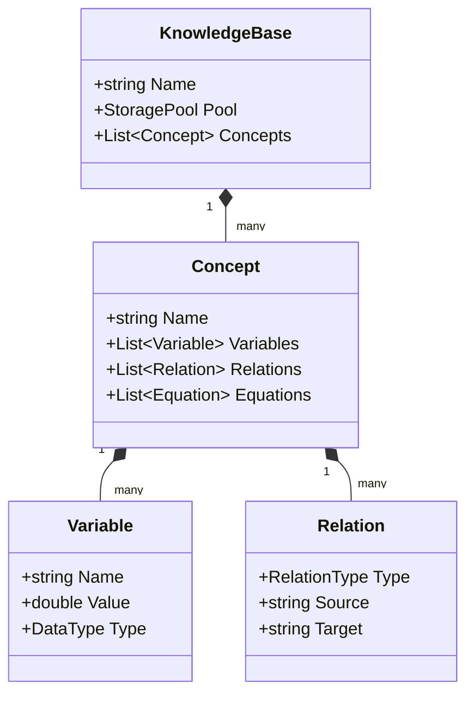

# 04.2. Mô hình Dữ liệu và Cấu trúc Tri thức (Knowledge Schema)

Tại tầng kiến trúc này, [KBMS](../00-glossary/01-glossary.md#kbms) định nghĩa các thực thể tri thức cơ bản dựa trên mô hình đối tượng tính toán (Computational Objects - [COKB](../00-glossary/01-glossary.md#cokb)).

## 1. Cấu trúc Hình học của Tri thức

Tri thức trong KBMS không tồn tại đơn lẻ mà được tổ chức theo cấu trúc phân cấp chặt chẽ:

## 2. Các Thực thể Chính (Core Entities)

Hệ thống quản lý 4 loại thực thể tri thức cốt lõi:

1.  **[Concept](../00-glossary/01-glossary.md#concept) (Khái niệm)**: Đóng vai trò là một container chứa các thuộc tính và luật logic. Mỗi Concept đại diện cho một đối tượng trong thế giới thực (ví dụ: `MachDien`, `DienTro`).
2.  **[Variable](../00-glossary/01-glossary.md#variable) (Biến số)**: Đại diện cho các thông số định lượng. Biến số có thể mang giá trị thực hoặc được tính toán thông qua suy diễn.
3.  **[Relation](../00-glossary/01-glossary.md#relation) (Quan hệ)**: Định nghĩa sự kết nối giữa các thực thể, bao gồm quan hệ phân cấp (Inheritance) và quan hệ cấu trúc (Composition).
4.  **[Equation](../00-glossary/01-glossary.md#equation) (Phương trình)**: Đặc tả các ràng buộc toán học giữa các biến số, phục vụ cho việc giải bài toán và khớp dữ liệu.

## 3. Định danh và Phạm vi (Scope)

Mọi thực thể trong KBMS đều được định danh duy nhất thông qua cơ chế `Qualified Name` (ví dụ: `KB_VatLy.MachDien.R1`). Cơ chế này đảm bảo tính toàn vẹn khi hệ thống thực hiện các phép [Join](../00-glossary/01-glossary.md#join) dữ liệu trong mạng [Rete](../00-glossary/01-glossary.md#rete-network).
