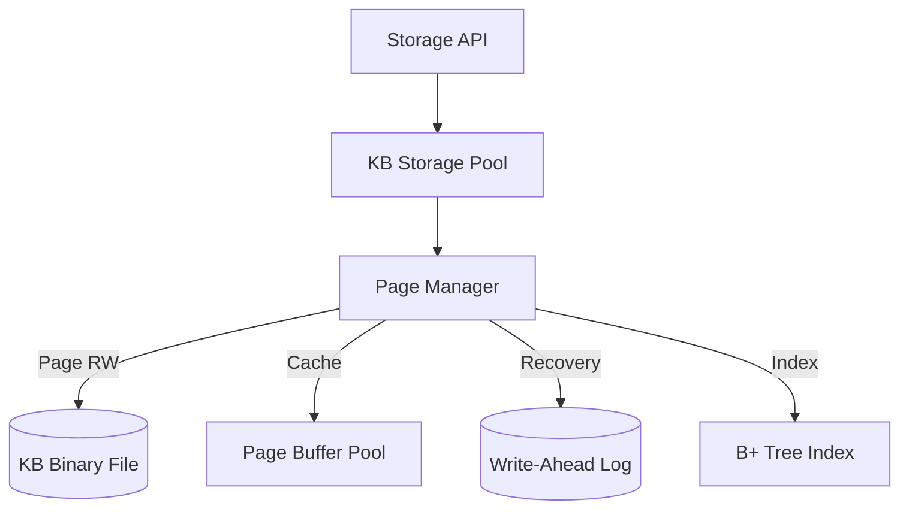

# 04.3. Tầng Lưu trữ Vật lý (Physical Storage Layer)

Tầng Lưu trữ (Storage Layer) của [KBMS](../00-glossary/01-glossary.md#kbms) được xây dựng dựa trên kiến trúc bộ máy lưu trữ nhị phân (`StorageEngine`), hỗ trợ tối ưu hóa truy xuất và đảm bảo tính bền vững của tri thức.

## 1. Kiến trúc Bộ máy Lưu trữ (Storage Engine)

Dưới đây là sơ đồ kiến trúc nội tại của `StorageEngine`:

## 2. Các thành phần Kỹ thuật Cốt lõi

-   **[B+ Tree Index](../00-glossary/01-glossary.md#b-tree-index)**: Được sử dụng để lưu trữ và truy xuất các khái niệm ([Concept](../00-glossary/01-glossary.md#concept)) theo khóa (Name/ID). Chỉ mục này cho phép tìm kiếm với độ phức tạp $O(\log n)$.
-   **[Write-Ahead Logging (WAL)](../00-glossary/01-glossary.md#write-ahead-logging)**: Mọi thao tác thay đổi tri thức đều được ghi vào nhật ký WAL trước khi được ghi xuống tệp tin vật lý, đảm bảo khả năng phục hồi dữ liệu khi có sự cố.
-   **[Page Manager](../00-glossary/01-glossary.md#page-manager)**: Quản lý việc đọc/ghi các trang dữ liệu nhị phân (thường là 4KB) từ bộ nhớ xuống đĩa cứng.

## 3. Định dạng Tệp tin (.kb)

Các cơ sở tri thức được lưu trữ dưới định dạng tệp tin nhị phân `.kb` với cấu trúc bao gồm:
-   **File Header**: Chứa siêu dữ liệu về phiên bản hệ thống và trạng thái KB.
-   **Data Sections**: Chứa các dải dữ liệu về biến số, phương trình và quan hệ đã được [Serialize](../00-glossary/01-glossary.md#serialize).
-   **B+ Tree Nodes**: Các nốt chỉ mục phân bậc để điều hướng dữ liệu.

Cơ chế này giúp KBMS có thể xử lý các cơ sở tri thức quy mô hàng triệu thực thể mà không làm giảm hiệu năng truy xuất ngẫu nhiên.
