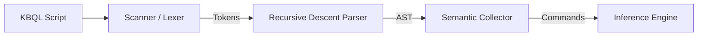

# 04.4. Ngôn ngữ Truy vấn Tri thức KBQL (Knowledge Base Query Language)

[KBQL](../00-glossary/01-glossary.md#kbql) là ngôn ngữ khai báo cho phép người dùng tương tác với hệ thống [KBMS](../00-glossary/01-glossary.md#kbms). 

## 1. Quy trình Biên dịch KBQL

Ngôn ngữ KBQL được xử lý thông qua một trình biên dịch chuyên dụng trong `KBMS.Server`:

## 2. Các Nhóm Lệnh Chính

Cú pháp KBQL được phân loại thành bốn nhóm chức năng:

-   **[KDL](../00-glossary/01-glossary.md#kdl) (Knowledge Definition)**: Dùng để định nghĩa cấu trúc tri thức.
    -   Ví dụ: `CONCEPT DienTro (u, i, r) { r = u / i }`
-   **[KQL](../00-glossary/01-glossary.md#kql) (Knowledge Query)**: Dùng để truy vấn thông tin dữ liệu.
    -   Ví dụ: `SELECT * FROM DienTro WHERE r > 100`
-   **[KML](../00-glossary/01-glossary.md#kml) (Knowledge Manipulation)**: Dùng để thay đổi giá trị hoặc kết cấu tri thức.
    -   Ví dụ: `UPDATE DienTro SET u = 220 WHERE id = 1`
-   **[TCL](../00-glossary/01-glossary.md#tcl) (Transaction Control)**: Quản lý các phiên làm việc và bảo mật.

## 3. Trình phân tích Cú pháp (Parser)

Hệ thống sử dụng thuật toán phân tích đệ quy xuống ([Recursive Descent](../00-glossary/01-glossary.md#recursive-descent)) để xử lý các biểu thức toán học phức tạp. Trình Parser đảm bảo tính nhất quán của tri thức bằng cách kiểm tra các ràng buộc ngữ nghĩa (Semantic Validation) trước khi nạp vào bộ máy suy diễn.
