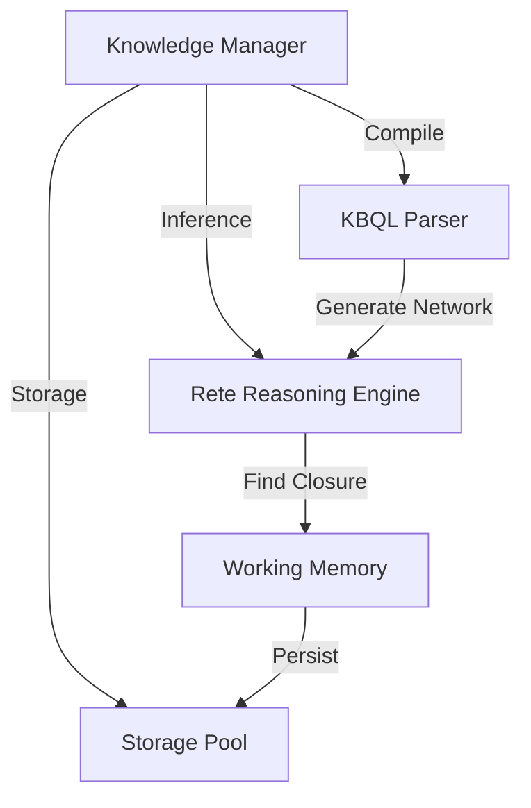

# 04.5. Tầng Máy chủ và Bộ máy Suy diễn (Server & Reasoning Engine)

Tầng Máy chủ (Server Layer) đóng vai trò là bộ não điều phối toàn bộ các hoạt động của [KBMS](../00-glossary/01-glossary.md#kbms).

## 1. Phối hợp giữa các Thành phần Thực thi

Dưới đây là sơ đồ phối hợp giữa Máy chủ, Trình biên dịch và Bộ máy Suy diễn:

## 2. Bộ điều phối Knowledge Manager

`Knowledge Manager` là thực thể trung tâm chịu trách nhiệm:
-   **Tách biệt KB**: Đảm bảo mỗi phiên làm việc của người dùng là độc lập.
-   **Điều phối luồng**: Nhận lệnh [KBQL](../00-glossary/01-glossary.md#kbql), gọi trình biên dịch và cập nhật kết quả suy diễn xuống tầng lưu trữ.

## 3. Hệ Suy diễn mạng Rete (Rete Network)

Bộ máy suy diễn của KBMS được xây dựng dựa trên thuật toán [Rete](../00-glossary/01-glossary.md#rete-network), cho phép khớp mẫu (Pattern Matching) hiệu quả:
-   **Alpha Nodes**: Thực hiện các phép lọc dữ kiện (Fact filtering) đơn lẻ.
-   **Beta Nodes**: Thực hiện thực thi các phép tham gia ([Join](../00-glossary/01-glossary.md#join)) giữa nhiều biến số.
-   **Terminal Nodes**: Thực thi các hành động khi một luật được thỏa mãn hoàn toàn.

Cơ chế này cho phép KBMS xử lý hàng ngàn ràng buộc logic phức tạp mà không phải tính toán lại từ đầu khi có dữ kiện mới, đạt tới điểm đóng suy diễn (**[F-Closure](../00-glossary/01-glossary.md#f-closure)**) trong thời gian tối ưu.
