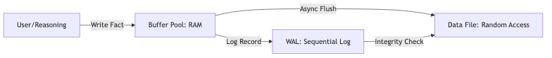

# 07.1. Tổng quan về Kiến trúc Lưu trữ

Cỗ máy lưu trữ của [KBMS](../00-glossary/01-glossary.md#kbms) V3 chịu trách nhiệm quản lý việc ghi dữ liệu tri thức xuống đĩa cứng một cách bền vững và truy xuất chúng với hiệu năng cao nhất. Kiến trúc này được thiết kế theo mô hình quản lý tập trung và phân tầng I/O chuyên biệt.

---

## 1. Hệ thống Phân tầng I/O

Dữ liệu trong KBMS luân chuyển qua 3 trạng thái chính để đảm bảo sự cân bằng giữa tốc độ truy cập RAM và độ an toàn của đĩa cứng:

*Hình 7.1: Sơ đồ chiến lược luồng I/O đa tầng của KBMS.*

---

## 2. Quản lý Đa Cơ sở tri thức

Khác với các phiên bản trước, KBMS V3 giới thiệu thành phần `StoragePool` chuyên biệt để quản lý mô hình "Multi-DB". Mỗi Cơ sở tri thức (KB) được cấp phát một tệp vật lý riêng biệt (`.kdb`), giúp cô lập dữ liệu và tối ưu hóa tài nguyên.

### Vai trò của StoragePool:
- **Điều phối (Orchestrator)**: Khởi tạo và quản lý vòng đời của `DiskManager`, `BufferPoolManager` và `WalManagerV3` cho từng KB.
- **Thread-Safety**: Sử dụng cơ chế khóa (`lock`) để đảm bảo việc truy cập đồng thời vào tài nguyên hệ thống không gây xung đột.
- **Memory Management**: Giới hạn tổng số lượng trang (Pages) được nạp vào RAM trên toàn hệ thống.

---

## 3. Thành phần thực thi

Kiến trúc nội tại của Storage Engine V3 được tổ chức thành 3 tầng xử lý chính:

1. **Tầng Vật lý ([DiskManager](../00-glossary/01-glossary.md#diskmanager))**: 
    - Quản lý tệp nhị phân trên hệ điều hành.
    - Thực thi truy xuất ngẫu nhiên $O(1)$ thông qua `FileStream.Seek`.
    - **Mã hóa [AES-256](../00-glossary/01-glossary.md#aes-256)**: Mọi khối dữ liệu trước khi ghi xuống đĩa đều được mã hóa để đảm bảo an toàn dữ liệu tĩnh.
2. **Tầng Quản lý RAM ([BufferPoolManager](../00-glossary/01-glossary.md#bufferpoolmanager))**: 
    - Duy trì bộ đệm trang ([Page](../00-glossary/01-glossary.md#page) Cache).
    - Áp dụng thuật toán **[LRU](../00-glossary/01-glossary.md#lru)** (Least Recently Used) để quyết định trang nào cần được giữ lại hoặc giải phóng.
3. **Tầng Nhật ký (WalManagerV3)**:
    - Ghi lại mọi thay đổi vào tệp `.wal`.
    - Đảm bảo tính nguyên tử (Atomicity) và bền vững (Durability).

---

## 4. Đặc tả Định lượng của Storage Engine

Thông số kỹ thuật của hệ thống được tinh chỉnh để tương thích hoàn hảo với các dòng SSD hiện đại:

*Bảng 7.1: Thông số định lượng chi tiết của Storage Engine V3.*

| Thông số | Giá trị | Giải thích |
| :--- | :--- | :--- |
| **Kích thước Trang (Page)** | **16,384 Bytes** | (16 KB) Đơn vị dữ liệu logic cơ bản. |
| **Kích thước Khối đĩa (Block)** | **16,416 Bytes** | Bao gồm 16KB dữ liệu + 32 byte Padding & IV mã hóa. |
| **Giải thuật Mã hóa** | **AES-256** | Sử dụng chế độ CBC với Véc-tơ khởi tạo (IV) ngẫu nhiên. |
| **Tốc độ Truy xuất** | **O(1)** | Nhờ cơ chế Header-based Addressing. |
| **Hệ thống tệp hỗ trợ** | **NTFS, ext4, APFS** | Tương thích Windows, Linux và macOS. |

---

## 5. Các tệp tin lưu trữ vật lý

KBMS sử dụng mô hình **File-per-KB**, trong đó mỗi Cơ sở tri thức (KB) được đại diện bởi một cặp tệp tin tại thư mục dữ liệu:

### 5.1. Tệp dữ liệu chính (`.kdb`)
- **Tên tệp**: `{kb_name}.kdb` (VD: `system.kdb`, `test_db.kdb`).
- **Vai trò**: Lưu trữ toàn bộ các Trang ([Page]) dữ liệu, bao gồm cả siêu dữ liệu và dữ liệu thực thể.
- **Bảo mật**: Mọi byte dữ liệu (trừ Page 0 [Header](../00-glossary/01-glossary.md#header)) đều được mã hóa bằng thuật toán AES-256.
- **Cấu trúc**: Tệp được chia thành các khối cố định **16,416 Bytes** (16KB payload + 32B IV/Padding vật lý).

### 5.2. Tệp Nhật ký ghi trước (`.wal`)
- **Tên tệp**: `{kb_name}.kdb.wal`.
- **Vai trò**: Lưu trữ nhật ký thay đổi ([LogRecord](../00-glossary/01-glossary.md#logrecord)) theo thời gian thực.
- **Đặc trưng**: Là tệp ghi nối đuôi (Append-only). Dữ liệu trong đây được dùng để hoàn tác (Undo) hoặc thực hiện lại (Redo) các giao dịch khi hệ thống khởi động lại sau sự cố.
- **Dọn dẹp**: Tệp này sẽ được thu nhỏ (Truncate) sau mỗi lần thực hiện [Checkpoint](../00-glossary/01-glossary.md#checkpoint).

---

## 6. Phân tích Định lượng Hiệu năng Thực thi

Để bảo chứng cho khả năng vận hành thực tế của kiến trúc V3, hệ thống đã trải qua các bài kiểm thử chịu tải (Stress Test) ở quy mô thực thể lớn. Các kết quả định lượng sau đây phản ánh hiệu năng của engine khi tương tác trực tiếp với tầng lưu trữ vật lý:

### 6.1. Thông lượng và Độ trễ (Throughput & Latency)
Trên tập dữ liệu thử nghiệm gồm **100,000 thực thể tri thức**, hệ thống đạt được các chỉ số sau:

| Chỉ số Hiệu năng | Giá trị Định lượng | Ghi chú kỹ thuật |
| :--- | :--- | :--- |
| **Write Throughput** | **~29,291 ops/sec** | Tốc độ chèn bản ghi nhị phân vào Slotted Pages. |
| **Full Scan Latency** | **92 ms** | Thời gian quét toàn bộ $10^5$ bản ghi từ bộ đệm RAM/Disk. |
| **Filter Latency** | **52 ms** | Thời gian đánh giá vị từ (Predicate) và trích xuất $10^4$ kết quả. |
| **Hash Join Latency** | **18 ms** | Thời gian thực hiện kết nối $10^4 \times 10^4$ thực thể qua bảng băm. |

### 6.2. Lý giải Mô hình Ước lượng Chi phí (Cost Model)
Bộ tối ưu hóa [Query Optimizer](../00-glossary/01-glossary.md#query-optimizer) sử dụng mô hình chi phí dựa trên kỳ vọng tài nguyên phần cứng (Heuristic [Cost Model](../00-glossary/01-glossary.md#cost-model)) để lựa chọn kế hoạch thực thi:

- **Baseline I/O (1.0)**: Lấy thao tác đọc một trang vật lý (Sequential Page Read) làm đơn vị chi phí cơ bản. Đây là điểm tham chiếu cho mọi phép đo khác.
- **CPU Penalty (1.1 - 10.0)**: Các toán tử tính toán được gán trọng số phụ thuộc vào độ phức tạp thuật toán. 
    - **Filter (1.1)**: Chi phí xử lý vị từ trên dòng dữ liệu thô.
    - **[Hash Join](../00-glossary/01-glossary.md#hash-join) (10.0 + con)**: Chi phí xây dựng và tra cứu bảng băm trong bộ nhớ, bù đắp cho việc giảm độ phức tạp từ $O(N \times M)$ xuống $O(N+M)$.

Việc áp dụng mô hình chi phí này giúp KBMS luôn ưu tiên các phương án giảm thiểu truy xuất đĩa cứng (I/O) - vốn là điểm nghẽn lớn nhất trong các hệ quản trị tri thức quy mô lớn.

