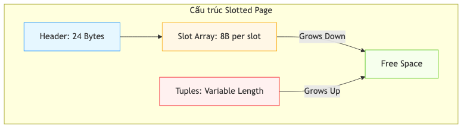

# 07.2. Giải phẫu Trang vật lý (Page Anatomy)

[KBMS](../00-glossary/01-glossary.md#kbms) V3 sử dụng mô hình phân trang (Paging) và cấu trúc **[Slotted Page](../00-glossary/01-glossary.md#slotted-page)** để tối ưu hóa truy xuất ngẫu nhiên và quản lý không gian trống hiệu quả cho các bản ghi có độ dài biến thiên.

---

## 1. Cấu trúc nội tại của Trang

Một trang dữ liệu chuẩn 16KB được phân rã thành 4 thành diện diện tích chính: **[Header](../00-glossary/01-glossary.md#header)**, **[Slot Array](../00-glossary/01-glossary.md#slot-array)**, **Free Space**, và **Tuples**.

*Hình 7.2: Giải phẫu cấu trúc trang nhị phân Slotted-[Page](../00-glossary/01-glossary.md#page) của KBMS V3.*

1. **Header (24 Bytes)**: Chứa các trường metadata điều phối và phục hồi.
2. **Slot Array**: Danh sách các "khe cắm" trỏ tới dữ liệu, phát triển theo chiều **tiến** (từ byte 24 trở đi). Mỗi slot chiếm **8 bytes** (`[Offset (4B) | Length (4B)]`).
3. **Free Space**: Vùng nhớ trống nằm giữa Slot Array và Tuples.
4. **Tuples (Dữ liệu)**: Nội dung thực tế (bản ghi), được chèn theo chiều **lùi** (từ byte 16383 ngược lên trên) để tối đa hóa tính linh hoạt.

---

## 2. Đặc tả Header

Cấu trúc Header được thiết kế đồng nhất để hỗ trợ tối đa cho việc phục hồi dữ liệu (Recovery) và điều hướng cấu trúc cây ([B+ Tree](../00-glossary/01-glossary.md#b-tree)):

*Bảng 7.2: Đặc tả cấu trúc Header 24 byte của trang vật lý trong KBMS*
| Byte Offset | Trường dữ liệu | Kiểu | Ý nghĩa |
| :--- | :--- | :--- | :--- |
| **0 - 3** | **PageId** | Int32 | ID duy nhất của trang trong tệp dữ liệu. |
| **4 - 7** | **LSN** | Int32 | Log Sequence Number phục vụ giao thức WAL. |
| **8 - 11** | **PrevPageId** | Int32 | Con trỏ tới trang trước trong cấu trúc B+ Tree. |
| **12 - 15** | **NextPageId** | Int32 | Con trỏ tới trang sau phục vụ quét tuần tự (Scan). |
| **16 - 19** | **FreeSpacePointer**| Int32 | Offset đánh dấu ranh giới bắt đầu của vùng dữ liệu (Tuples). |
| **20 - 23** | **TupleCount** | Int32 | Tổng số lượng bản ghi (Slots) hiện có trong trang. |

---

## 3. Quản lý bản ghi (Slotted Page Logic)

Cơ chế này cho phép KBMS xử lý các thực thể tri thức có kích thước khác nhau (Variable-length) mà không làm phân mảnh tệp vật lý:

1.  **Chèn bản ghi (Insert)**: Dữ liệu mới được đẩy vào cuối vùng `Free Space` (từ phải sang trái), đồng thời một Slot mới được thêm vào Slot Array (từ trái sang phải) để trỏ đến vị trí đó.
2.  **Định danh RID (Record ID)**: Một bản ghi được xác định duy nhất bởi cặp bộ số `(PageId, SlotId)`.
3.  **Xóa bản ghi (Delete)**: Khi một thực thể bị xóa, Slot tương ứng được đánh dấu là trống (Off=0, Len=0). KBMS hỗ trợ lệnh `VACUUM` (trong phiên bản Studio) để dồn dịch dữ liệu và thu hồi không gian trống bị phân mảnh.

---

## 4. Lợi ích kỹ thuật của KBMS V3

- **SSD Block [Alignment](../00-glossary/01-glossary.md#alignment)**: Kích thước 16KB là bội số của block size (4KB/8KB) trên hầu hết các dòng SSD hiện đại, giúp tránh hiện tượng "Read-Modify-Write" gây giảm hiệu suất và tuổi thọ ổ cứng.
- **Binary Search**: Nhờ Slot Array có kích thước cố định ở đầu trang, việc tìm kiếm một bản ghi cụ thể theo `SlotId` đạt độ phức tạp **O(1)**.
- **Tính Bền vững**: Việc tích hợp trực tiếp **[LSN](../00-glossary/01-glossary.md#lsn)** vào Header cho phép hệ thống kiểm tra tính nguyên vẹn của dữ liệu so với file nhật ký WAL ngay khi trang được nạp vào [Buffer Pool](../00-glossary/01-glossary.md#buffer-pool).
