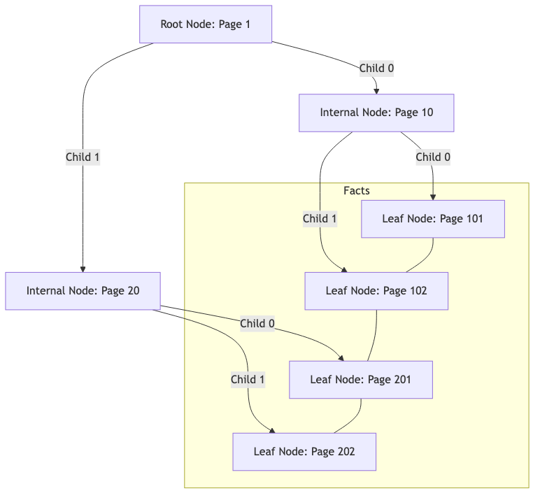
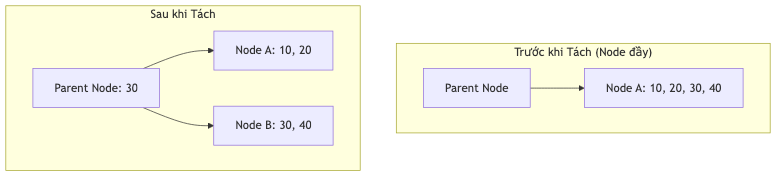

# 07.3. Chỉ mục Cây [B+ Tree]

[KBMS](../00-glossary/01-glossary.md#kbms) sử dụng cây [B+ Tree](../00-glossary/01-glossary.md#b-tree) làm cấu trúc dữ liệu chính để quản lý và truy xuất các thực thể (`ObjectInstance`) trong mỗi [Concept](../00-glossary/01-glossary.md#concept). B+ Tree là lựa chọn tối ưu cho việc truy vấn dữ liệu từ bộ nhớ ngoài (Disk) vì nó giảm thiểu số lần đọc đĩa (I/O) cần thiết.

---

## 1. Cấu trúc Đa tầng

Cây B+ Tree trong KBMS V3 thường duy trì từ 3 đến 5 tầng tùy thuộc vào khối lượng tri thức:

*Hình 7.3: Sơ đồ cấu trúc đa tầng của cây B+ Tree trong việc quản lý thực thể.*

1.  **Nút Gốc ([Root Node](../00-glossary/01-glossary.md#root-node)):** Điểm bắt đầu của mọi truy vấn. Nếu cây chỉ có 1 trang, Root đồng thời là Leaf.
2.  **Nút Trung gian (Internal Nodes):** Chứa các khóa dẫn hướng (Keys) và con trỏ trang (`PageId`). Các nút này không chứa dữ liệu thực tế.
3.  **Nút Lá (Leaf Nodes):** Tầng cuối cùng của cây, nơi chứa toàn bộ dữ liệu của các `Tuple`. Các nút lá được liên kết với nhau bằng con trỏ `NextPageId` tạo thành một danh sách liên kết kép, cho phép quét dữ liệu theo phạm vi (Range Scan) cực nhanh.

---

## 2. Các Thuật toán Vận hành Cốt lõi

### Tìm kiếm (Search) - $O(\log_b n)$
Hệ thống bắt đầu từ Root, so sánh khóa cần tìm với các ranh giới trong Nút trung gian để chọn `PageId` tiếp theo, cho đến khi chạm tới Nút lá. Tại đây, `Slotted Page` sẽ thực hiện tìm kiếm nhị phân trên `Slot Array` để lấy dữ liệu.

### Chèn và Tách trang
Khi một trang bị đầy (Overflow):
1.  **Tách trang:** Một trang mới được cấp phát.
2.  **Phân bổ:** Một nửa số lượng bản ghi được chuyển sang trang mới.
3.  **Cập nhật cha:** Khóa phân tách được chèn vào Nút trung gian cấp trên. Nếu Nút cha cũng đầy, quá trình tách sẽ đệ quy ngược lên trên, có thể làm tăng chiều cao của cây.

### Xóa và Gộp trang
Khi số lượng bản ghi trong một trang giảm xuống dưới 50% (Underflow):
-   **Vay mượn (Borrow):** Hệ thống kiểm tra các trang lân cận để chuyển bớt bản ghi sang.
-   **Gộp trang (Merge):** Nếu không thể vay mượn, hai trang lân cận sẽ được gộp làm một và trang thừa sẽ được giải phóng về cho `DiskManager`.

---

## 3. Clustered Index trong

Khác với các hệ quản trị CSDL truyền thống thường tách rời Index và Data, KBMS V3 sử dụng mô hình **[Clustered Index](../00-glossary/01-glossary.md#clustered-index)**:
-   Dữ liệu thực tế của `ObjectInstance` nằm trực tiếp tại các Nút lá của cây.
-   **Lợi ích:** Tiết kiệm một lần truy xuất đĩa (Disk Seek) vì sau khi tìm thấy khóa trong Index, hệ thống có ngay dữ liệu mà không cần trỏ đến một file dữ liệu riêng biệt.
-   **Hiệu năng:** Cực kỳ hiệu quả cho các truy vấn theo dải (ví dụ: `SELECT * FROM TamGiac WHERE canh_a > 5`).

*Hình 7.4: Cơ chế tách nút (Split) tự động khi trang dữ liệu bị đầy.*
