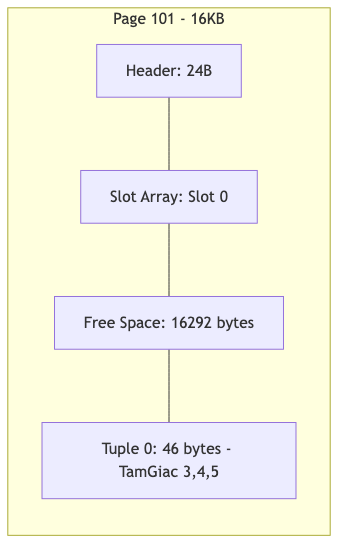

# 07.7. Thực tế hóa: Từ Mô hình đối tượng sang Chuỗi nhi phân

Để kết nối lý thuyết mô hình (Chương 5) và hạ tầng lưu trữ (Chương 7), chúng ta sẽ theo dõi lộ trình của một đối tượng cụ thể đi qua các tầng xử lý của [KBMS](../00-glossary/01-glossary.md#kbms).

---

## 1. Đối tượng đầu vào

Giả thiết chúng ta có một thực thể của khái niệm `Employee`:

```csharp
var e1 = new ObjectInstance {
    Id = new Guid("99999999-8888-7777-6666-555555555555"),
    ConceptName = "Employee",
    Values = new Dictionary<string, object> {
        { "age", 30 }, { "experience", 5 }
    }
};
```

---

## 2. Tuần tự hóa thành [Tuple]

Khi thực hiện lệnh `INSERT`, `V3DataRouter` sẽ chuyển đổi đối tượng trên thành khối nhị phân `Tuple` với cấu trúc sau:

*Bảng 7.10: Ánh xạ [Tuple](../00-glossary/01-glossary.md#tuple) nhị phân cho thực thể Employee.*

| Field | Nội dung | Kiểu | Size |
| :--- | :--- | :--- | :--- |
| **0** | `999999...5555` | GUID | 16B |
| **1** | `age|experience` | LPS | 15B |
| **2-3** | `30`, `5` | LPS | 2B + 1B |

**Kích thước:** [Header](../00-glossary/01-glossary.md#header) 8B (vì 4 fields) + Payload ~35B = **43 Bytes**.

---

## 3. Bản đồ vị trí trong Trang (Slotted Page Mapping)

Giả sử `Tuple` này được chèn vào một trang trống (`PageId=101`).

1.  **Header (24B):** Cập nhật `TupleCount = 1`, `FreeSpacePointer = 16341` ($16384 - 43$).
2.  **[Slot Array](../00-glossary/01-glossary.md#slot-array):** Slot đầu tiên (Index 0) chứa giá trị `[Offset: 16341, Length: 43]`.
3.  **Data Area:** 43 bytes dữ liệu nằm ở cuối trang (từ vị trí 16341 đến 16383).


*Hình 7.6: Minh họa vị trí thực tế của đối tượng TamGiac trong bộ nhớ nhị phân.*

---

## 4. Biểu diễn dưới dạng mã Hex

Dưới đây là mô phỏng 64 bytes đầu tiên của trang dữ liệu trên đĩa (đã giải mã AES):

```text
Offset    00 01 02 03 04 05 06 07 08 09 0A 0B 0C 0D 0E 0F    Decoded
-------------------------------------------------------------------------
; --- Page Header (At start of page) ---
00000000  01 00 00 00 00 00 00 00 FF FF FF FF FF FF FF FF    ........ÿÿÿÿÿÿÿÿ
          [ PageId: 1 ] [ LSN: 0  ] [ PrevPageId: -1    ]
00000010  FF FF FF FF D5 3F 00 00 01 00 00 00 D5 3F 00 00    .....?.......?..
          [ Next: -1  ] [ FSP:16341] [ Count: 1 ] [Slot0: Off=16341, Len=43]

[...] (Zero-padding area)

; --- Tuple Payload (At end of page, Offset 16341) ---
00003FD0  00 00 00 00 00 04 00 1A 00 28 00 2A 00 2B 00 99    ................
          [ T-Head (Len=4) ][ F0 Off ][ F1 Off ][ F2 Off ][ F3 Off ]
00003FE0  99 99 99 88 88 77 77 66 66 55 55 55 55 55 55 61    .....wwffUUUUUUa
          [ Field 0: ObjID GUID (16 bytes)                ]
00003FF0  67 65 7C 65 78 70 65 72 69 65 6E 63 65 33 30 35    ge|experience305
          [ Field 1: age|experience ][ F2: 30 ][ F3: 5 ]
```
---

## 5. Ví dụ Nhị phân: Tuần tự hóa Siêu dữ liệu

Bên cạnh dữ liệu thực thể, định nghĩa tri thức (`Concept`) cũng được lưu trữ dưới dạng nhị phân thuần túy thông qua `ModelBinaryUtility`. Xét một khái niệm đơn giản:

```csharp
var concept = new Concept {
    Id     = new Guid("aaaaaaaa-0000-0000-0000-000000000001"),
    KbId   = new Guid("bbbbbbbb-0000-0000-0000-000000000002"),
    Name   = "TamGiac",
    Variables = new List<Variable> {
        new Variable { Name = "a", Type = "int" },
        new Variable { Name = "b", Type = "int" },
        new Variable { Name = "c", Type = "int" }
    },
    Constraints = new List<Constraint> {
        new Constraint { Name = "bbt", Expression = "a+b>c", Line = 1, Column = 1 }
    }
};
```

### Phân tích từng Field trong Tuple nhị phân

Tuple được tạo ra bởi `ModelBinaryUtility.SerializeConcept()` gồm **13 Fields** (2 [GUID](../00-glossary/01-glossary.md#guid) + 1 Name + 10 danh sách con). Dưới đây là bố cục của 5 Fields quan trọng nhất:

*Bảng 7.11: Phân tích các trường trong Tuple Siêu dữ liệu [Concept](../00-glossary/01-glossary.md#concept).*

| Field | Nội dung | Mô tả | Kích thước |
| :--- | :--- | :--- | :--- |
| **0-1** | `AAAA...`, `BBBB...` | Concept/KB ID | 16B / ea |
| **2** | `TamGiac` | Tên khái niệm | 9 B |
| **3** | Blob: Variables| Danh sách biến | ~45 B |
| **4** | Blob: Constraints| Ràng buộc | ~22 B |
| **5–12**| Empty Blobs | Rels, Aliases... | 0 B |


### Cấu trúc Sub-blob của danh sách `Variables`

Mỗi danh sách lồng nhau được tuần tự hóa theo định dạng **Length-Prefixed List**:

```text
[Count: Int32 = 3]
  Item 0: [Name = "a" (LPS)] [Type = "int" (LPS)] [HasLength = 0x00] [HasScale = 0x00]
  Item 1: [Name = "b" (LPS)] [Type = "int" (LPS)] [HasLength = 0x00] [HasScale = 0x00]
  Item 2: [Name = "c" (LPS)] [Type = "int" (LPS)] [HasLength = 0x00] [HasScale = 0x00]
```

---

## 6. Minh họa Hex Dump: Metadata Concept

Dưới đây là mô phỏng 48 bytes mở đầu của Tuple Concept sau khi được tuần tự hóa (đã giải mã AES, chưa bao gồm sub-blobs rỗng):

```text
Offset    00 01 02 03 04 05 06 07 08 09 0A 0B 0C 0D 0E 0F    Annotation
----------------------------------------------------------------------------
00000000  0D 00 ...  (Tuple Header: FieldCount = 13)
          [...  26 bytes Offsets Array (13 fields × 2 bytes) ...]

; Field 0 — Concept ID (GUID, 16 bytes)
00000026  AA AA AA AA 00 00 00 00 00 00 00 00 00 00 00 01

; Field 1 — KB ID (GUID, 16 bytes)
00000036  BB BB BB BB 00 00 00 00 00 00 00 00 00 00 00 02

; Field 2 — Name "TamGiac" (LPS: 1 byte len + 7 bytes UTF-8)
00000046  07 54 61 6D 47 69 61 63    → (len=7) "TamGiac"

; Field 3 — Variables Sub-blob bắt đầu
0000004E  03 00 00 00               → Count = 3
00000052  01 61 03 69 6E 74 00 00   → "a", "int", HasLen=false, HasScale=false
0000005A  01 62 03 69 6E 74 00 00   → "b", "int", HasLen=false, HasScale=false
00000062  01 63 03 69 6E 74 00 00   → "c", "int", HasLen=false, HasScale=false

; Field 4 — Constraints Sub-blob
0000006A  01 00 00 00               → Count = 1
0000006E  03 62 62 74               → Name = "bbt" (len=3)
00000071  05 61 2B 62 3E 63         → Expression = "a+b>c" (len=5)
00000076  01 00 00 00               → Line = 1
0000007A  01 00 00 00               → Column = 1
```