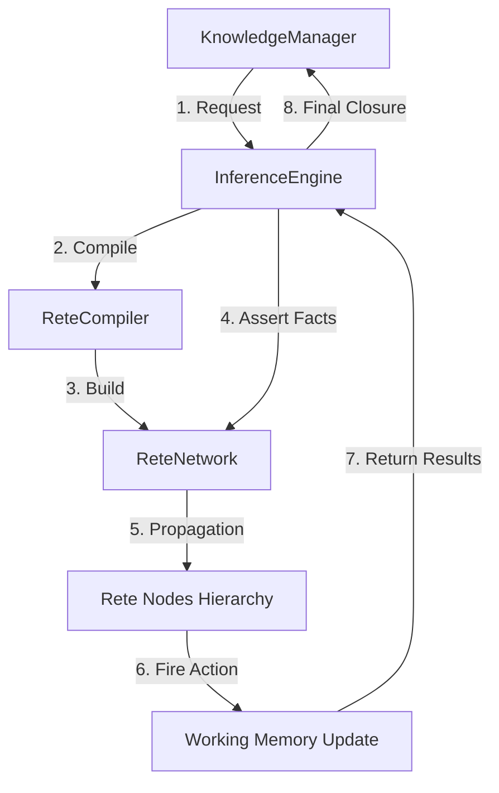

# 08.1. Kiến trúc Bộ máy Suy diễn KBMS.Reasoning

Bộ máy suy diễn của [KBMS](../00-glossary/01-glossary.md#kbms) được hiện thực hóa trong namespace `KBMS.Reasoning`, sử dụng kiến trúc mạng Rete làm hạt nhân xử lý. Đây là một hệ thống suy diễn hướng sự kiện, cho phép giải quyết các bài toán tri thức dựa trên sự lan truyền các thực thể tính toán ([Token](../00-glossary/01-glossary.md#token)).

## 1. Thành phần Cốt lõi của Library

Thư viện `KBMS.Reasoning` được chia thành hai phân vùng chức năng chính:

1.  **Bộ điều phối (Orchestrator)**: Lớp `InferenceEngine` đóng vai trò là giao diện lập trình ([API](../00-glossary/01-glossary.md#api)) chính, tiếp nhận yêu cầu suy diễn và quản lý vòng đời của mạng lưới.
2.  **Mạng thực thi (Execution Network)**: Folder `Rete/` chứa các định nghĩa nốt, bộ biên dịch và cơ chế lan truyền dữ kiện.

## 2. Mô hình Thực thi Hợp nhất

Khác với các hệ thống truyền thống sử dụng song song Forward và Backward Chaining, KBMS hợp nhất mọi quy trình suy diễn vào duy nhất một mạng lưới [Rete Network](../00-glossary/01-glossary.md#rete-network).

*   **Tính hướng sự kiện**: Mỗi khi một dữ kiện ([Fact](../00-glossary/01-glossary.md#fact)) được nạp vào thông qua `AssertFact`, mạng lưới sẽ tự động kích hoạt các nốt liên quan.
*   **Tính bao đóng ([F-Closure](../00-glossary/01-glossary.md#f-closure))**: Quá trình suy diễn tiếp diễn một cách gia tăng cho đến khi không còn nốt nào trong [Agenda](../00-glossary/01-glossary.md#agenda) có thể kích hoạt, đạt tới điểm dừng logic ([Fixed-point](../00-glossary/01-glossary.md#fixed-point)).

## 3. Cấu trúc Hình học của Mạng lưới

Mạng lưới suy diễn trong `KBMS.Reasoning` được tổ chức theo hình tháp từ nốt gốc đến các nốt kết luận:

| Phân tầng | Lớp đối tượng | Chức năng chính |
| :--- | :--- | :--- |
| **Root Layer** | `EntryNode` | Tiếp nhận và phân phối Token đầu vào. |
| **Alpha Layer** | `AlphaNode` | Lọc các dữ kiện dựa trên thuộc tính đơn (Loại, Màu sắc, ...). |
| **Beta Layer** | `BetaNode` | Thực hiện phép tham gia (Join) để so khớp nhiều biến số. |
| **Terminal Layer** | `TerminalNode` | Rút ra kết luận hoặc kích hoạt các bộ giải phương trình. |

Việc sử dụng cấu trúc này giúp hệ thống đạt tốc độ suy diễn tiệm cận thời gian thực bằng cách chia sẻ các phép kiểm tra trung gian giữa nhiều luật khác nhau.
