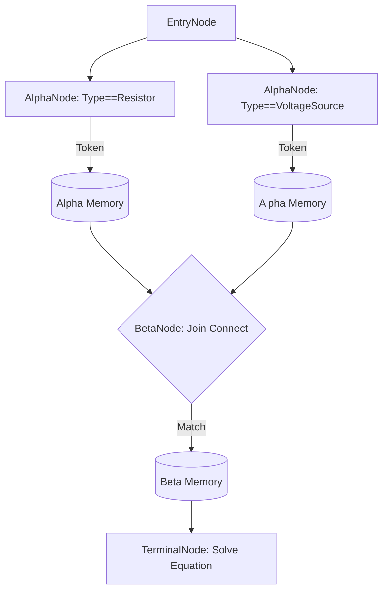

# 08.2. Cấu trúc Hình học Mạng Rete (Topology)

Kiến trúc mạng Rete trong `KBMS.Reasoning` được xây dựng dựa trên sự phân cấp của các đối tượng nốt chuyên biệt, mỗi loại đảm nhiệm một vai trò cụ thể trong quá trình khớp mẫu (Pattern Matching).

## 1. Cấu trúc Phân tầng Nốt

Mạng lưới được tổ chức thành đồ thị có hướng (Directed Acyclic Graph - DAG), bắt đầu từ các dữ kiện thô và kết thúc tại các nốt hành động.

## 2. Đặc tả các Loại Nốt (Node Types)

### 2.1. Nốt Alpha (AlphaNode - One-Input)
Nốt Alpha chịu trách nhiệm thực hiện các phép lọc đơn lẻ trên một thuộc tính của dữ kiện.
- **Chức năng**: Kiểm tra điều kiện hằng số (ví dụ: `Ten == 'R1'`).
- **Bộ nhớ**: Chứa `AlphaMemory` lưu trữ các [Token](../00-glossary/01-glossary.md#token) đã vượt qua bộ lọc.

### 2.2. Nốt Beta (BetaNode - Two-Input)
Nốt Beta là trái tim của quá trình suy diễn đa biến, thực hiện phép Join.
- **Chức năng**: So khớp hai nguồn dữ liệu (Left và Right) dựa trên các ràng buộc liên hợp (ví dụ: `R1.node2 == R2.node1`).
- **Bộ nhớ**: Duy trì `LeftMemory` và `RightMemory` để thực hiện phép nhân Đề-các ([Cross-Product](../00-glossary/01-glossary.md#cross-product)) một cách hiệu quả.

### 2.3. Nốt Terminal (TerminalNode)
Điểm cuối của một nhánh trong mạng lưới, đại diện cho một kết luận hoặc hành động.
- **Chức năng**: Khi nhận được một Token hợp lệ, nốt này sẽ kích hoạt việc sinh ra dữ kiện mới hoặc gọi bộ giải phương trình toán học.

## 3. Cơ chế Quản lý Bộ nhớ (Working Memory)

Trong `KBMS.Reasoning`, bộ nhớ không được lưu trữ tập trung mà phân tán tại chính các nốt:
- **Tính cục bộ**: Mỗi nốt chỉ biết về dữ liệu mà nó đang giữ.
- **Tính gia tăng**: Khi một dữ kiện bị xóa, các Token liên quan sẽ bị thu hồi khỏi bộ nhớ của các nốt con, đảm bảo tính nhất quán của hệ thống tri thức.
