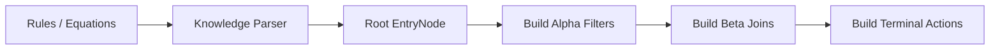
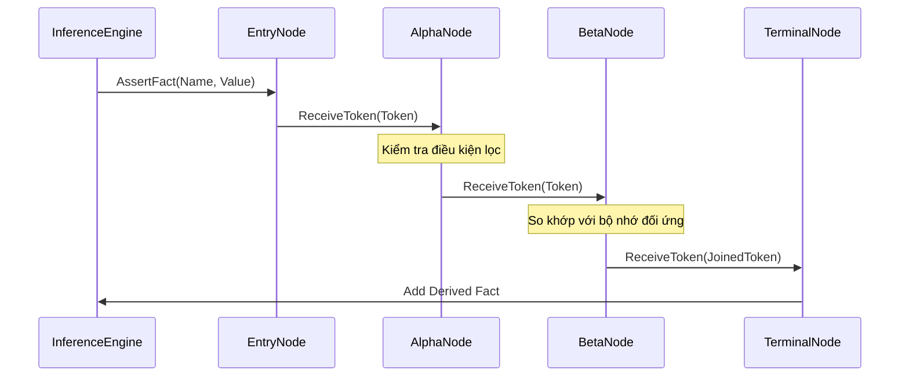

# 08.3. Biên dịch và Lan truyền Token (Compilation & Propagation)

Quy trình suy diễn trong `KBMS.Reasoning` được chia làm hai giai đoạn: Giai đoạn biên dịch mạng lưới thực thi (Compile-time) và Giai đoạn lan truyền dữ kiện thực tế (Runtime).

## 1. Giai đoạn Biên dịch (Rete Compilation)

Lớp `ReteCompiler` thực hiện việc chuyển đổi tri thức khai báo sang đồ thị thực thi.



- **Tối ưu hóa chia sẻ**: Nếu hai luật có cùng điều kiện lọc (ví dụ: `x > 0`), `ReteCompiler` sẽ chỉ khởi tạo duy nhất một `AlphaNode` và chia sẻ dữ liệu cho cả hai nhánh.
- **Tạo nốt Beta**: Đối với các luật có nhiều biến, trình biên dịch sẽ tạo ra các nốt Beta thực hiện phép tham gia giữa các dải dữ liệu.

## 2. Vòng đời của một Token (Propagation Lifecycle)

Khi một dữ kiện ([Fact](../00-glossary/01-glossary.md#fact)) được nạp vào, nó được đóng gói thành một `Token` và lan truyền theo mô hình sự kiện.



## 3. Đặc tả Giao thức `ReceiveToken` (Pseudocode)

Dưới đây là mã giả minh họa logic xử lý tại các nốt trong `KBMS.Reasoning`:

```csharp
// Đối với AlphaNode
void ReceiveToken(Token token) {
    if (MatchesCondition(token)) {
        AlphaMemory.Add(token);
        foreach (var child in Children) {
            child.ReceiveToken(token);
        }
    }
}

// Đối với BetaNode
void ReceiveToken(Token token, Sender source) {
    if (source == LeftParent) {
        LeftMemory.Add(token);
        foreach (var rToken in RightMemory) {
            if (JoinCondition(token, rToken)) {
                Propagate(CreateJoinedToken(token, rToken));
            }
        }
    }
}
```

Cơ chế này đảm bảo rằng mỗi phép so khớp chỉ được thực hiện một lần và kết quả được lưu trữ để phục vụ các lần lan truyền tiếp theo, giúp hệ thống không phải tính toán lại từ đầu khi có dữ kiện mới.
