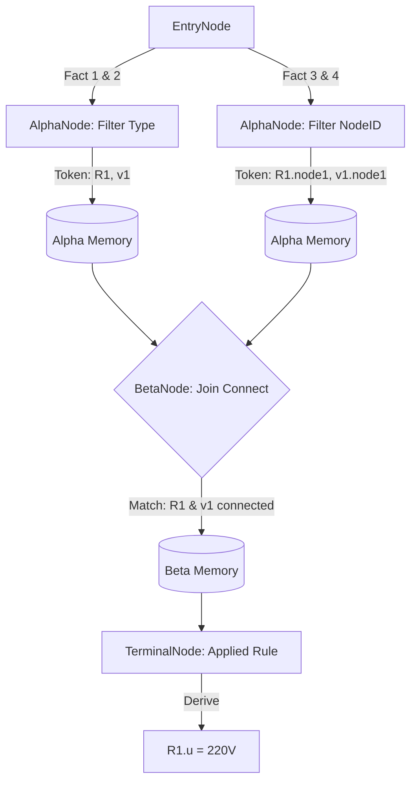

# 08.4. Mô phỏng và Dữ liệu mẫu (Simulation & Samples)

Phần này mô tả một kịch bản suy diễn thực tế trong `KBMS.Reasoning`, minh họa cách các dữ kiện ([Fact](../00-glossary/01-glossary.md#fact)) được nạp vào và xử lý thông qua mạng lưới Rete.

## 1. Kịch bản Dữ liệu mẫu: Phân tích Mạch điện

Giả sử chúng ta có một khái niệm `MachDien` với cấu trúc tri thức bao gồm:
- **Biến số**: `R1` (Resistor), `v1` (VoltageSource).
- **Ràng buộc nối**: `R1.node1 == v1.node1`.
- **Luật tri thức**: Nếu R1 và v1 nối song song, thì `R1.u == v1.u`.

### Dữ liệu đầu vào (Input Facts):
1. `R1.type = "Resistor"`
2. `v1.type = "VoltageSource"`
3. `R1.node1 = 10`
4. `v1.node1 = 10`
5. `v1.u = 220`

## 2. Mô phỏng Luồng lan truyền nốt

Dưới đây là sơ đồ Mermaid mô phỏng cách các dữ kiện trên kích hoạt mạng lưới:

## 3. Nhật ký Suy diễn (Execution Trace)

Nhật ký thực thi từ `InferenceEngine` sẽ ghi nhận các bước tính toán theo thời gian thực:

1.  **Step 0**: Khởi tạo mạng lưới và nạp dữ kiện ban đầu.
2.  **Step 1**: [Rete] Asserting fact `R1.type = Resistor` -> Kích hoạt nốt Alpha lọc loại điện trở.
3.  **Step 2**: [Rete] Asserting fact `v1.type = VoltageSource` -> Kích hoạt nốt Alpha lọc nguồn áp.
4.  **Step 3**: [Rete] Asserting fact `R1.node1 = 10` & `v1.node1 = 10` -> Nốt Beta phát hiện khớp nối (Join Success).
5.  **Step 4**: [Rete] Firing Terminal Node -> Thực thi luật song song và gán giá trị `R1.u = 220`.

## 4. Kiểm chứng Tính bao đóng (Convergence)

Sau khi `R1.u` được tính toán, nó sẽ quay trở lại nốt gốc để kiểm tra xem có kích hoạt thêm bất kỳ luật nào khác hay không (ví dụ: Luật Ohm `u = i * r`). Quá trình này sẽ dừng lại khi không còn bất kỳ dữ kiện nào mới được sinh ra thêm, đảm bảo tính bao đóng hoàn hảo của hệ tống tri thức.
