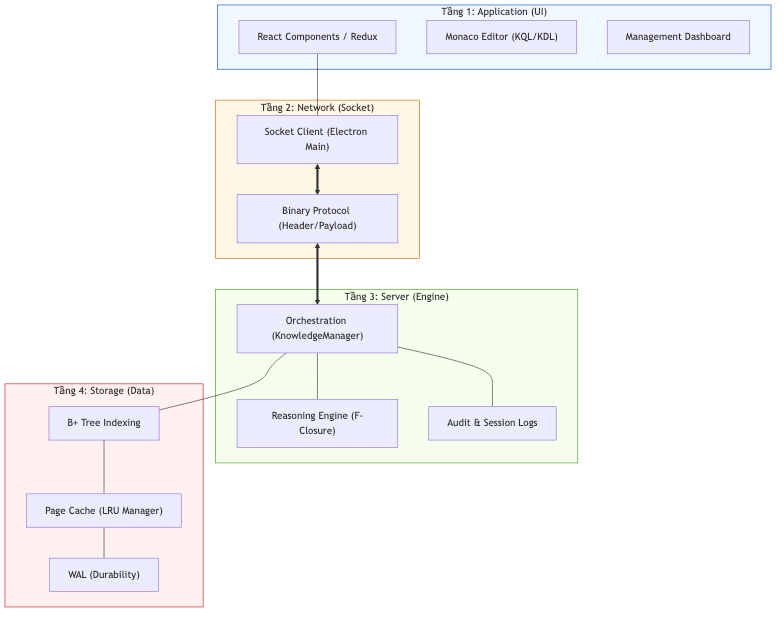
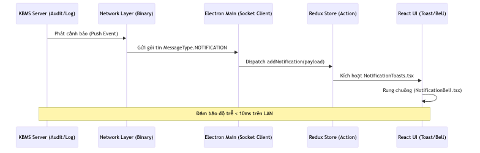

# 13.2. Kiến trúc 4 Tầng & Luồng Xử lý Chi tiết

[KBMS](../00-glossary/01-glossary.md#kbms) Studio vận hành dựa trên một kiến trúc phân tầng chặt chẽ, từ giao diện người dùng đến các trang dữ liệu nhị phân thấp cấp trên đĩa cứng.

## 1. Sơ đồ Luồng xử lý 4 Tầng

Sơ đồ dưới đây mô tả cách một câu lệnh Tri thức (như `SOLVE`) đi qua hệ thống:

*Hình 13.1: Luồng xử lý một yêu cầu tri thức xuyên suốt 4 tầng từ Studio UI.*

---

## 2. Đặc tả các Tầng

### Tầng 1: Application UI (React/Electron)
*   **Frontend**: [React](../00-glossary/01-glossary.md#react) xử lý trạng thái luồng (Redux). Khi người dùng nhấn "Run", lệnh được chuyển xuống [Electron](../00-glossary/01-glossary.md#electron) Main process.
*   **Auth**: Quản lý Session [Token](../00-glossary/01-glossary.md#token) và quyền truy cập cục bộ trên giao diện.

### Tầng 2: Network & Protocol
*   **Binary Framing**: Chuyển đổi lệnh thành các gói tin nhị phân. 
*   **Telemetry**: Gửi tín hiệu nhịp tim ([Heartbeat](../00-glossary/01-glossary.md#heartbeat)) định kỳ để duy trì kết nối Socket ổn định giữa Studio và Server.

### Tầng 3: Knowledge Engine
*   **KnowledgeManager**: Điều phối việc phân tách câu lệnh bằng [Lexer](../00-glossary/01-glossary.md#lexer)/[Parser](../00-glossary/01-glossary.md#parser).
*   **Reasoning**: Nếu là lệnh `SOLVE`, bộ máy suy diễn sẽ thực hiện [Forward Chaining](../00-glossary/01-glossary.md#forward-chaining) trên các [Page](../00-glossary/01-glossary.md#page) dữ liệu được nạp vào RAM.
*   **Logs**: Ghi lại nhật ký truy cập (Audit) đồng thời Stream Log trở lại Studio UI.

### Tầng 4: Storage Layer
*   **[B+ Tree](../00-glossary/01-glossary.md#b-tree)**: Tìm kiếm bản ghi Object dựa trên Index.
*   **[LRU](../00-glossary/01-glossary.md#lru) Cache**: Quản lý các trang dữ liệu (Pages) trong bộ nhớ đệm để tối ưu hóa tốc độ.
*   **WAL (Write-Ahead Logging)**: Đảm bảo tính toàn vẹn tri thức ngay cả khi mất điện đột ngột.

---

## 3. Luồng Thông báo Thời gian thực

Khác với luồng Request-Response thông thường, hệ thống Notification sử dụng cơ chế **[Server Push](../00-glossary/01-glossary.md#server-push)**:

*Hình 13.2: Cơ chế Server Push cho các thông báo hệ thống thời gian thực.*

1.  **[Trigger](../00-glossary/01-glossary.md#trigger)**: Một sự kiện an ninh hoặc hệ thống xảy ra tại Server.
2.  **Push**: Server đóng gói `MessageType.NOTIFICATION` và đẩy qua Socket.
3.  **Dispatch**: Electron Main nhận gói tin và gửi vào Redux Store của React.
4.  **UI Feedback**: Component `NotificationToasts` hiển thị thông báo popup, đồng thời cập nhật số lượng tin nhắn mới tại `NotificationBell`.

---

## 4. Quy trình Đăng nhập

1.  **[Handshake](../00-glossary/01-glossary.md#handshake)**: Studio gửi gói tin `LOGIN` kèm User/Pass được mã hóa Base64.
2.  **Server Verify**: Server kiểm tra trong hệ thống quản lý User (Tầng 4).
3.  **Session Record**: Nếu khớp, Server tạo một `SessionContext` trong RAM (Tầng 3) và trả về thông báo thành công.
4.  **Prompt Update**: Studio cập nhật trạng thái đã đăng nhập và cho phép thao tác với Knowledge Base.

